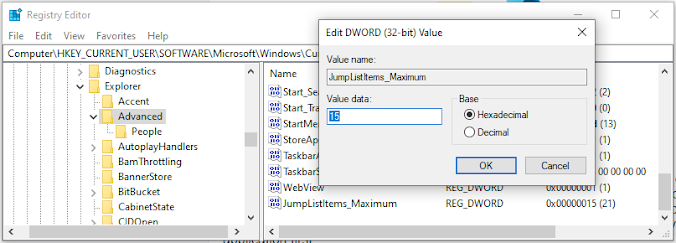
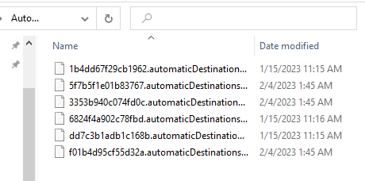

+++
title = "JumpList Forensics"
date = "2023-01-01"
draft = false
tags = ["4n6", "digital forensics", "windows forensics", "jumplist", "recent files", "DFIR"]
categories = ["4n6", "Digital Forensics"]
type = "4n6post"
seo_title = "JumpList Forensics - Windows Recent Files and User Activity Analysis"
description = "Comprehensive guide to JumpList forensic analysis for tracking user activity and recent files. Learn AutomaticDestinations, CustomDestinations, JLECmd usage, and DFIR investigation techniques."
keywords = ["JumpList forensics", "AutomaticDestinations", "CustomDestinations", "Windows user activity", "recent files tracking", "JLECmd", "digital forensics", "DFIR", "user behavior analysis", "taskbar forensics", "file access history", "Windows artifacts", "forensic timeline"]
canonical = "/4n6Post/JumpList/"
aliases = ["/4n6Post/JumpList/"]
featured_image = "/images/Windows11Explorer.png"
schema_type = "Article"
+++

## JumpList Forensics 


**JumpList** is a feature of Microsoft Windows operating systems that allows users to quickly access frequently used files, folders, and applications. This feature can be accessed by right-clicking on the taskbar icon or start menu tile of the target application. The JumpList registry holds the information that is displayed in the JumpList. This can be found multiple ways via Explorer File paths as well as within the registry itself.

## Normal Behavior

JumpList is a useful feature for normal use cases, such as allowing users to quickly access recently opened files or frequently used applications. For example, if you frequently use Microsoft Word to create documents, you can add the "New Document" option to the JumpList for Microsoft Word. This will allow you to create a new document without having to open the application first.

### JumpList Configuration

To set the Maximum Jump List, you can **Create** a new **DWORD(32-Bit Value)** with the hex set and the numeric value you want under within the key:

```
HKEY_CURRENT_USER\SOFTWARE\Microsoft\Windows\CurrentVersion\Explorer\Advanced
```



If you wish to **Disable JumpList**, you can alternatively **Create** a new **DWORD(32-Bit Value)** named `Start_TrackDocs` with the hex value of **0**.

**This is essentially "Not Start Tracking your Docs"**

## Finding JumpLists

To understand the JumpList registry, it is important to understand the structure of the registry itself. The registry is a hierarchical database that stores configuration information for the operating system, as well as for applications that run on the system.

### JumpList Locations

The JumpList was outdated in one of the windows 10 versions but the old location in the registry is located in the following path:

```
OLD: HKEY_CURRENT_USER\Software\Microsoft\Windows\CurrentVersion\Explorer\JumpListItems
```

The new location, which is your best location is in the **File Path**:

```
C:\%USERPROFILE%\AppData\Roaming\Microsoft\Windows\Recent\AutomaticDestinations
```



### File Structure

JumpList files are stored in two main locations:

1. **AutomaticDestinations**: Automatically populated jump lists
2. **CustomDestinations**: User-customized jump lists

## Forensic Analysis of JumpLists

### AutomaticDestinations Analysis

AutomaticDestinations contain `.automaticDestinations-ms` files that are named using Application IDs (AppIDs). These files contain:

- **Recently accessed files** for specific applications
- **File paths and metadata** about accessed documents
- **Timestamps** showing when files were accessed
- **LNK file data** embedded within the jumplist structure

### Application ID Mapping

Each application has a unique AppID that corresponds to its JumpList file:

- **Microsoft Word**: `adecfb853c7c7c49`
- **Microsoft Excel**: `7e4dfdde6cde5b5a`
- **Microsoft PowerPoint**: `dfaf9dfa8ce8b3c5`
- **Notepad**: `b2ae5e7dc68c6d3b`
- **Windows Explorer**: `f01b4d95cf55d32a`

### CustomDestinations Analysis

CustomDestinations contain `.customDestinations-ms` files for applications that support user-defined shortcuts and tasks.

## Malicious Use Cases

### Attack Vectors

JumpList can be exploited for malicious purposes:

- **Malicious Links**: Inserting malicious shortcuts into jump lists
- **Code Execution**: Links that execute malicious commands
- **Data Exfiltration**: Tracking accessed sensitive files
- **Persistence**: Maintaining access through jump list entries

### Anti-Forensics Techniques

Attackers may attempt to:
- **Clear JumpLists**: Remove evidence of file access
- **Modify Timestamps**: Alter access times to confuse analysis
- **Disable Tracking**: Turn off JumpList functionality
- **Plant False Evidence**: Insert misleading entries

## Forensic Investigation Techniques

### Timeline Analysis

JumpList analysis provides valuable timeline information:

1. **File Access Patterns**: When and how often files were accessed
2. **Application Usage**: Which applications were used and when
3. **User Behavior**: Patterns of file and application usage
4. **Data Correlation**: Cross-reference with other artifacts

### Analysis Tools

- **JumpList Explorer**: GUI-based analysis tool
- **JLECmd**: Eric Zimmerman's command-line JumpList tool
- **Registry Analysis**: Examining registry-based JumpList data
- **Hex Editors**: Low-level analysis of JumpList file structure

### Key Investigation Areas

1. **Recent File Access**: Identify recently accessed documents and files
2. **Application Usage**: Determine which applications were frequently used
3. **Network Resources**: Evidence of accessing network files or shares
4. **Suspicious Activity**: Unusual file access patterns or applications

## Normal vs. Malicious Indicators

### Normal Usage Patterns:
- **Business Documents**: Access to work-related files during business hours
- **Personal Files**: Regular access to personal documents and media
- **System Tools**: Occasional use of administrative tools
- **Standard Applications**: Regular use of common productivity software

### Suspicious Indicators:
- **System Files**: Unusual access to system files or directories
- **Script Files**: Frequent access to PowerShell, batch, or script files
- **Network Locations**: Access to unusual network shares or external systems
- **Timing Anomalies**: File access during unusual hours
- **Administrative Tools**: Frequent use of system administration utilities

## Registry Analysis

### Key Registry Locations:

```
HKEY_CURRENT_USER\SOFTWARE\Microsoft\Windows\CurrentVersion\Explorer\Advanced
HKEY_CURRENT_USER\Software\Microsoft\Windows\CurrentVersion\Explorer\JumpListItems (Legacy)
```

### Important Registry Values:
- **Start_TrackDocs**: Controls document tracking (0=disabled, 1=enabled)
- **JumpListItems_Maximum**: Maximum number of items in jump lists
- **Start_TrackPrograms**: Controls program tracking

## Best Practices for Analysis

### Data Collection
1. **Preserve Original Files**: Never modify original JumpList files
2. **Document Locations**: Record all JumpList file locations
3. **Extract Metadata**: Use specialized tools to extract embedded data
4. **Timeline Integration**: Include JumpList data in comprehensive timelines

### Analysis Methodology
1. **Application Mapping**: Identify applications associated with AppIDs
2. **File Path Analysis**: Examine accessed file paths for suspicious content
3. **Timestamp Correlation**: Cross-reference with other system artifacts
4. **Pattern Recognition**: Identify unusual access patterns or behaviors

### Reporting Considerations
- **User Activity**: Document patterns of legitimate vs. suspicious activity
- **File Access**: Provide detailed information about accessed files
- **Timeline Context**: Place JumpList activity within broader investigation timeline
- **Security Implications**: Highlight potential security risks or breaches

## Conclusion

JumpList forensics provides valuable insights into user behavior and application usage patterns. The artifacts stored in JumpList files offer investigators:

- **Detailed file access history** for specific applications
- **Timeline information** about user activity
- **Evidence of data access** that may not be available elsewhere
- **User behavior patterns** that can indicate normal or malicious activity

Understanding both the legitimate functionality and potential malicious exploitation of JumpLists is essential for comprehensive digital forensic investigations. The combination of registry analysis and file system examination provides a complete picture of user interactions with the Windows operating system.

Proper analysis of JumpList artifacts requires specialized tools and understanding of the underlying file formats, but the intelligence gained can be crucial for understanding user intent and system usage patterns in forensic investigations.