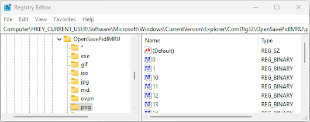
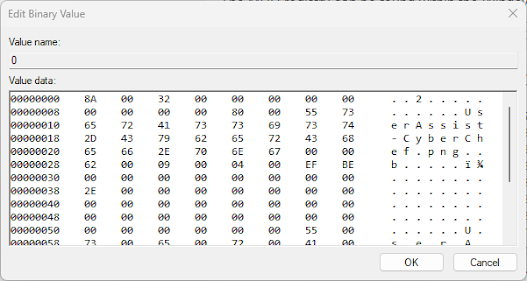
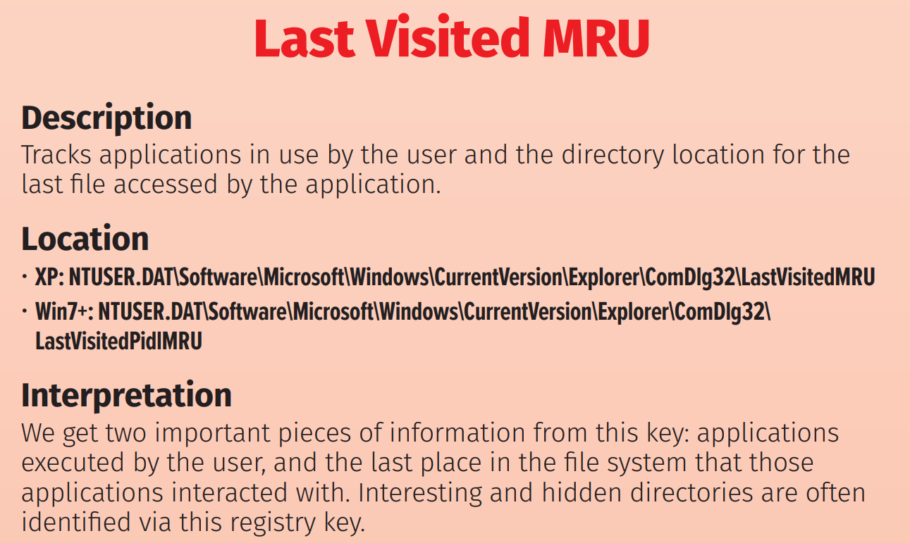

+++
title = "MRU (Most Recently Used) Registry"
description = "Understanding the MRU registry in Windows for digital forensics"
keywords = ["4n6", "digital forensics", "MRU", "registry", "Windows forensics", "SANS", "forensics analysis"]
type = "4n6post"
layout = "single"
author = "JonesCKevin"
seo_title = "MRU (Most Recently Used) Registry - Digital Forensics"
canonical = "/4n6Post/MRU/"
featured_image = "/images/RegistryBlock.png"
schema_type = "Article"
date = "2024-10-02"
+++

# MRU (Most Recently Used) Registry

The **MRU (Most Recently Used)** registry is a database in Microsoft Windows that stores information about recently opened files, URLs, and other items. This information can be used for a variety of purposes, both benign and malicious. **This is NOT the same as runMRU.**


## Normal Use Case

The MRU registry is commonly used by applications to keep track of recently opened files and other items. For example, a word processor might use the MRU registry to keep a list of the last ten documents a user has worked on. This information can be useful for the user, allowing them to quickly access the documents they have been working on.

Another example of a normal use case is in the Microsoft Internet Explorer browser. The MRU registry stores the list of URLs that a user has recently visited. This information can be used to improve the user's browsing experience, by providing quick access to the websites they frequently visit.

## Malicious Use Case

Unfortunately, the MRU registry can also be used by malicious actors to gather information about a user's activities. For example, a hacker might use the MRU registry to determine the applications and files that a user frequently accesses. This information could be used to target the user with a more specific attack.

Another malicious use case is in the tracking of user's online activities. The MRU registry stores information about recently visited URLs, which can be used by malicious actors to track a user's online behavior. This information can be used for malicious purposes, such as targeted advertising or identity theft.

### MRU in the File System and Registry

The MRU registry can be found within the Windows registry, under the following key:

```
HKEY_CURRENT_USER\Software\Microsoft\Windows\CurrentVersion\Explorer\ComDlg32\OpenSavePidlMRU
```



The MRU registry entries are stored as binary values, each representing a different file or URL that was recently accessed. These values can be analyzed to determine the names and locations of the files and URLs that were recently accessed.



In the file system, the MRU information is stored in various locations, depending on the type of item that was recently accessed. For example, information about recently opened files can be found in the Recent folder, located at the following path:

```
%APPDATA%\Microsoft\Windows\Recent
```

*See JumpList / Recent*

In conclusion, the MRU registry is a useful tool for both users and applications, allowing for quick access to recently used items. However, it can also be used for malicious purposes, such as tracking user behavior or targeting specific attacks. It is important to be aware of the MRU registry and understand how it can be used, both for benign and malicious purposes.

### SANS Poster

The SANS poster provides a detailed analysis of the MRU registry and how it can be used to prove execution of files and applications. It provides valuable information for forensic investigators who need to determine what files and applications were executed on a system.



[https://www.sans.org/posters/windows-forensic-analysis/](https://www.sans.org/posters/windows-forensic-analysis/)

## Sources

The [Microsoft Learn](https://learn.microsoft.com/en-us/answers/questions/364425/office-365-outlook-mru-roaming) provides a comprehensive overview of the MRU registry, including its purpose, structure, and use cases. It also provides technical details on how the MRU registry is implemented in Microsoft Windows.
