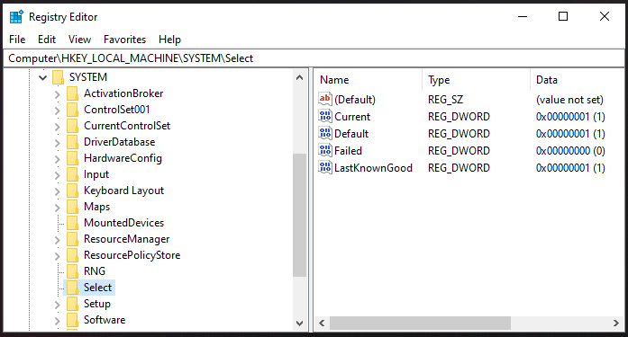

+++
title = "Registry- SYSTEM Select"
date = "2024-01-01"
draft = false
tags = ["4n6", "digital forensics", "windows registry", "forensics", "system analysis"]
categories = ["4n6", "Digital Forensics"]
type = "4n6post"
author = "JonesCKevin"
seo_title = "Windows Registry SYSTEM Select - ControlSet Forensics Analysis Guide"
description = "Detailed guide to Windows Registry SYSTEM Select key forensic analysis. Learn Current, Default, Failed, and LastKnownGood ControlSet tracking for DFIR investigations and system troubleshooting."
keywords = ["SYSTEM Select registry", "ControlSet forensics", "Windows registry analysis", "CurrentControlSet", "LastKnownGood", "Failed ControlSet", "digital forensics", "DFIR", "system configuration", "boot analysis", "registry artifacts", "Windows troubleshooting"]
canonical = "/4n6Post/Registry-SYSTEM-Select/"
aliases = ["/4n6Post/Registry-SYSTEM-Select/", "/2023/02/registry-systemselect.html"]
featured_image = "/images/RegistryBlock.png"
schema_type = "Article"
+++

## Windows Registry SYSTEM Select Key Analysis

The Windows Registry is a hierarchical database that stores configuration information for the operating system, applications, and hardware devices. One of the key branches in the registry is SYSTEM\Select, which contains information about the system's hardware configuration and boot options.

## The **SYSTEM\Select** subkeys and objects are as follows:

Not all objects exist if they are not referred to, set or used in older versions.

- **SYSTEM\Select\Current**  
    This key contains information about the operating system for which ControlSet### that is currently running on the computer. In the example, you can see that it is set to 1 which represents 001 for ControlSet001.

- **SYSTEM\Select\Default**  
    This key contains information about the default operating system that will be loaded at startup.

- **SYSTEM\Select\LastKnownGood**  
    This key contains information about the last operating system that was loaded successfully on the computer.

- **SYSTEM\Select\Failed**  
    This key contains information about the operating system that was last loaded but failed to start.

- **SYSTEM\Select\Ntldr**  
    This key contains information about the operating system that is specified in the Boot.ini file.

- **SYSTEM\Select\Setup**  
    This key contains information about the operating system that is specified in the Setup API.

- **SYSTEM\Select\SystemPartition**  
    This key contains information about the system partition on the computer. It stores the drive letter of the system partition, the type of file system used on the partition, and the size of the partition.

- **SYSTEM\Select\Windows**  
    This key contains information about the operating system that is specified in the Windows boot loader.

In conclusion, the SYSTEM\Select registry key and its subkeys are critical for the proper functioning of the operating system. They store information about the system's hardware configuration, boot options, and the operating system itself. Understanding this registry key and its subkeys can be useful for troubleshooting boot problems, restoring the system to a previous state, and for general system maintenance. It's important to note that making changes to the registry should be done with caution, as incorrect modifications can cause the operating system to become unstable or even fail to start.

## Normal Use Case

Normal usage of the SYSTEM\Select registry key and its subkeys can include changing the default operating system to be loaded at startup or modifying the information about the system partition. For example, if a user wants to dual-boot their computer with multiple operating systems, they can use the SYSTEM\Select key to specify which operating system should be loaded by default. Another normal usage is modifying the information about the system partition to reflect a change in its drive letter or file system type.

## Malicious Use Case

On the other hand, malicious usage of the SYSTEM\Select registry key can include altering the information about the operating system to hide the presence of malware or to redirect the system to a different operating system. For example, an attacker can change the information in the Current key to hide the presence of a malicious operating system, making it difficult for security software to detect and remove the malware. Another malicious usage is altering the information in the Default key to redirect the system to a different operating system at startup, potentially bypassing security measures and compromising the system.

## Conclusion

In conclusion, the registry section involving the Windows install time is an important aspect of the Windows registry that can be used for both normal and malicious purposes. Understanding this information and how to access it can be valuable for system administrators, security professionals, and anyone interested in the inner workings of the Windows operating system.
