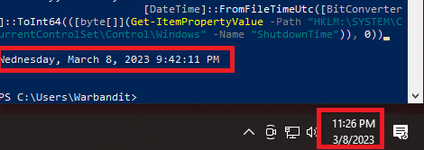
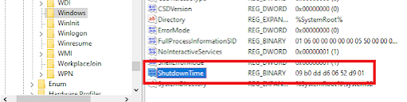

+++
title = "Windows Registry: System Start, Shutdown, and Reboot Tracking"
date = "2023-10-01"
draft = false
tags = ["4n6", "digital forensics", "windows forensics", "registry", "system start", "shutdown", "reboot", "DFIR"]
categories = ["4n6", "Digital Forensics"]
type = "4n6post"
author = "JonesCKevin"
seo_title = "Windows Registry: System Start, Shutdown, and Reboot Tracking"
description = "An in-depth look at the Windows registry for tracking system start, shutdown, and reboot events in digital forensic investigations."
keywords = ["Windows Registry", "System Start", "Shutdown", "Reboot", "Digital Forensics", "DFIR", "Forensic Artifacts"]
canonical = "/4n6Post/Registry-Start-Shutdown-Count/"
featured_image = "/images/RegistryBlock.png"
schema_type = "Article"
+++

The Windows registry is a hierarchical database that stores configuration settings for Windows operating systems, including Windows 10, Windows 8, and Windows 7. The registry is organized into five main components, namely HKEY_CLASSES_ROOT, HKEY_CURRENT_USER, HKEY_LOCAL_MACHINE, HKEY_USERS, and HKEY_CURRENT_CONFIG. Each of these components contains subkeys that store configuration data, including the data and time for when a computer turns on, shuts down, and restarts.


## The SYSTEM\Select subkeys and objects are as follows:

The following Windows registry artifacts are involved in tracking the data, time, and counts for when a computer turns on, shuts down, and restarts:

- **LastBootUpTime**: The subkey stores the date and time when the computer was last booted up.

```
HKEY_LOCAL_MACHINE\SYSTEM\CurrentControlSet\Control\Windows
```

- **ShutdownTime**: The subkey stores the date and time when the computer was last shut down. This is only logged when the host is shutdown correctly and not on BSOD or power plug pulls. During Incident handling, pulling the plug will potentially retain the date for you.

```
HKEY_LOCAL_MACHINE\SYSTEM\CurrentControlSet\Control\Windows
```

Here is a one liner PowerShell Script to decode your current Windows Registry date:

```powershell
[DateTime]::FromFileTimeUtc([BitConverter]::ToInt64(([byte[]](Get-ItemPropertyValue -Path "HKLM:\SYSTEM\CurrentControlSet\Control\Windows" -Name "ShutdownTime")), 0))
```





- **AutoReboot**: The subkey and stores a value of 1 if the computer is set to automatically restart after a system failure.

```
HKEY_LOCAL_MACHINE\SYSTEM\CurrentControlSet\Control\CrashControl
```

A secondary and less reliable yet unofficial reboot counter can be found under prefetch:

```
HKEY_LOCAL_MACHINE\SYSTEM\CurrentControlSet\Control\Session Manager\Memory Management\PrefetchParameters\EnablePrefetcher\BootID
```

## Normal Use Case

The data and time for when a computer turns on, shuts down, and restarts are critical artifacts that can be used in digital forensic investigations. The information can be used to determine if the computer was in use at a specific time, whether the computer was shut down or restarted to avoid detection, and if the computer was the source of a network intrusion or attack.

In addition, the data and time for when a computer turns on, shuts down, and restarts can be used to analyze system performance and identify potential system issues. For example, if a computer is experiencing frequent crashes, the data and time for when the computer was last shut down can be used to identify patterns and potential causes of the crashes.

## Malicious Use Case

The data and time for when a computer turns on, shuts down, and restarts can also be used maliciously by threat actors. For example, threat actors can use this information to determine when a computer is likely to be unattended and vulnerable to attack. They can also use this information to determine when a computer is likely to be in use, making it more challenging to conduct attacks.

Threat actors can also use this information to identify potential targets for social engineering attacks. For example, if a threat actor knows that a specific user always logs into their computer at a specific time, they can use this information to craft a phishing email that appears to be from a legitimate source and prompt the user to enter their credentials. With the user's login credentials, the threat actor can gain unauthorized access to the user's account and use it for various malicious activities, such as stealing sensitive data, launching further attacks, or disrupting operations.

Furthermore, threat actors can use the data and time for when a computer turns on, shuts down, and restarts to cover their tracks. For example, a threat actor who gains unauthorized access to a system may shut down or restart the system to erase any evidence of their activity, such as log files, temporary files, or other artifacts that may indicate their presence. By erasing the evidence, the threat actor can make it more challenging for investigators to detect their activities and attribute the attack to them.

## Conclusion

In conclusion, the data and time for when a computer turns on, shuts down, and restarts are critical artifacts that can provide valuable insights into digital forensic investigations. By analyzing these artifacts, investigators can determine if a computer was in use at a specific time, identify potential system issues, and track the movements of threat actors. However, this information can also be used maliciously by threat actors to conduct attacks, cover their tracks, and identify potential targets for social engineering attacks. Therefore, it is essential to be aware of the potential risks and take appropriate measures to protect systems and data from unauthorized access and malicious activities.
