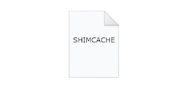

+++
title = "ShimCache - Windows Application Compatibility Cache for Digital Forensics"
date = "2023-10-01"
draft = false
tags = ["4n6", "digital forensics", "windows forensics", "registry", "shimcache", "DFIR"]
categories = ["4n6", "Digital Forensics"]
type = "4n6post"
author = "JonesCKevin"
seo_title = "ShimCache - Windows Application Compatibility Cache for Digital Forensics"
description = "An in-depth look at ShimCache (Application Compatibility Cache) and its significance for digital forensic investigations."
keywords = ["ShimCache", "Application Compatibility Cache", "Digital Forensics", "DFIR", "Registry Analysis", "Forensic Artifacts"]
canonical = "/4n6Post/SHIMCACHE/"
featured_image = "/images/SHIMCache-Logo.png"
schema_type = "Article"
+++

Shimcache is a Windows artifact that stores information about programs that **have been executed** on a Windows machine. The Shimcache can be used for both benign and malicious purposes, making it a useful tool for system administrators, digital forensics analysts, and attackers.

You should keep in mind that ShimCache and [AMCache](https://www.4n6post.com/2023/02/amcachehve.html) are very similar and depending on the version of Windows you are looking into, the AMCache might be more valuable to focus on. The ShimCache is in the registry where AmCache is a file on disk. So keep this in mind if you continue reading and notice similarities or relevance to it.

When we use our computers, we expect our operating systems to keep track of our activities, including which programs and files we access, how often we access them, and what modifications we make to them. In the case of Microsoft Windows, this information is stored in a structure known as the Shimcache.


The Shimcache is a data structure used by Windows to store information about programs that have been executed on a Windows machine. It is maintained by the Application Compatibility Engine (ACE), which is responsible for ensuring that older programs can run on newer versions of Windows. Everyone loves backwards compatibility, and you can thank Shimcache somewhere in that list.

```
HKEY_LOCAL_MACHINE\SYSTEM\CurrentControlSet\Control\Session Manager\AppCompatCache
```



## How does the Shimcache work?

When a program is executed on a Windows machine, the ACE checks to see if the program is listed in the Shimcache. If the program is not in the Shimcache, the ACE adds an entry for the program. If the program is in the Shimcache, the ACE updates the last accessed date/time stamp for the program.

The ACE uses the information stored in the Shimcache to determine how to run older programs on newer versions of Windows. For example, if a program was designed to run on Windows XP, the ACE might use the information in the Shimcache to simulate a Windows XP environment when the program is executed on Windows 10.

The Shimcache is stored in a binary format, which means that it cannot be easily read by humans. However, there are several tools available that can parse the Shimcache and present the information in a readable format.

## How to parse the Shimcache?

There are several tools available for parsing the Shimcache. In this section, we will discuss two popular tools: NirSoft's AppCompatCacheView and Mandiant's ShimCacheParser.

### NirSoft's - [AppCompatCacheView](https://www.nirsoft.net/utils/app_compatibility_view.html)

AppCompatCacheView is a tool developed by [NirSoft](https://www.nirsoft.net/) that will look at both the ShimCache as well as the AMCache and allows users to view and analyze the contents of the AppCompatCache, also known as the Shimcache. The tool is available for free on the [NirSoft website](https://www.nirsoft.net/) and can be used by security researchers, digital forensics analysts, and system administrators to better understand the programs that have been executed on a Windows system.

Here is a step-by-step guide on how to use AppCompatCacheView:

- Download the AppCompatCacheView tool from the NirSoft website. The tool is available in both 32-bit and 64-bit versions, so make sure you download the appropriate version for your system.
- Extract the contents of the downloaded file to a directory of your choice.
- Open a command prompt with administrative privileges.
- Navigate to the directory where you extracted the contents of the AppCompatCacheView tool.
- Type the following command to run the tool:

```cmd
AppCompatCacheView.exe
```

- The tool will display a list of all programs that have been executed on the system, along with information about the last execution time, file path, and other relevant details.
- To filter the results, click on the "Options" menu and select "Advanced Options." From here, you can filter the results based on various criteria, such as file path, last execution time, and process ID.
- To save the results, click on the "File" menu and select "Save Selected Items." The results will be saved in a text file that can be opened in a text editor, spreadsheet or a program like [EricZimmerman](https://ericzimmerman.github.io/#!index.md) - [TimeLineExplorer](https://ericzimmerman.github.io/#!index.md) [V1.3](https://f001.backblazeb2.com/file/EricZimmermanTools/TimelineExplorer.zip) or [V2.0](https://f001.backblazeb2.com/file/EricZimmermanTools/net6/TimelineExplorer.zip) for net6.

Here are some additional options that can be used with AppCompatCacheView:

- ***-regfile \<registry-hive-file\>***: Load the AppCompatCache from a specific registry hive file.
- ***-scomma \<filename\>***: Save the results in a CSV format.
- ***-shtml \<filename\>***: Save the results in an HTML format.

For example, the following command will load the AppCompatCache from the SYSTEM registry hive file located in the C:\Windows\System32\Config directory and save the results in a CSV file named "appcompat.csv":

```cmd
AppCompatCacheView.exe -regfile C:\Windows\System32\Config\SYSTEM -scomma appcompat.csv
```

### Mandiant - [ShimCacheParser](https://github.com/mandiant/ShimCacheParser)

ShimCacheParser is a tool developed by FireEye Mandiant that allows users to extract and analyze the contents of the Shimcache on a Windows system. The tool is freely available for download on the Mandiant GitHub repository and can be used by security researchers, digital forensics analysts, and system administrators to better understand the programs that have been executed on a Windows system.

Here is a step-by-step guide on how to use ShimCacheParser:

- Download the ShimCacheParser tool from the Mandiant GitHub repository. The tool is available in both 32-bit and 64-bit versions, so make sure you download the appropriate version for your system.
- Extract the contents of the downloaded file to a directory of your choice.
- Open a command prompt with administrative privileges.
- Navigate to the directory where you extracted the contents of the ShimCacheParser tool.
- Type the following command to display the help menu and available options for the tool:

```cmd
ShimCacheParser.exe -h
```

To extract the contents of the Shimcache, type the following command:

```cmd
ShimCacheParser.exe -f <path-to-hive-file>
```

Replace *\<path-to-hive-file\>* with the path to the system registry hive file that contains the Shimcache. By default, the Shimcache is stored in the SYSTEM registry hive file located in the C:\Windows\System32\Config directory.

## What's the Darn Difference between Shimcache and Amcache?

[AMCache](https://www.4n6post.com/2023/02/amcachehve.html) and ShimCache are two different Windows artifacts that store information about executed programs on a system. While they are similar in nature, there are some key differences between them.

ShimCache, also known as the Application Compatibility Cache, is a Windows artifact that contains information about programs that have been executed on a system. Specifically, it contains a cache of metadata about the execution of programs that have been launched on the system. This metadata includes the file path, last execution time, size of the file, and other details. ShimCache is typically stored in the Windows registry and can be accessed using registry analysis tools or specialized tools like ShimCacheParser.

[AMCache](https://www.4n6post.com/2023/02/amcachehve.html), on the other hand, is a newer Windows artifact that was introduced in Windows 8 and Windows Server 2012. Like ShimCache, AMCache also contains information about executed programs on the system. However, AMCache stores this information in a different format and location than ShimCache. Specifically, AMCache stores this information in a binary file located in the *C:\Windows\AppCompat\Programs\Amcache.hve* file. This file is a binary hive file that can be accessed using registry analysis tools or specialized tools like AmcacheParser.

One of the key differences between ShimCache and AMCache is the level of detail that is stored in each artifact. ShimCache typically stores less detailed information about executed programs than AMCache. As these tools/softwares get updated, these tools may even combine them together to make a more comprehensive list for you.

## Conclusion

ShimCache is a valuable artifact for security researchers, digital forensics analysts, and system administrators to better understand the programs that have been executed on a Windows system. Its ability to provide information about executed programs, including file path, last execution time, and other details, can be used to identify potentially malicious activity on a system and track the activity of legitimate programs over time. Tools like ShimCacheParser and AppCompatCacheView make it easy to access and analyze the contents of the ShimCache. While there are some limitations to ShimCache, such as its lack of detailed information about executed programs, it remains a useful tool in the digital forensics and incident response toolkit.

## Additional Resources:

- NirSoft's - [AppCompatCacheView](https://www.nirsoft.net/utils/app_compatibility_view.html)
- YouTube - 13Cube - [Let's Talk About ShimCache](https://www.youtube.com/watch?v=7byz1dR_CLg)
