## Resources and Help

- **SOF-ELK from [GitHub](https://github.com/philhagen/sof-elk/wiki/Virtual-Machine-README)** or **[VM from FOR572](https://for572.com/sof-elk-vm)**
- **Kroll - [KAPE Direct Download](https://s3.amazonaws.com/cyb-us-prd-kape/kape.zip)**
- **SOF-ELK [KAPE Support](https://github.com/philhagen/sof-elk/wiki/KAPE-Support)**
- **YouTube Video Guide by [SystemForensics](https://www.youtube.com/watch?v=k-Kc0VhVjZg)**

## SOF-ELK Introduction

SOF-ELK, coupled with the powerful capabilities of the KAPE (Kroll Artifact Parser and Extractor) software, forms a dynamic duo in the realm of cybersecurity and digital forensics. KAPE, developed by Eric Zimmerman, serves as a versatile and efficient tool for acquiring and processing forensic artifacts, including Master File Table (MFT) and Event Log files. By seamlessly integrating KAPE into the SOF-ELK framework, security practitioners gain a comprehensive solution for extracting, parsing, and visualizing critical data. This synergy enhances the efficiency of incident response and forensic investigations by allowing analysts to harness the rich insights embedded within MFT and Event Log artifacts. Together, SOF-ELK and KAPE create a robust environment that empowers organizations to navigate the complex landscape of security data, enabling proactive threat detection and bolstering the overall resilience of their digital infrastructure.

## Installing the SOF-ELK VM

You can easily import the Virtual Machine by using the downloaded VMDK and VMX files. Depending on the version, you might need to upgrade it to match your current version, as shown in the images below. If the image fails to load, it suggests an upgrade. Once you create a clone, the Virtual Machine should function properly.

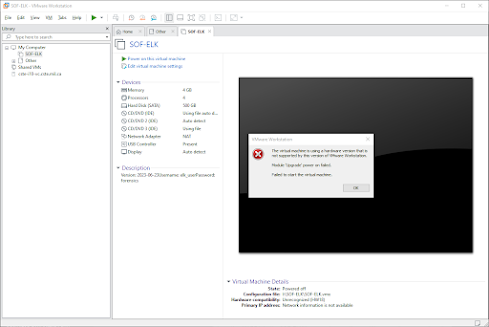

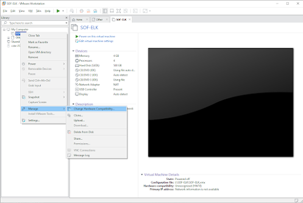

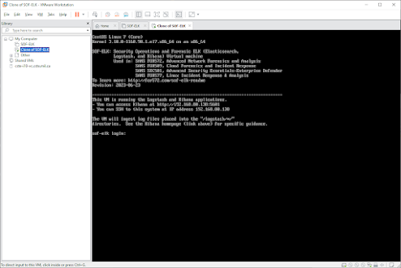

**Default User:** elk_user  
**Default Password:** forensics

> **Note: Remember the IP AND PORT for logging into the web GUI later.**

## File Transfer Location

To start, it's essential to prepare and decide on the method you intend to use for transferring files to the designated folder on the machine. In this example, I'll be utilizing WinSCP for the connection and transfer process.

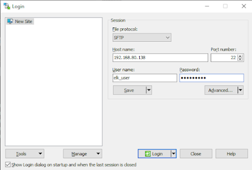

**Navigate to the destination folder:**

```
/logstash/kape
```

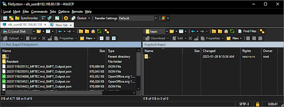

## Creating KAPE Files

### Step 1: Download and Install KAPE
Begin by downloading and installing KAPE on your system.

### Step 2: Create a KAPE Target
Define a KAPE target to specify the artifacts you want to collect, including MFT and EVTX files. For this example, I will be using the KAPE GUI to assist for photos.

### Step 3: Configure Output Destination
Set the destination where KAPE will store the collected files. Ensure that there is sufficient storage space available.

### Step 4: Run KAPE Scan
Execute the KAPE scan by providing the appropriate command, specifying the target and output location. This target in the example will be the local host, but this could be a mounted image that is on a different partition letter such as "F:\" exporting to "C:\".

### Step 5: Process Artifacts
Utilize KAPE's processing capabilities to extract meaningful information from the collected MFT and EVTX files. KAPE provides various modules for parsing and analyzing different artifacts.

Note: For this, you will want to ensure that the JSON files are created. To do so, select on the JSON radio button as highlighted in the photo in green.

### Step 6: Review Results
Once the scan completes, review the generated KAPE report to ensure that the MFT and EVTX files were successfully collected and processed into timeline files.

### Step 7: Move the Results
Once you confirm the files appear correct, use WinSCP to move/copy the files to the SOF-ELK KAPE Folder and wait a few minutes for the system to import them with the preinstalled filebeats process.

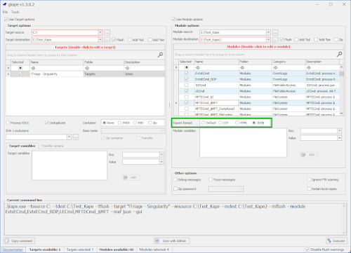

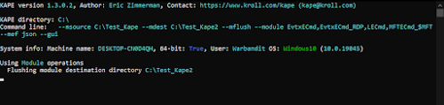

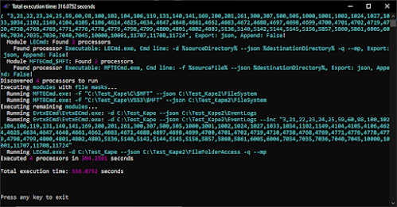

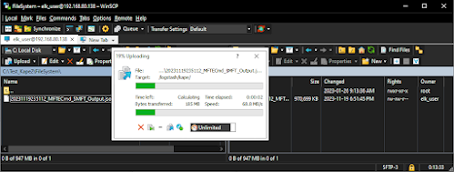

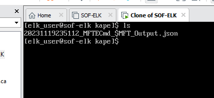

## Exploring the SOF-ELK Web GUI

Using the IP:Port of your Server, navigate to `http://<IP>:5601`.

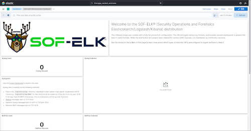

The key area you will want to be aware of is the different dashboards you can pick from as each of the different artifacts are shown using a different dashboard.

### Available Dashboards:
- **Eventlog Dashboard**
- **LNK File Dashboard**
- **Filesystem Dashboard**

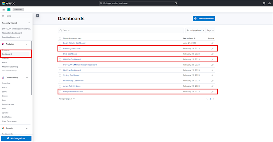

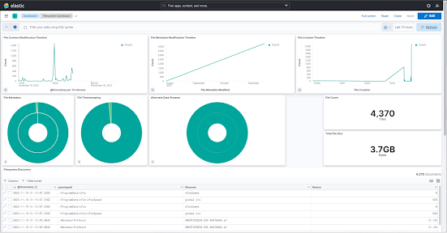

> **IMPORTANT: ENSURE YOU CHANGE THE TIMEFRAME AT THE TOP RIGHT TO FIT THE PROPER TIMEFRAME YOU ARE LOOKING FOR!!**

## Deleting Imported Data

To delete all imported data from Elasticsearch:

**Using curl:**
```bash
curl -X DELETE 'http://localhost:9200/_all'
```

**Using PowerShell:**
```powershell
Invoke-WebRequest -method DELETE http://localhost:9200/_all
```

Source: [StackOverflow](https://stackoverflow.com/questions/22924300/removing-data-from-elasticsearch)

## Additional Resources

- **EricZimmerman - [LECmd](https://ericzimmerman.github.io/#!index.md)** - Parse lnk files
- **EricZimmerman - [MFTECmd](https://ericzimmerman.github.io/#!index.md)** - Parse $MFT / $J file
- **EricZimmerman - [EvtxECmd](https://ericzimmerman.github.io/#!index.md)** - Parse EVTX Files
- **KROLL - [KAPE](https://s3.amazonaws.com/cyb-us-prd-kape/kape.zip)** - Modular Triage Tool
