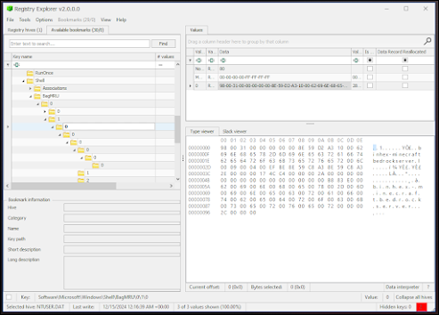
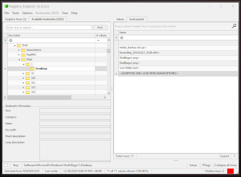
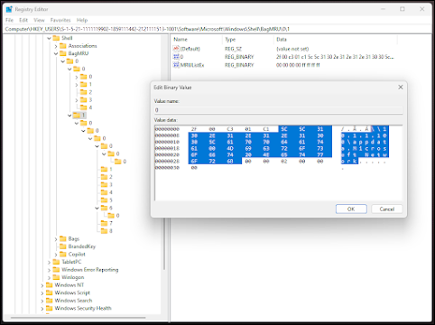
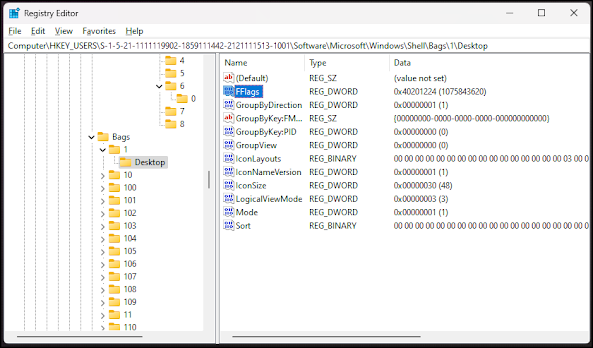

+++
title = "ShellBags Registry"
date = "2024-01-02"
draft = false
description = "Comprehensive guide to ShellBags forensic analysis in Windows Registry. Learn folder access tracking, ShellBags Explorer tool usage, external device detection, and DFIR investigation techniques."
tags = ["forensics", "registry", "shellbags", "windows", "digital-forensics"]
keywords = ["ShellBags forensics", "ShellBags Explorer", "folder access tracking", "Windows registry analysis", "user activity forensics", "external device detection", "digital forensics", "DFIR", "Windows Explorer forensics", "BagMRU", "registry artifacts", "folder history"]
categories = ["Digital Forensics"]
type = "4n6post"
author = "JonesCKevin"
seo_title = "ShellBags Registry Forensics - Windows Folder Access Analysis Guide"
canonical = "/4n6Post/ShellBags/"
aliases = ["/4n6Post/ShellBags/", "/2024/12/registry-shellbags.html"]
featured_image = "/images/RegistryBlock.png"
schema_type = "Article"
+++

## Understanding ShellBags in the Windows Registry: A Deep Dive

As my other posts likely portrais. The Windows operating system is a treasure of love and trove-like of forensic evidence. Along with the various artifacts, ShellBags stand out for their ability to provide valuable timeline and insights into a user's general activity. Whether used for legitimate investigations or malicious purposes, understanding ShellBags is crucial for anyone dealing with digital forensics and even cybersecurity defenses like EDR.

## What Are ShellBags?

ShellBags is a feature in the Windows Registry that records user interactions with directories in Windows Explorer. When a user opens, navigates, customizes, or interacts with a folder, the operating system stores data about that folder in the Registry. This data includes details like the folder path, view settings, and timestamps, creating a historical record.

ShellBags was primarily designed to improve the users experience by storing folder view preferences, such as icon size or sort order, Windows allows users to customize their interactions with the file explorer. However, for digital forensic analysts, these records can provide evidence of folder access, even if the folder has been deleted or was stored on an external device. One example, I have seen was where a user downloaded a malicious file and copied it to an external device where we can only observe that it was copied to a directory name. By matching the time frame of that copy, we were able to identify which external device this was associated with and were able to later obtain it for analysis.

## How do ShellBags Work?

ShellBag data is stored within specific hives of the Windows Registry, mainly in the following locations:

- **NTUSER.DAT**: Found in the user's profile directory `(%USERPROFILE%)`, this hive contains user-specific ShellBag entries.
- **UsrClass.dat**: Also located in the user's profile, this hive stores additional ShellBag information related to the user's interactions with the system.

Creating a supertimeline of the registry can put all of these registry lines in order as well.

ShellBags are organized under subkeys like `BagMRU` and `Bags`:

- **BagMRU (Bag Most Recently Used(MRU))**: This key tracks the hierarchy of accessed directories.
- **Bags**: This key stores view settings for each folder.

Each ShellBag entry is associated with a unique identifier (BagID), linking it to specific directories and their metadata. Using the standard MRU concept, the most recently accessed directories are assigned lower BagIDs, while older entries have higher BagIDs. You can use the MRUListEx as a guide, but noting that 0 is the most recent and anything higher is older / further from most recent. Using the example below, you can see a lot of 0 and a lot of 1. In the long list, each subkey is an additional directory depth that was accessed.

## Normal Use Cases of ShellBags

In regular activity, ShellBags serve several legitimate purposes:

- **Customization of Folder Views**: If a user sets a folder to display items as thumbnails or groups files by type, these preferences are stored in the Registry.
- **Tracking Folder Usage**: ShellBags help Windows remember the locations of directories and their settings, even after a system reboot.
- **File Explorer Enhancements**: By remembering folder states, ShellBags streamline navigation and improve the overall user experience. Unless you dont want it to remember... Then you probably hate it, like you hate Jump Lists. I for some reason hate jump lists so I always disable it. Moving on!
- As a forensic analyst, you can use ShellBags to reconstruct a user's file access history, identify frequently accessed directories, and uncover evidence of file manipulation execution or deletion. This can be useful in cases involving data exfiltration, insider threats, or unauthorized access.

## Malicious Use Cases of ShellBags

While ShellBags enhance usability, they can also be exploited for malicious purposes:

- **Evidence Tampering**: A malicious actor could manipulate ShellBag entries to obscure their activity or frame someone else.
- **Persistence Mechanisms**: Malware developers might use ShellBag entries to track or monitor specific directories.
- **Reconnaissance**: Attackers could analyze ShellBag data to identify frequently accessed directories, including those containing sensitive information.

In this example, I navigated to a Minecraft Bedrock directory but you can see further directories which could be useful in an investigation. The BagMRU key is a good place to start as it will show you the most recent directories accessed. The Bags key will show you the view settings for each directory. This can be useful in determining if a user was hiding files or if they were viewing files in a specific way.

## Parsing ShellBags with RegistryExplorer

Eric Zimmerman's **RegistryExplorer** is one tool for analyzing Registry data. Here's how to parse ShellBags using this tool:

1. **Load the NTUser.dat or UsrClass.dat Registry Hive:** via RegistryExplorer. Navigate to the relevant ShellBag keys, typically under:
    - `Software\Microsoft\Windows\Shell\BagMRU`
    - `Software\Microsoft\Windows\Shell\Bags`
2. **Interpret the Data:** RegistryExplorer provides a user-friendly ish interface that decodes binary data into readable formats. Review folder paths, timestamps, and view settings.
3. **Bookmark Key Entries:** RegistryExplorer's bookmark feature is invaluable for investigations. Analysts can mark critical entries for quick reference, helping streamline the analysis process.

Another tool that can be used is AccessData's Registry Viewer. This tool is also useful for parsing ShellBag data and provides a similar interface to RegistryExplorer. RegistryExplorer is likely more often used for the bookmarks but I tend to prefer RegistryViewer for the UI and less clicks for the data I personally want. I won't use examples here as to not double the blog data, but it's worth checking both to experience it yourself.

## Examples of ShellBag Analysis

### Normal Use Case

Imagine a scenario where a user accesses a folder named "Vacation Photos" stored on an external drive. They customize the folder view to display thumbnails sorted by date. Windows stores this information in ShellBags. Even if the external drive is disconnected, the ShellBag entry remains, providing a record of the folder's existence and interaction. You could potentially use this information along with something like MFT to prove the creation of new files.

In the following example, you can see a directory on a network share was accessed and looking at the left pane, this is represented as a 1 which would be the second last upper directory accessed, and it contains its own sub directories in order of last access as well.

### Malicious Use Case

In a case involving insider threats, an employee might attempt to delete incriminating files from their workstation. However, the ShellBags in their NTUSER.DAT file reveal access to a folder named "Confidential" shortly before the deletion. The folder's metadata provides critical evidence for the investigation.

## The Importance of Timestamps

ShellBag entries often include timestamps. These timestamps can establish a timeline of user activity, which is particularly useful in forensic investigations.

## Registry MetaData

### FFlags

The following uses `\Shell\Bags\1\Desktop` as an example. The FFlags value is a DWORD value that stores various settings for ShellBags. This may not often be used but you can keep this incase the information is of interest. Here are some common values you could use as a reference when analyzing ShellBag data:

FFlags uses the Hex Adding together concept and are used to store various settings for ShellBags. This may not often be used but you can keep this incase the information is of interest. Here are some common values you could use as a reference when analyzing ShellBag data:

#### Common FFlags Values

| Value          | Description             | Value          | Description             |
| -------------- | ----------------------- | -------------- | ----------------------- |
| **0x00000000** | No Flags                | **0x00000001** | Show All Files          |
| **0x00000002** | Hide System Files       | **0x00000004** | Hide Hidden Files       |
| **0x00000008** | Hide Known Extensions   | **0x00000010** | Show Super Hidden Files |
| **0x00000020** | No Confirm Recycle      | **0x00000040** | Show Compressed Files   |
| **0x00000080** | No Map Network Drive    | **0x00000100** | No Net Disconnect       |
| **0x00000200** | No Recent Docs          | **0x00000400** | No Logoff               |
| **0x00000800** | No ToolTips             | **0x00001000** | No Active Desktop       |
| **0x00002000** | No Web                  | **0x00004000** | No Drives               |
| **0x00008000** | No Drive AutoRun        | **0x00010000** | No Drive AutoRunOnce    |
| **0x00020000** | No Drive AutoOpen       | **0x00040000** | No Drive AutoClose      |
| **0x00080000** | No Drive AutoEject      | **0x00100000** | No Drive AutoInsert     |
| **0x00200000** | No Drive AutoPlay       | **0x00400000** | No Drive AutoPlaySearch |
| **0x00800000** | No Drive AutoPlayPrompt | **0x01000000** | No Drive AutoPlayDrop   |
| **0x02000000** | No Drive AutoPlayPics   | **0x04000000** | No Drive AutoPlayMusic  |
| **0x08000000** | No Drive AutoPlayVideo  | **0x10000000** | No Drive AutoPlayMixed  |
| **0x20000000** | No Drive AutoPlayBlank  | **0x40000000** | No Drive AutoPlayCD     |
| **0x80000000** | No Drive AutoPlayDVD    |                |                         |

#### Example

**FFlags:** 0x00000011
- Show All Files
- Hide System Files

**FFlags:** 0x40201224
- 0x40000000 - No Drive AutoPlayCD
- 0x02000000 - No Drive AutoPlayPics
- 0x00001000 - No Active Desktop
- 0x00000200 - No Recent Docs
- 0x00000024 - No Flags

## Summary

ShellBags track your folder access and whats in them.

### Additional Resources

- [Eric Zimmerman's Tools - RegistryExplorer](https://ericzimmerman.github.io/#!index.md)
- [Exterro / AccessData's - RegistryViewer](https://www.exterro.com/ftk-product-downloads/)
