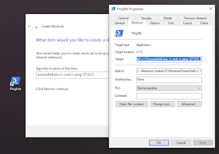
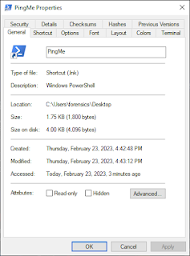
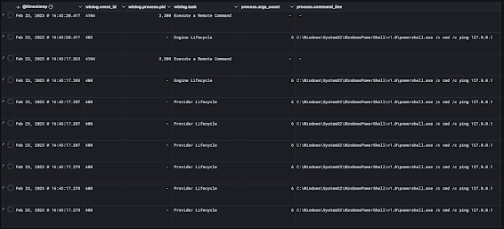
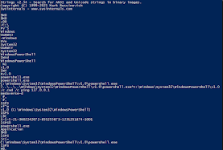
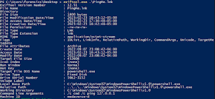
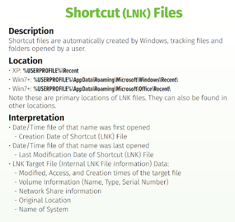

+++
title = "File and Folder Opening - Link Files (LNK)"
date = "2023-01-01"
draft = false
tags = ["4n6", "digital forensics", "windows forensics", "LNK files", "shortcuts", "malware analysis", "DFIR"]
categories = ["4n6", "Digital Forensics"]
type = "4n6post"
author = "JonesCKevin"
seo_title = "LNK File Forensics - Windows Shortcut Analysis for DFIR"
description = "Complete guide to LNK file forensic analysis for tracking file access and user activity. Learn LNK file structure, LECmd tool usage, malware detection, and DFIR investigation techniques."
keywords = ["LNK file forensics", "Windows shortcuts", "LECmd", "file access tracking", "user activity analysis", "digital forensics", "DFIR", "LNK parser", "malware analysis", "shortcut forensics", "forensic artifacts", "link file analysis"]
canonical = "/4n6Post/ShortCut-LNK/"
aliases = ["/4n6Post/ShortCut-LNK/", "/2023/02/shortcut-files-lnk.html"]
featured_image = "/images/Windows11Explorer.png"
schema_type = "Article"
+++

Windows users are likely familiar with .lnk files, also known as LNK Link files. These files are shortcuts that point to another file or folder on the computer, allowing users to quickly access their desired content. While LNK files are a convenient feature in Windows, they can also be exploited by malicious actors. In this post, we'll explore LNK files, their normal use cases, and how they can be exploited by cybercriminals.

## Understanding LNK Files

A .lnk file is a file shortcut in Windows that contains information about the location of the file or folder that it points to. These files have a .lnk extension and are typically created when a user right-clicks on a file or folder and selects "Create shortcut." The LNK file then appears in the same location as the original file or folder, but with a different icon. If this shortcut is activating a program the icon will generally take shape of the program. An example would be the powershell icon would be used on the lnk if you start with powershell.exe.

When a user double-clicks on an LNK file, the shortcut opens the file or folder that it points to. LNK files can be useful for users who frequently access certain files or folders, as they provide a quick and convenient way to do so. However, lnk's are not tracked the same within windows as using a lnk file is unique. Think of one as double clicking the thing you are actually using instead of a file. This isn't 100% for all features and may change between windows versions, making digital forensics and tracking potentially annoying over time.

## Normal Use Case

The most common use case for LNK files is for creating shortcuts to frequently used files or folders. For example, a user might create an LNK file for a Word document that they need to access frequently, or for a folder that contains important files. LNK files can also be used to create shortcuts to programs or scripts that a user wants to run quickly.

Another common use case for LNK files is for organizing files and folders. Users can create LNK files for related files or folders and place them all in one folder, allowing for easy access to all of the related content or even to use commonly used command lines.

### Legitimate Uses:
- **Desktop Shortcuts**: Quick access to frequently used applications
- **Document Shortcuts**: Direct links to important documents
- **Network Shares**: Shortcuts to network locations and shared folders
- **Administrative Tools**: Quick access to system utilities
- **Productivity Enhancement**: Streamlined access to work-related resources

## Malicious Use Case

Unfortunately, LNK files can also be exploited by malicious actors. Malware authors have used LNK files to deliver their malicious payloads to unsuspecting victims.

### Stuxnet Example

One example of malware that uses LNK files is the infamous Stuxnet worm, which was discovered in 2010. Stuxnet was a highly sophisticated piece of malware that targeted industrial control systems (IDS), specifically those used in Iran's nuclear program. The worm was spread through infected USB drives, and it used LNK files to execute its malicious payload when the user clicked on the shortcut.

When a user clicked on an infected LNK file, it would execute a malicious payload that exploited a Windows zero-day vulnerability to install the worm on the victim's computer. Once installed, Stuxnet would search for specific industrial control systems and attempt to manipulate their processes. The worm was able to cause physical damage to Iran's nuclear program and is considered one of the most sophisticated cyberattacks in history.

### Emotet Example

Another example of malware that uses LNK files is the more recent common day malware called the Emotet Trojan. Emotet is a banking Trojan that has been active since 2014 and has evolved over the years to become one of the most dangerous pieces of malware in circulation. The Trojan is typically spread through phishing emails (as is most of the worlds Trojans), which contain an infected LNK file as an attachment.

When a user clicks on the infected LNK file, it executes a PowerShell command that downloads and installs the Emotet Trojan on the victim's computer. Once installed, Emotet is capable of stealing sensitive information, downloading additional malware, and spreading to other computers on the victim's network.

## Example Walkthrough

For this example, I decided to do something simple and normally create a shortcut on the desktop using the syntax:

**"powershell /c cmd /c ping 127.0.0.1"**

**This tiny script will run powershell to use the command, execute cmd.exe to use the argument ping 127.0.0.1. This is a total of 6 arguments.**

Windows will appropriately clean up the path with full paths as you can see in the image below. In the photo, you can also see that the starting path was set to the default powershell directory and the icon was converted to the appropriate powershell icon.

### Analysis Methods

To view the data, in a more forensics or reverse malware method, I will use:

1. **[Strings by SysInternals](https://learn.microsoft.com/en-us/sysinternals/downloads/strings)** - Extract readable strings from the LNK file
2. **[LECmd by Eric Zimmerman](https://github.com/EricZimmerman/LECmd)** - Specialized LNK file analysis tool
3. **Hex Editors** - Low-level binary analysis of LNK structure

### LNK File Structure Analysis

LNK files contain structured binary data that includes:

- **Header Information**: File signature and basic metadata
- **Target Information**: Path to the target file or folder
- **Command Line Arguments**: Parameters passed to the target
- **Working Directory**: Starting directory for execution
- **Icon Information**: Display icon and location
- **Timestamps**: Creation, modification, and access times

## Forensic Analysis Techniques

### Metadata Extraction

LNK files preserve valuable forensic information:

- **File Paths**: Original and target file locations
- **Timestamps**: When shortcuts were created and last used
- **User Context**: Information about the user who created the shortcut
- **Machine Information**: Details about the system where the LNK was created
- **Network Shares**: Evidence of network resource access

### Timeline Analysis

LNK files contribute to forensic timelines by showing:
- When shortcuts were created
- Last access times for target files
- Evidence of user activity patterns
- Network resource usage

### Malware Detection

Suspicious LNK characteristics:
- **Hidden Extensions**: .lnk files disguised as documents
- **Unusual Targets**: Shortcuts pointing to script interpreters
- **Long Command Lines**: Complex PowerShell or cmd commands
- **Network Locations**: Shortcuts to external resources
- **System Directories**: Links targeting system folders

## Investigation Best Practices

### Collection and Preservation
1. **Preserve Original**: Never modify original LNK files
2. **Document Context**: Record where LNK files were found
3. **Extract Metadata**: Use specialized tools for complete analysis
4. **Timeline Integration**: Include LNK data in master timeline

### Analysis Methodology
1. **Structure Analysis**: Examine binary structure for anomalies
2. **Target Validation**: Verify target files exist and are legitimate
3. **Command Analysis**: Review any embedded commands for malicious content
4. **Cross-Reference**: Correlate with other system artifacts

### Tools and Techniques
- **LECmd**: Eric Zimmerman's LNK analysis tool
- **LnkParse**: Python-based LNK file parser
- **FTK Imager**: Forensic imaging and analysis
- **Hex Editors**: Binary structure examination

## Conclusion

LNK files represent a significant forensic artifact that provides insight into user behavior, system usage, and potential security incidents. Understanding the structure and analysis of LNK files enables investigators to:

- Track user access patterns and file usage
- Identify potential malware delivery mechanisms
- Reconstruct user activity timelines
- Detect evidence of lateral movement or data exfiltration

The dual nature of LNK files—as both legitimate system functionality and potential attack vectors—makes them critical artifacts for digital forensic analysis. Proper analysis requires understanding both the technical structure of LNK files and the context in which they're used.

For investigators, LNK files offer a window into user intentions and system interactions that can be invaluable for understanding both normal operations and malicious activities within Windows environments.