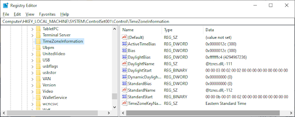
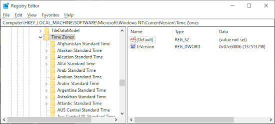
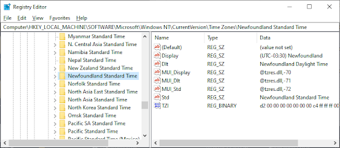
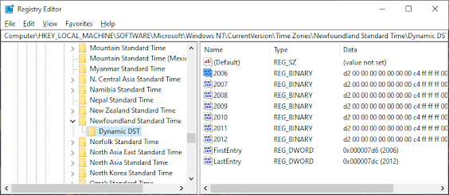
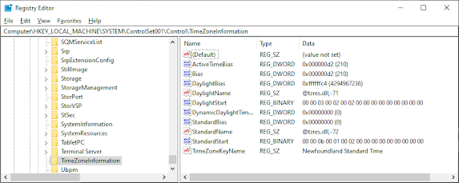
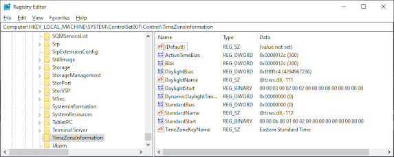
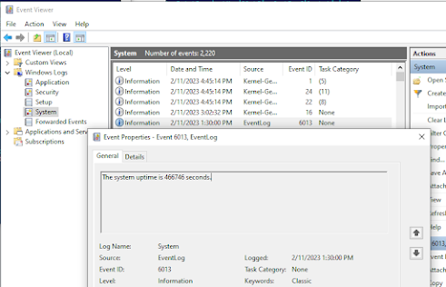
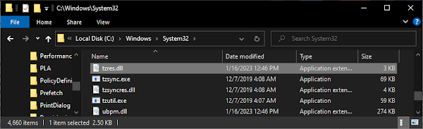
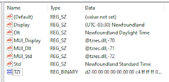
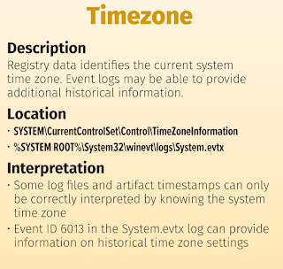

+++
title = "TimeZone Information"
date = "2023-01-01"
draft = false
tags = ["4n6", "digital forensics", "windows forensics", "registry", "timezone", "timestamp analysis", "DFIR"]
categories = ["4n6", "Digital Forensics"]
type = "4n6post"
author = "JonesCKevin"
seo_title = "TimeZone Information - Windows Timezone Registry Forensics"
description = "An in-depth look at the TimeZoneInformation registry section and its significance for digital forensic investigations."
keywords = ["TimeZoneInformation", "Windows Timezone", "Registry Analysis", "Digital Forensics", "DFIR", "Timestamp Analysis", "Forensic Artifacts"]
canonical = "/4n6Post/TimeZoneInformation/"
featured_image = "/images/4n6post-Analog-Clock.png"
schema_type = "Article"
+++


The Windows registry is a critical component of the Windows operating system. It stores important configuration data and settings that help the operating system function properly. One of the registry keys that play an important role in the functioning of the system is the TimeZoneInformation registry key. In this blog post, we'll delve into the registry TimeZoneInformation, its connection with the Dynamic Link Library (DLL) it uses, and how it is used in both normal and malicious scenarios.

## Summary Points

Something worth noting ahead time if you plan to skim the article is:

- **-300** is equal to 5 hours behind UTC time, calculated in Minutes
- **-/+60** is more than likely reference to daylight saving adjustment time count. Calculated in Minutes
- A lot of the timezone data is calculated live in real time by referencing the Registry, and does not show data such as -360 when it should be (-300)+(-60)=(-360)
- **tzres.dll, -112** is the String ID that references which TimeZone is applicable. There is normally 2-3 for each Time zone as not all timezone use Day Light Savings

| String ID | TimeZone Description                   |
| --------- | -------------------------------------- |
| 110       | (UTC-05:00) Eastern Time (US & Canada) |
| 111       | Eastern Daylight Time                  |
| 112       | Eastern Standard Time                  |

## Understanding TimeZoneInformation Registry

The TimeZoneInformation registry key contains critical data about the system's timezone configuration. This information is essential for digital forensic investigations as it helps establish accurate timelines and correlate events across different systems.

### Registry Location

The primary timezone information is stored at:

```
HKEY_LOCAL_MACHINE\SYSTEM\CurrentControlSet\Control\TimeZoneInformation
```



## Registry Values and Their Meanings

### Key Registry Values:



**Bias**: The time difference (in minutes) between the local time and Coordinated Universal Time (UTC)
- Example: -300 = 5 hours behind UTC (Eastern Time)

**StandardName**: The name of the standard timezone
- Example: "Eastern Standard Time"

**DaylightName**: The name when daylight saving time is active  
- Example: "Eastern Daylight Time"



**StandardBias**: Additional bias applied during standard time (usually 0)

**DaylightBias**: Additional bias applied during daylight saving time (typically -60 minutes)

**TimeZoneKeyName**: References the specific timezone configuration



## Dynamic Link Library (DLL) Connection

The timezone system relies heavily on **tzres.dll** (Time Zone Resource DLL) which contains:

- Timezone display names
- Daylight saving time rules
- Historical timezone data
- Localized timezone strings



The registry contains resource IDs that reference specific strings within tzres.dll, allowing the system to display appropriate timezone information based on the user's locale and preferences.

## Forensic Analysis Applications

### Timeline Establishment



Accurate timezone information is crucial for:
- **Event Correlation**: Matching timestamps across multiple systems
- **Timeline Construction**: Establishing chronological order of events
- **Log Analysis**: Converting UTC timestamps to local time
- **Evidence Validation**: Ensuring timestamp accuracy in legal proceedings

### Event Log Analysis



Event logs often contain timezone-specific timestamps that must be properly interpreted:
- System startup/shutdown events
- User logon/logoff activities  
- Application execution records
- Security audit events

## Normal Use Cases

### Legitimate System Administration:
- Timezone configuration during system setup
- Adjustments for daylight saving time
- Multi-timezone environment management
- Remote system administration

### User Activities:
- Travel-related timezone changes
- Relocation to different time zones
- Collaboration across time zones
- System clock synchronization



## Malicious Use Cases

### Anti-Forensics Techniques:
- **Timestamp Manipulation**: Altering timezone to confuse timeline analysis
- **Log Evasion**: Changing timezone to hide activity during specific time periods
- **Evidence Tampering**: Modifying timezone to create false alibis
- **Detection Avoidance**: Using timezone changes to evade time-based security controls

### Indicators of Suspicious Activity:
- Frequent timezone changes without legitimate reason
- Timezone settings inconsistent with geographic location
- Timezone modifications coinciding with suspicious file activity
- Non-standard timezone configurations

## Investigative Techniques

### 1. Timezone Consistency Check
Verify that the timezone settings are consistent with:
- System location
- User activity patterns
- Network geolocation data
- Business operations

### 2. Historical Timeline Analysis
- Compare timezone changes with system events
- Cross-reference with user account activities
- Analyze correlation with file modification times
- Review network access logs

### 3. Registry Timeline Reconstruction


Examine registry modification timestamps for:
- When timezone was last changed
- Frequency of timezone modifications
- Correlation with other system changes
- Administrative versus user-initiated changes

## Best Practices for Forensic Analysis

1. **Document Current Settings**: Capture all timezone-related registry values
2. **Historical Analysis**: Review registry backup files for previous configurations
3. **Cross-Reference**: Compare with system logs and file timestamps
4. **Validation**: Verify timezone consistency across multiple artifacts
5. **Context Analysis**: Consider legitimate reasons for timezone changes



## Conclusion

TimeZoneInformation registry analysis is a fundamental component of digital forensic investigations. Understanding how Windows manages timezone data through registry entries and DLL resources enables investigators to:

- Establish accurate timelines
- Detect timestamp manipulation attempts
- Correlate events across multiple systems
- Identify suspicious timezone-related activities

The timezone registry serves as both a critical system function and a potential vector for anti-forensics techniques. Forensic investigators must carefully analyze timezone configurations to ensure the integrity and accuracy of their timeline analysis.

Proper understanding of timezone mechanics, including the relationship between bias values, daylight saving time adjustments, and DLL resource references, is essential for conducting thorough and accurate digital forensic examinations.