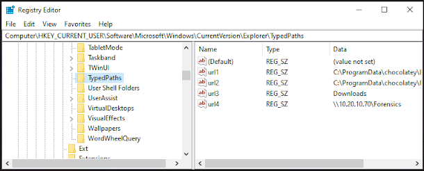
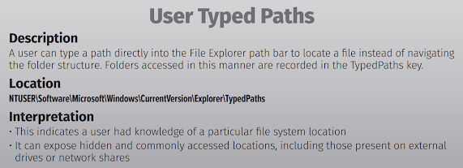

+++
title = "TypedPath Registry"
date = "2023-01-01"
draft = false
tags = ["4n6", "digital forensics", "windows forensics", "registry", "typed paths", "DFIR"]
categories = ["4n6", "Digital Forensics"]
type = "4n6post"
author = "JonesCKevin"
seo_title = "TypedPaths Registry Forensics - Windows Explorer Navigation History"
description = "Comprehensive guide to TypedPaths registry forensic analysis for tracking user navigation history. Learn Explorer address bar artifacts, path tracking, and DFIR investigation techniques for Windows forensics."
keywords = ["TypedPaths registry", "Windows Explorer history", "address bar forensics", "navigation tracking", "user activity analysis", "digital forensics", "DFIR", "registry artifacts", "path history", "Explorer forensics", "typed URLs", "forensic investigation"]
canonical = "/4n6Post/TypedPath/"
aliases = ["/4n6Post/TypedPath/"]
featured_image = "/images/RegistryBlock.png"
schema_type = "Article"
+++


# Registry Section of TypedPath: Understanding Its Importance in Digital Forensics

The registry is an important aspect of a computer's operating system, as it stores information about the configuration, settings, and installed software. In digital forensics, the registry can provide valuable information to investigators, as it can reveal data about software execution and system changes. The registry section of **TypedPath** is a digital forensics tool that can be used to extract information from the registry of a computer.

In this blog post, we will discuss the normal use case and malicious use case of the registry section of TypedPath and what a digital forensic investigator would want to find in this section.

## Finding the TypedPath Registry

TypedPath is a powerful tool in digital forensics, helping investigators quickly and easily access the Windows registry and retrieve valuable data that can assist in their investigations. The registry section of TypedPath is of particular interest to digital forensic investigators because it provides critical information about the configuration, settings, and activities of a computer system.

The TypedPath registry entries are located at:

```
HKEY_CURRENT_USER\Software\Microsoft\Windows\CurrentVersion\Explorer\TypedPaths
```



## What is TypedPath?

TypedPath registry entries contain the paths that users have manually typed into the Windows Explorer address bar. This registry key maintains a history of directories that users have directly navigated to by typing the path, rather than browsing through folders.

### Key Characteristics:
- **Manual Entry**: Only paths manually typed into Explorer address bar
- **Direct Navigation**: Records when users navigate directly to specific folders
- **Historical Data**: Maintains a chronological list of accessed paths
- **Persistence**: Data remains even after clearing browser history

## Normal Use Cases

In normal usage scenarios, TypedPath entries typically contain:

### Common Legitimate Paths:
- **System Directories**: `C:\Windows\System32`, `C:\Program Files`
- **User Directories**: `C:\Users\[username]\Documents`, `C:\Users\[username]\Desktop`
- **Network Locations**: `\\server\share`, `\\192.168.1.100\shared`
- **Administrative Paths**: `C:\temp`, `C:\logs`, `%appdata%`

### Typical User Behavior:
- IT administrators accessing system folders
- Power users navigating to specific directories
- Network drive access for shared resources
- Quick access to frequently used folders

## Malicious Use Cases

TypedPath can reveal suspicious activity patterns that indicate malicious behavior:

### Indicators of Compromise:
- **Malware Locations**: Paths to temporary folders where malware was executed
- **Data Exfiltration**: Access to sensitive directories before data theft
- **Lateral Movement**: Network paths indicating unauthorized access attempts
- **Anti-Forensics**: Paths to system cleaning tools or registry editors

### Suspicious Path Examples:
- `C:\Windows\Temp\[random_folder]` - Potential malware staging
- `\\victim_machine\c$\Users` - Lateral movement attempts
- `C:\Users\[user]\AppData\Roaming\[suspicious_app]` - Malware persistence
- Network shares with unusual naming conventions

## Forensic Analysis Techniques

### Timeline Analysis
Correlate TypedPath timestamps with:
- File system activity logs
- Network connection logs
- Process execution records
- User logon/logoff events

### Pattern Recognition
Look for:
- Unusual directory structures
- Paths inconsistent with user role
- Network locations accessed outside business hours
- Systematic directory traversal patterns

### Cross-Reference Analysis
Compare TypedPath data with:
- Browser history
- Recent documents
- Prefetch files
- UserAssist registry entries

## Investigation Best Practices

1. **Document Everything**: Capture full registry path and timestamp data
2. **Context Analysis**: Consider user role and typical behavior patterns
3. **Timeline Construction**: Map typed paths to other system activities
4. **Network Correlation**: Investigate any network paths for additional evidence



## Conclusion

The TypedPath registry section provides valuable insight into user navigation behavior and can reveal both legitimate administrative activities and potential security incidents. For digital forensic investigators, this artifact serves as a window into deliberate user actions, making it particularly valuable for understanding intent and behavior patterns.

When analyzing TypedPath data, investigators should focus on unusual patterns, network locations, and paths that don't align with expected user behavior. Combined with other forensic artifacts, TypedPath can help build a comprehensive picture of user activity and potential security incidents.

The persistence and specificity of TypedPath data make it an excellent complement to other forensic artifacts, providing investigators with concrete evidence of where users have intentionally navigated within the file system.