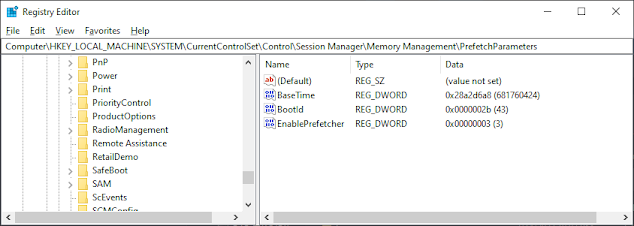
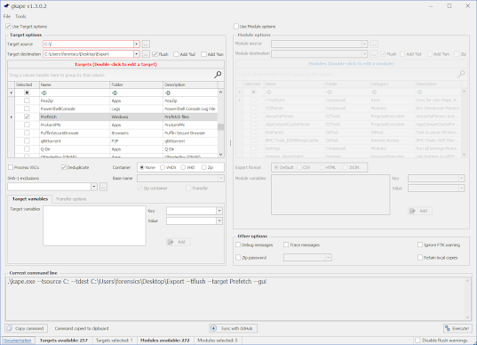
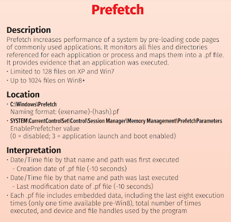

+++
title = "Prefetch"
description = "Complete guide to Windows Prefetch forensics for tracking application execution. Learn prefetch structure, forensic analysis techniques, PECmd usage, and DFIR investigation methods."
keywords = ["Windows Prefetch", "prefetch analysis", "digital forensics", "proof of execution", "POE", "application tracking", "Windows forensics", "DFIR", "PECmd", "forensic artifacts", "execution timeline", "malware analysis", "incident response", "forensic tools"]
date = 2023-01-01
lastmod = 2025-09-30
draft = false
tags = ["4n6", "digital forensics", "windows forensics", "prefetch", "DFIR", "PECmd", "execution tracking", "forensic timeline", "malware analysis", "incident response"]
categories = ["4n6", "Digital Forensics", "Windows Forensics", "DFIR"]
type = "4n6post"
seo_title = "Windows Prefetch Analysis - Digital Forensics Application Tracking Guide"
canonical = "/4n6post/prefetch/"
aliases = ["/4n6post/prefetch/"]
featured_image = "/images/Windows11Explorer.png"
schema_type = "TechArticle"
author = "JonesCKevin"
sitemap_priority = 0.8
sitemap_changefreq = "monthly"
+++

## Windows Prefetch Analysis - Digital Forensics Execution Tracking

Windows Prefetch is a feature in the Windows operating system that was first introduced in Windows XP. It is a built-in tool that helps to speed up the loading of applications and other system processes by analyzing which files and libraries are most frequently used and then pre-loading them into memory. In this blog post, we will explore what Windows Prefetch is, how it works, and provide examples of both normal and malicious use cases.


## How Windows Prefetch Works

Windows Prefetch operates by creating a database of frequently used files and libraries on a user's computer. It collects data on how frequently each file is accessed, how much time it takes to load, and other relevant information. Based on this data, Windows Prefetch creates a "prefetch file" that lists all the files and libraries that are frequently accessed by the user's system. 

When the user boots up their computer, Windows Prefetch uses this file to pre-load all the frequently used files and libraries into memory, so they can be accessed quickly and easily. Windows Prefetch did start in Windows XP which allowed up to 128 prefetch files before it started to recycle. This stayed the same, right up to Windows 7. Once Windows 8 came out and as of current into Windows 11, this has been increased to 1024.

In addition to pre-loading frequently used files, Windows Prefetch also optimizes the order in which these files are loaded. This is done to minimize the amount of time it takes for the user's computer to boot up and for applications to launch. By pre-loading frequently used files and libraries and optimizing their order, Windows Prefetch helps to speed up the overall performance of the user's system.

## Normal Use Case

One of the most significant benefits of Windows Prefetch is that it can significantly speed up the performance of a user's computer. This is especially true for users who frequently use the same applications and files.

Here are a few examples of how Windows Prefetch can be useful in a normal use case:

### Faster Boot Times
Windows Prefetch can significantly reduce the amount of time it takes for a user's computer to boot up. By pre-loading frequently used files and libraries, the user's computer can start up more quickly and be ready for use much faster.

### Quicker Application Launches
When a user launches an application, Windows Prefetch can help to speed up the process by pre-loading the necessary files and libraries into memory. This means that the application will launch more quickly, and the user can get to work faster.

### Better Performance
By pre-loading frequently used files and optimizing their order, Windows Prefetch can help to improve the overall performance of a user's computer. This can result in faster response times, smoother multitasking, and an overall better user experience.

## Malicious Use Case

While Windows Prefetch is a valuable tool that can improve the performance of a user's system, it can also be used for malicious purposes. Here are a few examples of how Windows Prefetch can be abused:

### Malware Persistence
Malware authors can use Windows Prefetch to ensure that their malicious code is loaded into memory whenever the user's computer boots up. This can make it more difficult for antivirus software to detect and remove the malware.

### Information Stealing
Attackers can use Windows Prefetch to gather information about a user's browsing habits, application usage, and other sensitive information. This information can be used for identity theft or other malicious purposes.

### Exploits
Attackers can use Windows Prefetch to optimize the order in which files and libraries are loaded into memory. This can be used to exploit vulnerabilities in the user's system, potentially leading to a full system compromise.

## Accessing/Enabling Pre-Fetch

By default, prefetch is already enabled at a level 3. To access the Prefetch in the Registry, follow the steps below:

1. Press the Windows key + R to open the Run dialog box.
2. Type "regedit" into the Run dialog box and click "OK".

In the Registry Editor, navigate to the following key:

```
HKEY_LOCAL_MACHINE\SYSTEM\CurrentControlSet\Control\Session Manager\Memory Management\PrefetchParameters\EnablePrefetcher
```



### Registry Values

#### BaseTime
- "BaseTime" is a value used by the Windows Prefetch feature to determine the age of a Prefetch file. The BaseTime value is a 64-bit integer that represents the number of 100-nanosecond intervals since January 1, 1601.
- The BaseTime value is stored in the Windows Prefetch file header, along with other metadata about the file, such as the last time the file was accessed, the process that accessed the file, and the file's path and name.
- If the BaseTime value indicates that the Prefetch file is too old, the operating system may choose not to use the Prefetch file and instead load the file directly from disk.

#### BootID
The "BootId" value in the Windows Registry is a 128-bit integer that is generated each time the operating system starts up. The value is used by the Prefetch feature to keep track of which files were loaded during a particular boot session, so that it can optimize the loading of those files during subsequent boot sessions.

#### EnablePrefetcher
In the right-hand pane, you will see a number of values that control how Prefetch operates. The most important value is **"EnablePrefetcher"**. This value determines whether Prefetch is enabled or disabled.

- **Value = 0**: Prefetch is **disabled**.
- **Value = 1**: Prefetch is **enabled for applications only**.
- **Value = 2**: Prefetch is **enabled for boot files and applications**.
- **Value = 3**: Prefetch is **enabled for all files**. *(Default)*

To view the Prefetch files, navigate to the following key:

```
C:\Windows\Prefetch
```

In the right-hand pane, you will see a list of files that have been preloaded by Windows Prefetch. The file names are displayed in hexadecimal format. This Hex value is determined by:

1. The path and filename of the file are converted into a string of Unicode characters.
2. The Unicode string is converted to a hash value using the versioned hash algorithm.
3. The hash value is then converted to a hexadecimal string, which becomes the file's identifier in the Prefetch cache.

It's important to note that modifying the Prefetch data in the Registry can have unintended consequences, and should only be done by advanced users who know what they are doing. Modifying the Prefetch data can potentially cause system instability or other issues.

## Parsing

I will now go through a GUI demo for you for fun. If you prefer CLI, you can use EricZimmerman [PECmd](https://ericzimmerman.github.io/#!index.md) - Prefetch parser via command `PECmd.exe -d <c:\windows\prefetch>`

For this demo I will be using Nirsoft - [winprefetchviewer.exe](https://www.nirsoft.net/utils/win_prefetch_view.html). For an added bonus I used [Kape](https://www.kroll.com/en/insights/publications/cyber/kroll-artifact-parser-extractor-kape) by Kroll to collect the data for you.


*I used the GUI to make a command for myself.*


*Using the command, I gathered the files into my export folder.*


*Here is an image of the exported prefetch*


*Open winprefetchview.exe from the start or where applicable*


*By default this will open your systems Prefetch. Press F9 or go to Options → Advanced Options to select your target Prefetch folder.*


*In this example, you can see I have 3x Instances of Kape type programs. This is because 2x Kape.exe are in different locations, and the Hex Value is calculated from the path.*


*Prefetch will collect the last 8 run times. You can include 9 if you count the Initial Creation Time as first run.*


*In the loaded area at the bottom, you can see what was logged into the prefetch. The highlighted example is showing that it loaded the file PREFETCH.TKAPE which is a support file within the Kape directory. This area can provide you useful files or DLL that was associated for evidence or something or to help track down potentially relevant malicious files or intent.*

## Summary

Windows Prefetch is an essential component of the Windows operating system that helps to improve system performance by preloading frequently used files and applications into memory. It achieves this by analyzing usage patterns and loading the files ahead of time. While Prefetch is primarily used for legitimate purposes, it can also be exploited by malicious actors to gather information about a system or to execute malware.

It's important to note that while Prefetch can be a helpful tool for improving system performance, it can also be a security risk. As a user, it's important to remain vigilant and take necessary precautions to protect your system from malicious activity.

Understanding how Windows Prefetch works and being aware of the potential security risks can help users make informed decisions about how they use their systems and take steps to protect their devices.



[https://www.sans.org/posters/windows-forensic-analysis/](https://www.sans.org/posters/windows-forensic-analysis/)

## Additional Resources

- Prefetch Files in Windows - [https://www.geeksforgeeks.org/prefetch-files-in-windows/](https://www.geeksforgeeks.org/prefetch-files-in-windows/)
- Windows Prefetch File (PF) format - [https://github.com/libyal/libscca/](https://github.com/libyal/libscca/)
- EricZimmerman - [PECmd.exe](https://ericzimmerman.github.io/#!index.md)
