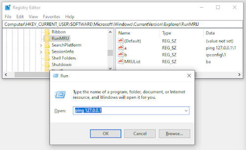
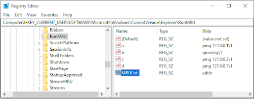

+++
title = "Registry- RunMRU"
date = "2023-01-01"
draft = false
tags = ["forensics", "windows", "registry", "security", "digital-forensics"]
categories = ["Digital Forensics"]
type = "4n6post"
author = "JonesCKevin"
seo_title = "RunMRU Registry Forensics - Windows Run Dialog History Analysis"
description = "Complete guide to RunMRU registry forensic analysis for tracking command execution history. Learn Run dialog artifacts, malware detection techniques, and DFIR investigation methods for Windows forensics."
keywords = ["RunMRU registry", "Run dialog history", "command execution tracking", "Windows forensics", "malware analysis", "digital forensics", "DFIR", "execution artifacts", "Windows Run command", "forensic investigation", "proof of execution", "registry analysis"]
canonical = "/4n6Post/runMRU/"
aliases = ["/4n6Post/runMRU/", "/2023/02/runmru.html"]
featured_image = "/images/RegistryBlock.png"
schema_type = "Article"
+++

## Understanding the RunMRU Registry: Security Implications and Forensic Value

The RunMRU (Most Recently Used) registry is a key component of the Microsoft Windows operating system, storing information about the most recently executed applications and documents. This information is used to populate the "Recent Items" list in the Start menu, as well as for application compatibility purposes.


While the RunMRU registry serves a useful purpose for end users, it also presents a potential security risk if not properly managed. In this blog post, we will discuss the normal use case for the RunMRU registry, as well as several examples of malicious use of the RunMRU registry. We will also provide links to additional resources for further study, including a white paper on the RunMRU registry and a SANS poster with proof of execution.

## Finding the RunMRU Registry

The registry entries within this key contain the full path to the recently executed applications and documents, as well as the order in which they were executed.

```
HKCU\Software\Microsoft\Windows\CurrentVersion\Explorer\RunMRU
```

The RunMRU registry is located in the Windows registry under the key **HKCU\Software\Microsoft\Windows\CurrentVersion\Explorer\RunMRU**. It can be viewed and modified using the Registry Editor (regedit.exe) in Windows.



In the image above, I used `ping 127.0.0.1` in the run box, followed by ipconfig. This gave the order a and then b. You can see the last object called **"MRUList"** with the value of **"ba"**. This will give you the last order of usage of the RunMRU's. In this case, **"b"** was most recently used as it was the second one I executed. In the following image, you can see additional MRUList items for an example.



In order of last executed, you can see that I re-ran **"a"** after I ran **"d"** and the list will only show the last use.

## Normal Use Case

This information is used to populate the "Recent Items" list in the Start menu, making it easy for users to quickly access recently used files. The RunMRU registry is also used for application compatibility purposes, as older applications may not be able to run correctly on modern versions of Windows without the information stored in the RunMRU registry.

## Malicious Use Case

While the RunMRU registry serves a useful purpose for end users, it can also be used by attackers to gain insight into the activities of an infected system. For example, attackers can use the RunMRU registry to determine which applications and documents have been recently executed on a system, potentially exposing sensitive information or identifying targets for further attack.

Additionally, attackers can use the RunMRU registry to persistently execute malicious code on a system. By adding a malicious file to the RunMRU registry, attackers can ensure that their code will be executed every time the system is started. This can be especially dangerous in the case of system-level infections, where the malicious code will run with elevated privileges and have full access to the system.

## Conclusion

The RunMRU registry is an important component of the Microsoft Windows operating system, storing information about the most recently executed applications and documents. While the RunMRU registry serves a useful purpose for end users, it also presents a potential security risk if not properly managed. In this blog post, we have discussed the normal use.

For proof of execution of malicious activity related to the RunMRU registry, we recommend viewing the SANS poster "RunMRU Registry Key: Proof of Execution". This poster can be found at the following link:

<!---->

[https://www.sans.org/posters/windows-forensic-analysis/](https://www.sans.org/posters/windows-forensic-analysis/)
