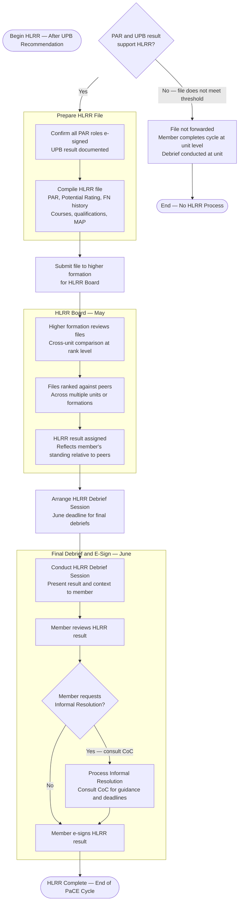

# PaCE — Higher Level Review Ranking (HLRR)

> **Timeline:** May (Board) — June (Final Debriefs and E-Sign)
> Back to [master.md](master.md)

### Key Notes
- **Gateway requirements:** A strong PAR is the entry point. A UPB recommendation is required before a file proceeds to HLRR.
- **Cross-unit comparison:** HLRR ranks members against peers across multiple units or formations — not just within the unit.
- **Timeline:** Boards held in May. All final debriefs and e-signs must be complete by end of June.
- **Consult CoC:** PaCE Managers and CoC provide direction on appropriate HLRR guidance and key deadlines.
- **Informal Resolution:** If the member disputes the result, the Informal Resolution process applies. Consult CoC for deadlines.
