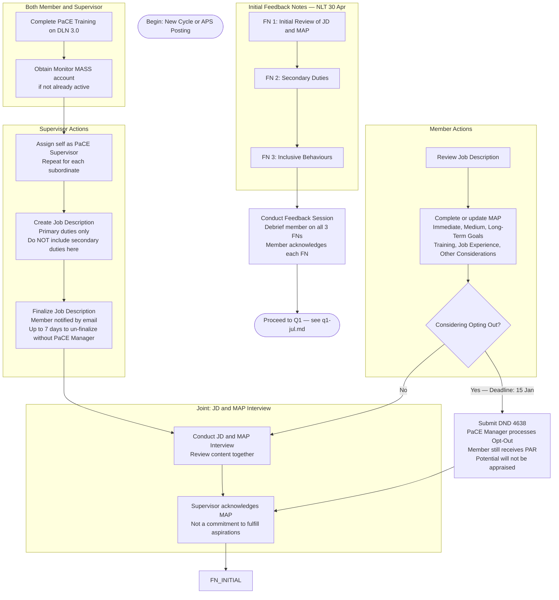

# PaCE — Initial Setup

> **Deadline:** NLT 30 April, or ASAP after APS posting.
> Back to [master.md](master.md)

### Key Notes
- **Posted member:** Losing unit must produce a summary FN and debrief before departure. Member must acknowledge before departure.
- **Gaining unit:** Complete Initial Setup steps ASAP after member arrives.
- **Opt-Out deadline:** DND 4638 must be approved by 15 January.
- **Succession Management:** Only PO2/Sgt and above complete this field in the MAP.
- **Secondary Streams:** Only LCdr/Maj and above complete this section.
- **Career Interests:** Only CPO1/CWO complete this section.
