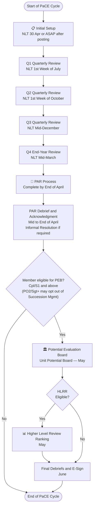

# PaCE Supervisor Workflow — Master Flowchart

> Full annual PaCE cycle overview. Each phase links to a detailed sub-flowchart.

## Supporting References

| Document | Purpose |
|---|---|
| [initial.md](initial.md) | Initial Setup — JD, MAP, 3x FNs |
| [q1-jul.md](q1-jul.md) | Q1 Quarterly Review (NLT 1st Week July) |
| [q2-oct.md](q2-oct.md) | Q2 Quarterly Review (NLT 1st Week October) |
| [q3-dec.md](q3-dec.md) | Q3 Quarterly Review (NLT Mid-December) |
| [q4-mar.md](q4-mar.md) | Q4 End-Year Review (NLT Mid-March) |
| [par.md](par.md) | PAR — Author → IR → RO → PARMON → Debrief |
| [peb.md](peb.md) | Unit Potential Board — May |
| [hlrr.md](hlrr.md) | Higher Level Review Ranking — May/June |
| [potential-appraisal.md](potential-appraisal.md) | How Potential is scored (BI ratings, IBR, 5-point scale) |
