# PaCE — Performance Appraisal Report (PAR) Process

> **Deadline:** Complete by End of April
> Back to [master.md](master.md)

```mermaid
flowchart TD
    START(["Begin PAR Process — After Q4 Review"])

    ROLES_CHECK["Confirm PAR role assignments with PaCE Manager<br/>Author — Reviewing Officer — Signing Authority<br/>Intermediary Reviewer if applicable"]

    ROLES_CHECK --> FN_SUMMARY["Author: Review full year FN summary<br/>Open PAR module in Monitor MASS<br/>Select Author View and Get Data"]

    subgraph AUTHOR_PAR ["Author — Writing the PAR"]
        MEMBER_INFO["Verify member information<br/>Preferred language, conduct, subordinates supervised"]
        COURSES["Record significant courses completed<br/>Unit qualifications and secondary duties"]
        EXPAND["Expand all competency facets<br/>Review each Behavioural Indicator"]
        SCORE["Score each Behavioural Indicator<br/>Ensure scores are supported by FNs"]
        JUSTIFICATION["Write Score Justification and Author comments<br/>Reference specific FNs and observed behaviours"]
        PAR_NOTES["Add PAR Notes for Reviewing Officer<br/>if any context or guidance is needed"]
        MEMBER_INFO --> COURSES --> EXPAND --> SCORE --> JUSTIFICATION --> PAR_NOTES
    end

    FN_SUMMARY --> MEMBER_INFO

    PAR_NOTES --> IR_CHECK{"Intermediary Reviewer<br/>assigned?"}
    IR_CHECK -->|Yes| SEND_IR["Author sends PAR to<br/>Intermediary Reviewer"]
    IR_CHECK -->|No| SEND_RO

    subgraph IR_REVIEW ["Intermediary Reviewer"]
        IR_REVIEW_PAR["IR reviews PAR<br/>Scores, comments, member info accuracy"]
        IR_CHANGES{"Changes<br/>Required?"}
        IR_REVIEW_PAR --> IR_CHANGES
        IR_CHANGES -->|Yes| IR_RETURN["IR returns PAR to Author<br/>with notes"]
        IR_CHANGES -->|No| IR_FORWARD["IR forwards PAR to<br/>Reviewing Officer"]
    end

    SEND_IR --> IR_REVIEW_PAR
    IR_RETURN --> SCORE
    IR_FORWARD --> SEND_RO

    SEND_RO["Author sends PAR to<br/>Reviewing Officer"]

    subgraph RO_REVIEW ["Reviewing Officer"]
        RO_REVIEW_PAR["RO reviews PAR<br/>Accuracy of member info, scores, comments,<br/>language preference, conduct"]
        RO_CHANGES{"Changes<br/>Required?"}
        RO_REVIEW_PAR --> RO_CHANGES
        RO_CHANGES -->|Yes| RO_RETURN["RO returns PAR to Author<br/>with notes in PAR Notes section"]
        RO_CHANGES -->|No| RO_SCORE["RO adds Score Justification<br/>if applicable"]
    end

    SEND_RO --> RO_REVIEW_PAR
    RO_RETURN --> SCORE
    RO_SCORE --> SEND_PARMON["RO sends PAR to<br/>PAR Monitor — PARMON"]

    subgraph PARMON_SA ["PAR Monitor and Signing Authority"]
        PARMON["PARMON administers PAR<br/>Final review and tracking"]
        SA_SIGN["Signing Authority e-signs PAR"]
        PARMON --> SA_SIGN
    end

    SEND_PARMON --> PARMON

    SA_SIGN --> DEBRIEF_PREP["Author arranges Debrief Session<br/>Provide member copy of PAR<br/>Minimum 24 hrs notice, preferably 48 hrs"]

    subgraph DEBRIEF_SESSION ["PAR Debrief and Acknowledgment"]
        DEBRIEF["Conduct PAR Debrief Session<br/>Author or designate presents PAR to member"]
        MBR_REVIEW["Member reviews PAR content"]
        MBR_ACK["Member acknowledges PAR<br/>At Author station or own station"]
        DEBRIEF --> MBR_REVIEW --> MBR_ACK
    end

    DEBRIEF_PREP --> DEBRIEF

    MBR_ACK --> INFORMAL{"Member requests<br/>Informal Resolution?"}
    INFORMAL -->|"Yes — deadline: mid/end April"| IR_PROC["Process Informal Resolution Request<br/>Consult CoC for guidance"]
    INFORMAL -->|No| END

    IR_PROC --> END(["PAR Complete — Return to master.md"])
```

### Key Notes
- **PAR Exemption (PARX):** Contact PaCE Manager if a member requires a PAR exemption (e.g., insufficient time in position).
- **Replacement PAR:** Required after a successful grievance — PaCE Manager initiates.
- **Language:** Confirm PAR is written in the member's preferred language.
- **Informal Resolution:** Deadline is mid to end of April. Consult CoC for appropriate guidance.
- **Strong PAR is the gateway** to Potential Appraisal (PEB/UPB) and HLRR consideration.
