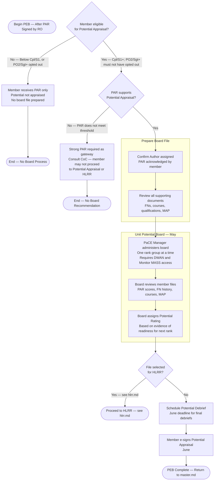

# PaCE — Potential Evaluation Board (PEB) / Unit Potential Board (UPB)

> **Timeline:** May
> Back to [master.md](master.md)
> How Potential is **scored** in PaCE → [potential-appraisal.md](potential-appraisal.md)
> Applies to: **Cpl/S1 and above** (all qualifying PAR recipients). Only **PO2/Sgt and above** may opt out of Succession Management via DND 4638.

### Key Notes
- **Eligibility:** Cpl/S1 and above (all qualifying PAR recipients). Only PO2/Sgt and above may opt out of Succession Management via DND 4638 — Cpl/S1 and MCpl/MS are included automatically.
- **Gateway requirement:** A strong PAR is required before a member's file can be forwarded for Potential Appraisal.
- **Board rooms:** UPBs require access to DWAN and Monitor MASS.
- **One rank at a time:** Boards are held per rank group — not all members at once.
- **Timeline:** UPBs are held in May. Final debriefs and e-signs complete by end of June.
- **PaCE Manager role:** The PaCE Manager administers the board and manages file access.
