# PaCE — Potential Appraisal Process (PO2/Sgt and Above)

> **Who this applies to:** PO2/Sgt, WO/PO1, MWO/CPO2, CWO/CPO1, and all Officers who have **not** opted out of Succession Management in their MAP.
> **Timeline:** Feeding into PEB/UPB (May) and HLRR (May–June)
> Back to [master.md](master.md) | See also [peb.md](peb.md)

---

## What is Potential Appraisal?

The **Potential Appraisal** is a separate and distinct component from the Performance Appraisal (PAR). It assesses whether a member shows the capacity to perform effectively at the **next rank level**. It is:
- **Not** based on how well they do their current job alone.
- **Not** automatic — it requires a strong PAR as a gateway.
- **Optional** — members PO2/Sgt and above can opt out via DND 4638 (deadline: 15 Jan).

The Potential score and the Inclusive Behaviours Rating (IBR) are **automatically generated** by the PaCE system based on the BI scores the supervisor enters. They are not manually input by the supervisor.

---

## How Potential is Scored in PaCE

```mermaid
flowchart TD
    START(["Begin Potential Appraisal Scoring"])

    CONFIRM_ELIG{"Member PO2/Sgt or above<br/>AND opted in to<br/>Succession Management in MAP?"}
    CONFIRM_ELIG -->|No| NOT_APPLICABLE["Potential Appraisal does not apply<br/>PAR only — skip this chart"]
    CONFIRM_ELIG -->|Yes| OPEN_PAR

    NOT_APPLICABLE --> END_NA(["End"])

    OPEN_PAR["Open PAR in Monitor MASS<br/>Select member from Author View"]

    subgraph SCORE_BIS ["Step 1: Score All Behavioural Indicators (BIs)"]
        EXPAND_ALL["Click 'Expand All' in competency section<br/>View all facets and BIs for the member's rank"]
        SCORE_EACH["Score each BI on the 5-point scale:<br/>1 = Ineffective<br/>2 = Partially Effective<br/>3 = Effective (meets standard)<br/>4 = Above Effective<br/>5 = Extremely Effective"]
        BI_GUIDANCE["Refer to rank-specific competency standards<br/>for guidance on what each score means<br/>→ See competency-standards/ folder"]
        EXPAND_ALL --> SCORE_EACH --> BI_GUIDANCE
    end

    OPEN_PAR --> EXPAND_ALL

    BI_GUIDANCE --> AUTO_CALC

    subgraph AUTO_CALC ["Step 2: Automatic System Calculations"]
        PERF_BRACKET["System calculates Performance Bracket<br/>Based on aggregated BI scores<br/>across all competencies"]
        IBR_CALC["System auto-generates Inclusive Behaviours Rating (IBR)<br/>Based on scores for the ~14 IBR-mapped competencies<br/>Green = Strong | Neutral | Red = Needs Attention<br/>IBR does not contribute to performance bracket"]
        POT_CALC["System calculates Potential Score<br/>Based on scores for BIs that reflect<br/>next-rank capability indicators"]
        PERF_BRACKET --> IBR_CALC --> POT_CALC
    end

    subgraph SCORE_JUST ["Step 3: Score Justification and Comments"]
        WRITE_JUST["Author writes Score Justification<br/>Must support scores with specific FN references<br/>and observed behaviours"]
        RO_JUST["Reviewing Officer reviews and may add<br/>their own Score Justification"]
        WRITE_JUST --> RO_JUST
    end

    POT_CALC --> WRITE_JUST

    RO_JUST --> SEND_PARMON["Send PAR to PAR Monitor (PARMON)<br/>Signing Authority e-signs"]

    subgraph UPB_INPUT ["Step 4: Unit Potential Board Input"]
        BOARD_INPUT["PEB/UPB reviews Potential Score alongside:<br/>• PAR performance bracket result<br/>• FN history and quality<br/>• Courses and qualifications<br/>• MAP career aspirations<br/>• IBR result"]
        GATE_CHECK{"Performance bracket<br/>meets minimum threshold<br/>for Potential consideration?"}
        BOARD_INPUT --> GATE_CHECK
        GATE_CHECK -->|No| NO_POT["Potential Appraisal not forwarded<br/>Member debriefed at unit level"]
        GATE_CHECK -->|Yes| POT_RATING["Board assigns/confirms Potential Rating<br/>and supporting narrative"]
    end

    SEND_PARMON --> BOARD_INPUT

    POT_RATING --> HLRR_ROUTE{"File recommended<br/>for HLRR?"}
    HLRR_ROUTE -->|No| DEBRIEF_UNIT["Conduct Potential Debrief at unit<br/>June — member e-signs"]
    HLRR_ROUTE -->|Yes| HLRR_FWD["Forward to HLRR Board<br/>→ See hlrr.md"]

    NO_POT --> DEBRIEF_UNIT
    DEBRIEF_UNIT --> END(["Potential Appraisal Complete"])
    HLRR_FWD --> END
```

---

## 5-Point BI Rating Scale — Supervisor Reference

Use this scale when scoring each Behavioural Indicator in PaCE for your member's rank:

| Score | Label | What it means |
|---|---|---|
| **1** | **Ineffective** | Member does not demonstrate this behaviour. The gap is evident and requires immediate intervention or remediation. |
| **2** | **Partially Effective** | Member demonstrates this behaviour inconsistently. It appears in some situations but not reliably. Coaching required. |
| **3** | **Effective** | Member consistently demonstrates the BI as written for their rank. This is the expected standard — meeting it is not exceptional. |
| **4** | **Above Effective** | Member consistently meets the BI and regularly demonstrates initiative, depth, or skill clearly beyond the minimum standard. Occasionally shows behaviours expected at the next rank. |
| **5** | **Extremely Effective** | Member routinely demonstrates behaviours expected at the **next rank level**. Serves as a role model. Rare — reserve for truly outstanding performance. |

> **Important:** A score of **3 is the standard**. Supervisors should resist pressure to inflate scores. Honest scoring is the foundation of accurate Potential Appraisal. The system relies on score distribution to identify high-potential members — inflated scoring makes Potential data meaningless.

---

## Inclusive Behaviours Rating (IBR) — How it Works

The IBR is automatically generated by PaCE based on the BI scores for the approximately **14 competencies** where inclusive behaviour indicators are embedded. The supervisor does not manually set the IBR.

| IBR Result | Meaning |
|---|---|
| **Green** | Member's scored BIs across inclusive behaviour-mapped competencies indicate consistently inclusive performance |
| **No colour (neutral)** | Performance on inclusive behaviour indicators is mixed |
| **Red** | Scores on inclusive behaviour-mapped BIs indicate the member's inclusive behaviours need attention |

The IBR does **not** affect the performance bracket or potential score. It is a separate feedback mechanism used during debrief sessions.

---

## Key Reminders for Supervisors

- **Score based on evidence.** Every score should be traceable to a Feedback Note or documented observation.
- **A score of 3 is correct for most members most of the time.** 4s and 5s should be earned, not given.
- **The IBR is automatic** — you cannot manually override it. If the IBR comes back Red, review your BI scores for the relevant competencies and ensure they reflect what you actually observed.
- **Potential ≠ Performance.** A member can be highly effective in their current role (strong PAR) but not yet ready for the next rank. Both assessments should reflect honest observations.
- **The member must be debriefed** on both their Performance Appraisal and Potential Appraisal (if applicable) before they e-sign.
