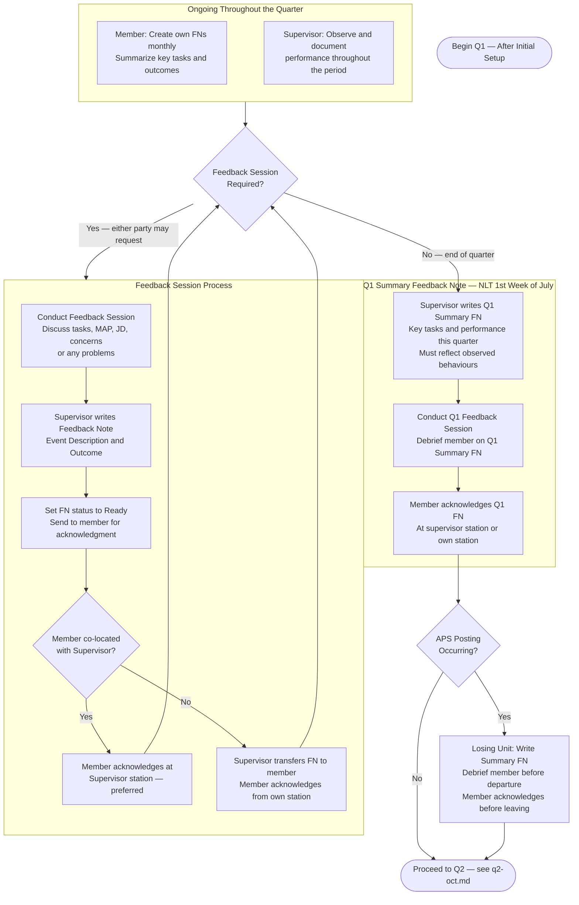

# PaCE — Q1 Quarterly Review (April to July)

> **Deadline:** NLT 1st Week of July
> Back to [master.md](master.md)

### Q1 Context (April – July)
- First regular FN quarter following Initial Setup.
- Confirm the JD and MAP reflect the member's actual duties after settling into the cycle.
- Address any early performance trends — positive, corrective, or developmental — before they become entrenched.
- Remind member to review competencies associated with their rank.
