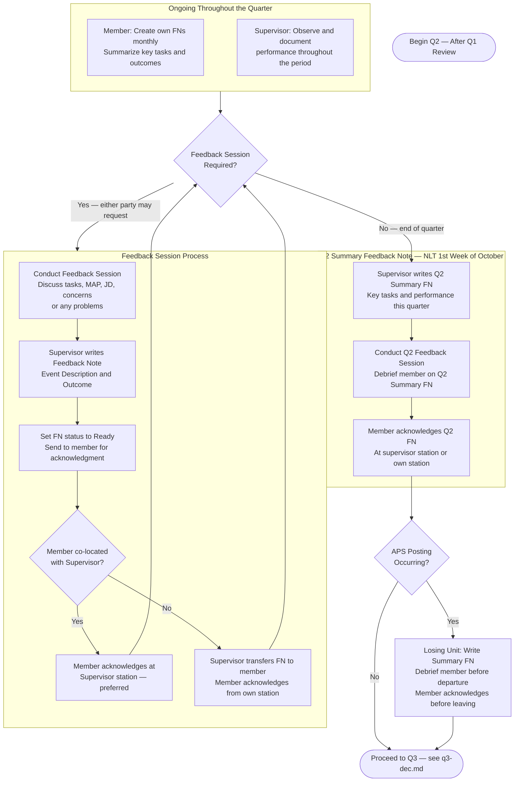

# PaCE — Q2 Quarterly Review (July to October)

> **Deadline:** NLT 1st Week of October
> Back to [master.md](master.md)

### Q2 Context (July – October)
- Mid-year review — a good checkpoint to evaluate whether the JD still reflects current duties.
- Discuss whether the member's MAP goals remain realistic and relevant.
- If the member is considering Opting Out, this is a good time to discuss ramifications before the 15 January deadline.
- Address any significant events, courses, or qualifications completed this quarter.
