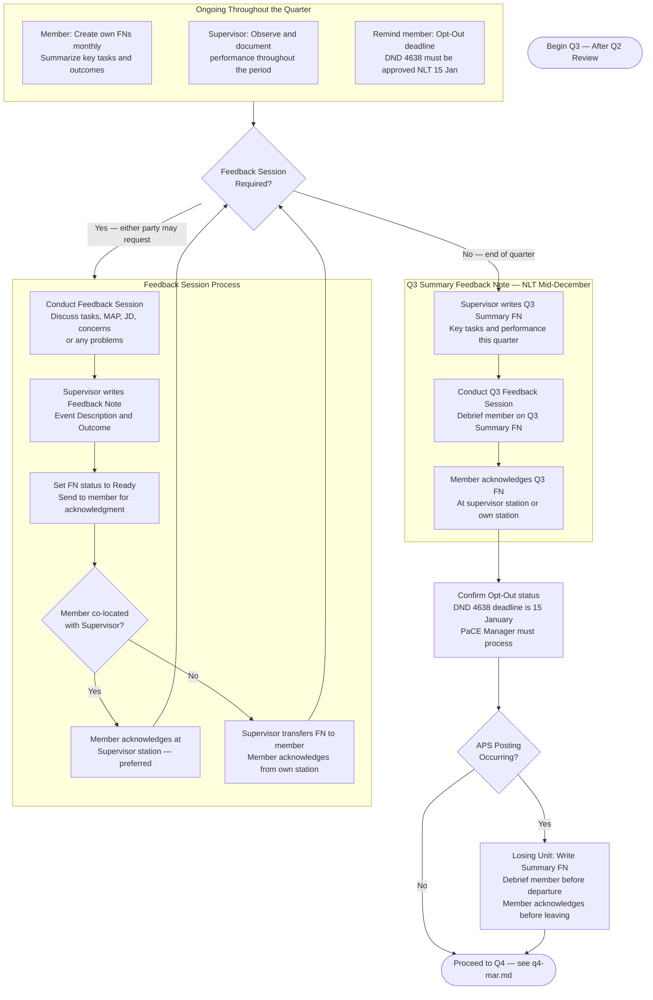

# PaCE — Q3 Quarterly Review (October to December)

> **Deadline:** NLT Mid-December
> Back to [master.md](master.md)

### Q3 Context (October – December)
- The Opt-Out deadline (15 Jan) is approaching — confirm the member's decision and process DND 4638 if applicable.
- Begin reviewing the member's cumulative FN record in preparation for the upcoming year-end PAR.
- Ensure all significant events, courses, and qualifications from this period are captured in FNs while details are fresh.
- Consider whether any additional FNs are needed before year-end to accurately reflect performance.
