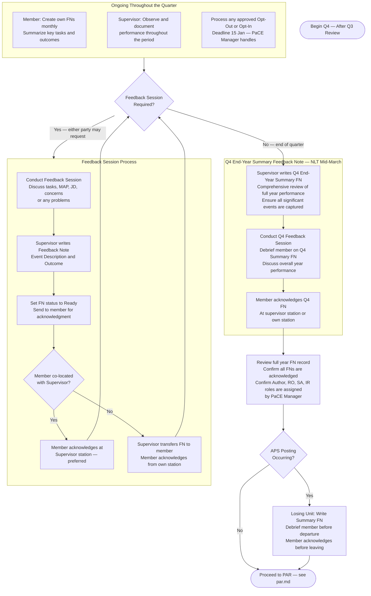

# PaCE — Q4 End-Year Review (December to March)

> **Deadline:** NLT Mid-March
> Back to [master.md](master.md)

### Q4 Context (December – March)
- This is the end-year quarter. The Q4 FN should reflect the full year's performance, not just this quarter.
- Confirm all PaCE roles are assigned (Author, Reviewing Officer, Signing Authority, Intermediary Reviewer if required) — contact PaCE Manager to assign or correct.
- Ensure the member's cumulative FN record is complete before the PAR is written.
- This is the last opportunity to capture any significant events in writing before the PAR cycle begins.
