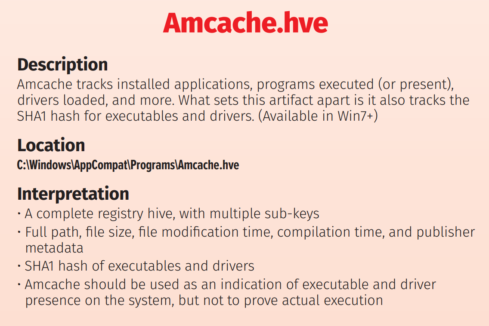

+++
title = "Amcache.hve"
date = "2024-10-01"
draft = false
tags = ["registry", "4n6", "digital forensics", "windows forensics"]
categories = ["4n6", "Digital Forensics"]
type = "Artifacts"
author = "JonesCKevin"
seo_title = "Amcache.hve Analysis - Windows Application Execution Forensics Guide"
description = "Complete guide to Amcache.hve forensic analysis for tracking application execution. Learn file locations, registry keys, AmcacheParser tool usage, and DFIR investigation techniques."
keywords = ["Amcache.hve", "Amcache forensics", "application execution tracking", "Windows forensics", "AmcacheParser", "digital forensics", "DFIR", "forensic artifacts", "program execution", "Windows registry", "malware analysis", "incident response", "execution timeline"]
canonical = "/artifacts/Amcache.hve/"
aliases = ["/artifacts/Amcache.hve/", "/2023/02/amcachehve.html"]
featured_image = "/images/featured/SHIMCache-Logo.png"
schema_type = "Article"
sitemap_priority = 0.7
+++

Amcache.hve is a forensic artifact that can be used to uncover valuable information about a computer system, both in normal and malicious use cases. The Amcache.hve file is a hive file that is located in the Windows operating system, and it provides a wealth of information about the software and files that have been executed on the system.

In normal use cases, the Amcache.hve file can be used to track software installations and updates, as well as to determine which files were recently executed on the system. This information can be useful for system administrators and other IT professionals who need to manage and maintain their computer systems.

In malicious use cases, the Amcache.hve file can be used to uncover evidence of malware infections, as well as to track the execution of malicious files. For example, the Amcache.hve file can be used to determine which malicious files were executed on a system, and which files were used to carry out the attack. This information can be critical in identifying the source of an attack, as well as in tracking down the attackers themselves.

The Amcache.hve file can be found in the file system at the following location: %SystemRoot%\AppCompat\Programs\Amcache.hve. 

Additionally, the Amcache.hve information can be found within the registry, under the following key:

Computer\HKEY_LOCAL_MACHINE\SYSTEM\CurrentControlSet\Control\Session Manager\AppCompatCache\
You can manually go through this data for dates and programs or use a program to  parse the data. See the ping as the photo bellow as an example. Doing this manually will be extremely tedious.

which can be parsed with either:

Mandiant. - ShimCacheParser

EricZimmerman - AmcacheParser

 

AmcacheParser.exe -f Amcache.hve --csv C:\Users\<USER>\Desktop\KAPE\Export --csvf amcache.csv

Using Timeline Explorer, to view the Shortcuts, you can see the App and ID, the path and last time the program was written/referenced.

The SANS Institute has published a white paper on the Amcache.hve file, which can be found here: https://digital-forensics.sans.org/media/Amcache_Whitepaper.pdf. The white paper provides a comprehensive overview of the Amcache.hve file and its uses in forensic investigations.

In conclusion, the Amcache.hve file is a valuable forensic artifact that can provide valuable information about a computer system, both in normal and malicious use cases. Whether you are a system administrator or a forensic investigator, the Amcache.hve file is a valuable resource that should be included in your toolkit. To learn more about the Amcache.hve file and its uses, be sure to read the white paper and the SANS poster linked above.

https://www.sans.org/posters/windows-forensic-analysis/