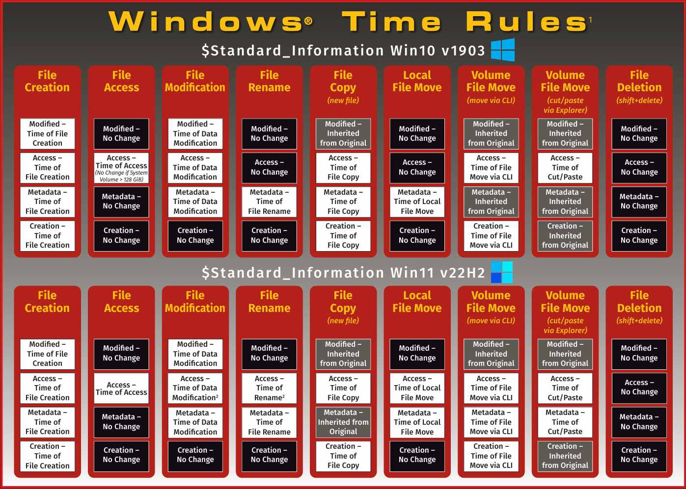
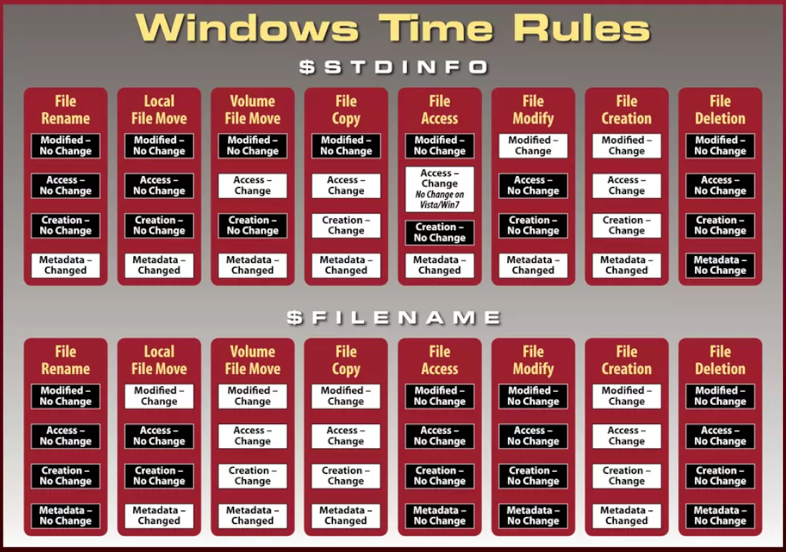

<style>
/* Modern table styling */
table {
  width: auto!important;
  max-width: 100%!important;
  margin-bottom: 1.5em!important;
}

.macb-wrapper {
  display: flex!important;
  justify-content: center!important;
  margin: 0.5em 0!important;
}

.macb-wrapper table {
  border-collapse: collapse!important;
  border-spacing: 0!important;
  box-shadow: 0 2px 8px rgba(0,0,0,0.1)!important;
  border-radius: 8px!important;
  overflow: hidden!important;
  font-size: 0.75em!important;
}

.macb-wrapper th {
  background: linear-gradient(135deg, #667eea 0%, #764ba2 100%)!important;
  color: #ffffff!important;
  padding: 14px 18px!important;
  text-align: center!important;
  font-weight: 700!important;
  font-size: 0.95em!important;
  letter-spacing: 0.5px!important;
  text-transform: uppercase!important;
  border-bottom: 3px solid #5a67d8!important;
  border-right: 1px solid rgba(255,255,255,0.1)!important;
  position: relative!important  ;
}

.macb-wrapper th:last-child {
  border-right: none!important;
}

.macb-wrapper th::after {
  content: '';
  position: absolute!important;
  bottom: 0!important;
  left: 0!important;
  right: 0!important;
  height: 2px!important;
  background: linear-gradient(90deg, transparent, rgba(255,255,255,0.3), transparent)!!important;
}

.macb-wrapper td {
  padding: 10px 16px!important;
  border-bottom: 1px solid #e0e0e0!important;
  line-height: 1!important;
}

.macb-wrapper tr:last-child td {
  border-bottom: none!important;
}

.macb-wrapper tr:hover {
  background-color: rgba(52, 152, 219, 0.05)!important;
}

.macb-wrapper tbody tr:nth-child(even) {
  background-color: rgba(0,0,0,0.02)!important;
}

/* MACB color indicators */
.m-green { color: #2ecc71; font-weight: 700!important; }
.m-yellow { color: #f39c12; font-weight: 700!important; }
.m-gray { color: #95a5a6; font-weight: 500!important; }
.m-purple { color: #9b59b6; font-weight: 700!important; }
.m-updated { color: #2ecc71; font-weight: 700!important; }
.m-inherited { color: #f39c12; font-weight: 700!important; }
.m-unchanged { color: #95a5a6; font-weight: 500!important; }
.m-varies { color: #9b59b6; font-weight: 700!important; }
</style>


# MACB Forensic Timestamp Reference

I put together a nice little post here detailing the behavior of MACB timestamps (Modified, Accessed, Changed, Birth) across various filesystems and common file operations. This is a great reference for digital forensics practitioners conducting timeline analysis.
I focused on Windows NTFS, FAT32/exFAT, Linux ext4/XFS, and macOS APFS since these are the most common filesystems encountered in investigations for 2025.

Hopefully I got everything correct, but if you spot any mistakes or have additional info, please reach out! Especially if you have a good Table design. I am always unsure if I like the table designs for some reason.

## Legend

### MACB Attributes

<div class="macb-wrapper">

| Attr | Name | Desc |
|:-:|------|-------------|
| <span class="m-green">M</span> | Modified | Content last changed |
| <span class="m-green">A</span> | Accessed | Last opened/read |
| <span class="m-green">C</span> | Changed | Metadata/inode changed (POSIX) or MFT record changed (NTFS) |
| <span class="m-green">B</span> | Birth | File creation time |

</div>

### Color Key

<div class="macb-wrapper">

| Indicator | Meaning | Forensic Significance |
|-----------|---------|----------------------|
| <span class="m-green">M</span> Green | Updated | Operation timestamp marker |
| <span class="m-yellow">M</span> Yellow | Inherited/preserved from source | Indicates copy with preservation |
| <span class="m-gray">M</span> Gray | Unchanged | Same-volume moves; original times retained |
| <span class="m-purple">M</span> Purple | Varies by policy/tool | Depends on registry, mount options, or flags |
| **--** Hyphen | Not supported/Not applicable | Filesystem limitation (e.g., no atime on APFS, no btime on XFS) |

</div>

---

## Windows NTFS

> **⚠️ Forensic Alert**  
> NTFS stores two sets of timestamps. `$SI` is user-modifiable; `$FN` requires kernel access. Compare both to detect timestomping!

### Timestamp Behavior (Separate $SI and $FN)

<div class="macb-wrapper">

| Operation | $SI M | $SI A | $SI C | $SI B | $FN M | $FN A | $FN C | $FN B | Notes |
|-----------|:-----:|:-----:|:-----:|:-----:|:-----:|:-----:|:-----:|:-----:|-------|
| Create new file | <span class="m-updated">M</span> | <span class="m-updated">A</span> | <span class="m-updated">C</span> | <span class="m-updated">B</span> | <span class="m-updated">M</span> | -- | <span class="m-updated">C</span> | <span class="m-updated">B</span> | Both sets initialized; $FN A not maintained |
| Modify content (write) | <span class="m-updated">M</span> | <span class="m-varies">A</span> | <span class="m-updated">C</span> | <span class="m-unchanged">B</span> | <span class="m-unchanged">M</span> | -- | <span class="m-unchanged">C</span> | <span class="m-unchanged">B</span> | $FN unchanged on content-only edits. Atime varies by policy. |
| Read/open (no write) | <span class="m-unchanged">M</span> | <span class="m-varies">A</span> | <span class="m-unchanged">C</span> | <span class="m-unchanged">B</span> | <span class="m-unchanged">M</span> | -- | <span class="m-unchanged">C</span> | <span class="m-unchanged">B</span> | LastAccess disabled by default since Vista |
| Rename / Move (same volume) | <span class="m-unchanged">M</span> | <span class="m-unchanged">A</span> | <span class="m-unchanged">C</span> | <span class="m-unchanged">B</span> | <span class="m-updated">M</span> | -- | <span class="m-updated">C</span> | <span class="m-unchanged">B</span> | Key forensic indicator: $FN updates but $SI doesn't |
| Move (cross-volume) | <span class="m-inherited">M</span> | <span class="m-varies">A</span> | <span class="m-updated">C</span> | <span class="m-updated">B</span> | <span class="m-updated">M</span> | -- | <span class="m-updated">C</span> | <span class="m-updated">B</span> | Effectively copy+delete. New MFT entry. |
| Copy (same or cross volume) | <span class="m-inherited">M</span> | <span class="m-varies">A</span> | <span class="m-updated">C</span> | <span class="m-updated">B</span> | <span class="m-updated">M</span> | -- | <span class="m-updated">C</span> | <span class="m-updated">B</span> | New file created. Explorer preserves M. |
| Change attributes/ACL | <span class="m-unchanged">M</span> | <span class="m-unchanged">A</span> | <span class="m-updated">C</span> | <span class="m-unchanged">B</span> | <span class="m-unchanged">M</span> | -- | <span class="m-unchanged">C</span> | <span class="m-unchanged">B</span> | Metadata-only change updates $SI C |
| Set times via API (SetFileTime) | <span class="m-varies">M</span> | <span class="m-varies">A</span> | <span class="m-updated">C</span> | <span class="m-varies">B</span> | <span class="m-unchanged">M</span> | -- | <span class="m-unchanged">C</span> | <span class="m-unchanged">B</span> | **Timestomping indicator:** $SI set to arbitrary values; $FN unchanged |

</div>

**Legend:** <span class="m-updated">G</span> = Updated | <span class="m-inherited">Y</span> = Inherited/preserved | <span class="m-varies">P</span> = Varies | <span class="m-unchanged">Gray</span> = Unchanged | -- = Not supported

---

1. One method to set time via API is using PowerShell:
```powershell
$path = "C:\path\to\file.txt"
$creationTime = Get-Date "2023-01-01 12:00:00"
$lastAccessTime = Get-Date "2023-01-02 12:00:00"
$lastWriteTime = Get-Date "2023-01-03 12:00:00"
[System.IO.File]::SetCreationTime($path, $creationTime)
[System.IO.File]::SetLastAccessTime($path, $lastAccessTime)
[System.IO.File]::SetLastWriteTime($path, $lastWriteTime)
```
2. A second method is using the `SetFileTime` function in C/C++:

```c
#include <windows.h>
#include <stdio.h>
void SetFileTimes(const char* filePath, FILETIME* creationTime, FILETIME* lastAccessTime, FILETIME* lastWriteTime) {
    HANDLE hFile = CreateFileA(filePath, GENERIC_WRITE, 0, NULL, OPEN_EXISTING, FILE_ATTRIBUTE_NORMAL, NULL);
    if (hFile == INVALID_HANDLE_VALUE) {
        printf("Error opening file: %d\n", GetLastError());
        return;
    }
    if (!SetFileTime(hFile, creationTime, lastAccessTime, lastWriteTime)) {
        printf("Error setting file times: %d\n", GetLastError());
    }
    CloseHandle(hFile);
}
```

---


> **💡 Detection Tip:** If `$SI B` > `$FN B`, suspect timestomping--attackers can modify `$SI` but rarely touch `$FN`.

---

## Windows FAT32 / exFAT

**Resolution:** FAT32: M ~2s, B ~10ms, A = date only | exFAT: All ~10ms

<div class="macb-wrapper">

| Operation | M | A | C | B | Notes |
|-----------|:-:|:-:|:-:|:-:|-------|
| Create new | <span class="m-updated">M</span> | <span class="m-updated">A</span> | -- | <span class="m-updated">B</span> | A = date-only on FAT32; full time on exFAT |
| Modify content | <span class="m-updated">M</span> | <span class="m-varies">A</span> | -- | <span class="m-unchanged">B</span> | B unchanged; A may update |
| Read/open | <span class="m-unchanged">M</span> | <span class="m-varies">A</span> | -- | <span class="m-unchanged">B</span> | Some tools suppress A updates |
| Rename/Move (same volume) | <span class="m-unchanged">M</span> | <span class="m-unchanged">A</span> | -- | <span class="m-unchanged">B</span> | Directory entry updated only |
| Copy (same or cross volume) | <span class="m-inherited">M</span> | <span class="m-updated">A</span> | -- | <span class="m-updated">B</span> | M preserved; B set to now |
| Move (cross volume) | <span class="m-inherited">M</span> | <span class="m-updated">A</span> | -- | <span class="m-updated">B</span> | Copy+delete semantics |

</div>

**Legend:** <span class="m-updated">G</span> = Updated | <span class="m-inherited">Y</span> = Inherited/preserved | <span class="m-varies">P</span> = Varies | <span class="m-unchanged">Gray</span> = Unchanged | -- = Not supported

> **💡 USB Forensics:** FAT32/exFAT timestamps are local time, not UTC--account for timezone when correlating!

---

## Linux ext4

<div class="macb-wrapper">

| Operation | M | A | C | B | Notes |
|-----------|:-:|:-:|:-:|:-:|-------|
| Create new | <span class="m-updated">M</span> | <span class="m-updated">A</span> | <span class="m-updated">C</span> | <span class="m-updated">B</span> | All four timestamps initialized |
| Modify content | <span class="m-updated">M</span> | <span class="m-varies">A</span> | <span class="m-updated">C</span> | <span class="m-unchanged">B</span> | relatime: A updates if M newer or 24h passed |
| Read/open | <span class="m-unchanged">M</span> | <span class="m-varies">A</span> | <span class="m-unchanged">C</span> | <span class="m-unchanged">B</span> | relatime throttles; noatime disables |
| Rename/Move (same fs) | <span class="m-unchanged">M</span> | <span class="m-unchanged">A</span> | <span class="m-updated">C</span> | <span class="m-unchanged">B</span> | Inode metadata change updates C |
| Copy (cp default) | <span class="m-updated">M</span> | <span class="m-updated">A</span> | <span class="m-updated">C</span> | <span class="m-updated">B</span> | New inode; all timestamps = now |
| Move (cross fs) | <span class="m-inherited">M</span> | <span class="m-updated">A</span> | <span class="m-updated">C</span> | <span class="m-updated">B</span> | mv preserves M from source |
| chmod/chown/xattr | <span class="m-unchanged">M</span> | <span class="m-unchanged">A</span> | <span class="m-updated">C</span> | <span class="m-unchanged">B</span> | Metadata-only operations update C |

</div>

**Legend:** <span class="m-updated">G</span> = Updated | <span class="m-inherited">Y</span> = Inherited/preserved | <span class="m-varies">P</span> = Varies | <span class="m-unchanged">Gray</span> = Unchanged

> **💡 Note:** C (ctime) cannot be set by user-space tools. This is useful for detecting evidence tampering.

---

## Linux XFS

<div class="macb-wrapper">

| Operation | M | A | C | B | Notes |
|-----------|:-:|:-:|:-:|:-:|-------|
| Create new | <span class="m-updated">M</span> | <span class="m-updated">A</span> | <span class="m-updated">C</span> | -- | No birth time stored in XFS |
| Modify content | <span class="m-updated">M</span> | <span class="m-varies">A</span> | <span class="m-updated">C</span> | -- | relatime behavior same as ext4 |
| Read/open | <span class="m-unchanged">M</span> | <span class="m-varies">A</span> | <span class="m-unchanged">C</span> | -- | A updates per mount options |
| Rename/Move (same fs) | <span class="m-unchanged">M</span> | <span class="m-unchanged">A</span> | <span class="m-updated">C</span> | -- | Directory link change updates C |
| Copy (cp default) | <span class="m-updated">M</span> | <span class="m-updated">A</span> | <span class="m-updated">C</span> | -- | New inode; M/A/C = now |
| Move (cross fs) | <span class="m-inherited">M</span> | <span class="m-updated">A</span> | <span class="m-updated">C</span> | -- | mv preserves M; new inode |
| chmod/chown/xattr | <span class="m-unchanged">M</span> | <span class="m-unchanged">A</span> | <span class="m-updated">C</span> | -- | Metadata changes always update C |

</div>

**Legend:** <span class="m-updated">G</span> = Updated | <span class="m-inherited">Y</span> = Inherited/preserved | <span class="m-varies">P</span> = Varies | <span class="m-unchanged">Gray</span> = Unchanged | -- = Not supported

> **⚠️ Limitation:** XFS does not support birth time--B column always N/A.

---

## macOS APFS

<div class="macb-wrapper">

| Operation | M | A | C | B | Notes |
|-----------|:-:|:-:|:-:|:-:|-------|
| Create new | <span class="m-updated">M</span> | -- | <span class="m-updated">C</span> | <span class="m-updated">B</span> | APFS does not maintain atime |
| Modify content | <span class="m-updated">M</span> | -- | <span class="m-updated">C</span> | <span class="m-unchanged">B</span> | Data + metadata change |
| Read/open | <span class="m-unchanged">M</span> | -- | <span class="m-unchanged">C</span> | <span class="m-unchanged">B</span> | No timestamp updates on read |
| Rename/Move (same volume) | <span class="m-unchanged">M</span> | -- | <span class="m-updated">C</span> | <span class="m-unchanged">B</span> | Metadata change updates C only |
| Copy (Finder/cp) | <span class="m-inherited">M</span> | -- | <span class="m-updated">C</span> | <span class="m-updated">B</span> | Finder preserves M; B = copy time |
| Move (cross volume) | <span class="m-inherited">M</span> | -- | <span class="m-updated">C</span> | <span class="m-updated">B</span> | Copy+delete; M preserved, new B |
| chmod/chown/xattr | <span class="m-unchanged">M</span> | -- | <span class="m-updated">C</span> | <span class="m-unchanged">B</span> | Metadata-only updates C |

</div>

**Legend:** <span class="m-updated">G</span> = Updated | <span class="m-inherited">Y</span> = Inherited/preserved | <span class="m-varies">P</span> = Varies | <span class="m-unchanged">Gray</span> = Unchanged | -- = Not supported

> **💡 Forensic Note:** APFS lack of atime means file access patterns cannot be tracked via timestamps.

---

## Windows NTFS: File Tunneling

> **⚠️ Forensic Alert:** Tunneling can cause misleading timestamps in investigations!

NTFS maintains a "tunnel cache" that preserves metadata from deleted/renamed files. When a new file is created with the same name in the same directory within the tunnel window, it inherits the previous file's **Created (B)** timestamp and short 8.3 filename.

> The 8.3 filename for some who may not know is a legacy DOS-compatible short filename format (e.g., `FILE~1.TXT`). The character limit is 8 characters for the name and 3 for the extension. This was used in older Windows versions and applications that required short filenames.

### How It Works
- **Trigger:** Delete or rename a file, then create a new file with the original name in the same directory.
- **Window:** Default ~15 seconds (configurable). The cache is keyed by directory + long filename.
- **Effect:** New file's `$SI` B (Created) timestamp is set to the deleted file's B, not the actual creation time.
- **Short name:** The 8.3 short filename is also inherited from the tunnel cache.

### Registry Controls
Location: `HKLM\SYSTEM\CurrentControlSet\Control\FileSystem`

<div class="macb-wrapper">

| Value Name | Type | Default | Description |
|------------|------|---------|-------------|
| `MaximumTunnelEntries` | DWORD | 1024 | Max entries in tunnel cache. Set to 0 to disable. |
| `MaximumTunnelEntryAgeInSeconds` | DWORD | 15 | Seconds before tunnel entry expires. |

</div>

### Forensic Implications
- **False timeline:** A malicious file created today may show a B timestamp from weeks ago if it replaced a legitimate file quickly.
- **Detection:** Compare `$SI` B vs `$FN` B. If `$FN` B is recent but `$SI` B is old, tunneling may have occurred.
- **MFT analysis:** The MFT entry sequence number and `$LogFile` can reveal the true creation time.
- **Common scenario:** "Save As" operations that overwrite, or malware replacing system files.

> **💡 Tip:** When `$SI` B predates `$FN` B by more than 15 seconds, tunneling is unlikely--investigate for timestomping instead.

---

## CLI Tool Timestamp Behavior

Default behavior (no flags). See tunneling section for NTFS cross-references.

### Windows CLI Tools (NTFS)

<div class="macb-wrapper">

| Tool | Type | $SI M | $SI A | $SI C | $SI B | $FN M | $FN A | $FN C | $FN B | Notes |
|------|-----------|-------|-------|-------|-------|-------|-------|-------|-------|-------|
| `copy` | Same vol | <span class="m-inherited">M</span> | <span class="m-updated">A</span> | <span class="m-updated">C</span> | <span class="m-updated">B</span> | <span class="m-updated">M</span> | -- | <span class="m-updated">C</span> | <span class="m-updated">B</span> | M preserved; new B. ⚠️ Tunneling possible |
| | Cross volume | <span class="m-inherited">M</span> | <span class="m-updated">A</span> | <span class="m-updated">C</span> | <span class="m-updated">B</span> | <span class="m-updated">M</span> | -- | <span class="m-updated">C</span> | <span class="m-updated">B</span> | M preserved; new B on dest |
| `xcopy` | Same volume | <span class="m-inherited">M</span> | <span class="m-updated">A</span> | <span class="m-updated">C</span> | <span class="m-updated">B</span> | <span class="m-updated">M</span> | -- | <span class="m-updated">C</span> | <span class="m-updated">B</span> | Like copy. Use /K to copy attributes. |
| | Cross volume | <span class="m-inherited">M</span> | <span class="m-updated">A</span> | <span class="m-updated">C</span> | <span class="m-updated">B</span> | <span class="m-updated">M</span> | -- | <span class="m-updated">C</span> | <span class="m-updated">B</span> | M preserved; B = copy time |
| `robocopy` | Same volume | <span class="m-inherited">M</span> | <span class="m-updated">A</span> | <span class="m-updated">C</span> | <span class="m-updated">B</span> | <span class="m-updated">M</span> | -- | <span class="m-updated">C</span> | <span class="m-updated">B</span> | Default: M preserved. /COPY:DAT for more. |
| | Cross volume | <span class="m-inherited">M</span> | <span class="m-updated">A</span> | <span class="m-updated">C</span> | <span class="m-updated">B</span> | <span class="m-updated">M</span> | -- | <span class="m-updated">C</span> | <span class="m-updated">B</span> | Enterprise backup tool; M preserved. |
| `move` | Same volume | <span class="m-unchanged">M</span> | <span class="m-unchanged">A</span> | <span class="m-unchanged">C</span> | <span class="m-unchanged">B</span> | <span class="m-updated">M</span> | -- | <span class="m-updated">C</span> | <span class="m-unchanged">B</span> | Pointer update only; $SI unchanged. |
| | Cross volume | <span class="m-inherited">M</span> | <span class="m-updated">A</span> | <span class="m-updated">C</span> | <span class="m-updated">B</span> | <span class="m-updated">M</span> | -- | <span class="m-updated">C</span> | <span class="m-updated">B</span> | Copy+delete; M preserved, new B. |
| `Copy-Item` | Same volume | <span class="m-inherited">M</span> | <span class="m-updated">A</span> | <span class="m-updated">C</span> | <span class="m-updated">B</span> | <span class="m-updated">M</span> | -- | <span class="m-updated">C</span> | <span class="m-updated">B</span> | PowerShell; behaves like copy. |
| | Cross volume | <span class="m-inherited">M</span> | <span class="m-updated">A</span> | <span class="m-updated">C</span> | <span class="m-updated">B</span> | <span class="m-updated">M</span> | -- | <span class="m-updated">C</span> | <span class="m-updated">B</span> | M preserved; B = copy time. |
| `Move-Item` | Same volume | <span class="m-unchanged">M</span> | <span class="m-unchanged">A</span> | <span class="m-unchanged">C</span> | <span class="m-unchanged">B</span> | <span class="m-updated">M</span> | -- | <span class="m-updated">C</span> | <span class="m-unchanged">B</span> | PowerShell; pointer update like move. |
| | Cross volume | <span class="m-inherited">M</span> | <span class="m-updated">A</span> | <span class="m-updated">C</span> | <span class="m-updated">B</span> | <span class="m-updated">M</span> | -- | <span class="m-updated">C</span> | <span class="m-updated">B</span> | Copy+delete; M preserved, new B. |

</div>

**Legend:** <span class="m-updated">G</span> = Updated | <span class="m-inherited">Y</span> = Inherited/preserved | <span class="m-varies">P</span> = Varies | <span class="m-unchanged">Gray</span> = Unchanged | -- = Not supported

### Linux CLI Tools (ext4/XFS)

<div class="macb-wrapper">

| Tool | Operation | M | A | C | B | Notes |
|------|-----------|---|---|---|---|-------|
| `cp` | Same fs | <span class="m-updated">M</span> | <span class="m-updated">A</span> | <span class="m-updated">C</span> | <span class="m-updated">B</span> | New inode; all timestamps = now |
| | Cross fs | <span class="m-updated">M</span> | <span class="m-updated">A</span> | <span class="m-updated">C</span> | <span class="m-updated">B</span> | New inode on dest |
| `cp -p` | Same fs | <span class="m-inherited">M</span> | <span class="m-inherited">A</span> | <span class="m-updated">C</span> | <span class="m-updated">B</span> | M/A preserved from source |
| | Cross fs | <span class="m-inherited">M</span> | <span class="m-inherited">A</span> | <span class="m-updated">C</span> | <span class="m-updated">B</span> | Preserves M/A; C always updates |
| `mv` | Same fs | <span class="m-unchanged">M</span> | <span class="m-unchanged">A</span> | <span class="m-updated">C</span> | <span class="m-unchanged">B</span> | Inode unchanged; C updates |
| | Cross fs | <span class="m-inherited">M</span> | <span class="m-updated">A</span> | <span class="m-updated">C</span> | <span class="m-updated">B</span> | Copy+unlink; M preserved |
| `rsync` | Same fs | <span class="m-updated">M</span> | <span class="m-updated">A</span> | <span class="m-updated">C</span> | <span class="m-updated">B</span> | Default: no preservation |
| | Cross fs | <span class="m-updated">M</span> | <span class="m-updated">A</span> | <span class="m-updated">C</span> | <span class="m-updated">B</span> | All timestamps = now |
| `rsync -a` | Same fs | <span class="m-inherited">M</span> | <span class="m-updated">A</span> | <span class="m-updated">C</span> | <span class="m-updated">B</span> | Archive mode: M preserved |
| | Cross fs | <span class="m-inherited">M</span> | <span class="m-updated">A</span> | <span class="m-updated">C</span> | <span class="m-updated">B</span> | M preserved via utimensat |

</div>

**Legend:** <span class="m-updated">G</span> = Updated | <span class="m-inherited">Y</span> = Inherited/preserved | <span class="m-varies">P</span> = Varies | <span class="m-unchanged">Gray</span> = Unchanged

> **Note:**  
> XFS shows -- for B column (no birth time). C (ctime) cannot be preserved by user-space tools.

### macOS CLI Tools (APFS)

<div class="macb-wrapper">

| Tool | Operation | M | A | C | B | Notes |
|------|-----------|---|---|---|---|-------|
| `cp` | Same volume | <span class="m-inherited">M</span> | -- | <span class="m-updated">C</span> | <span class="m-updated">B</span> | M preserved; new B; no atime on APFS |
| | Cross volume | <span class="m-inherited">M</span> | -- | <span class="m-updated">C</span> | <span class="m-updated">B</span> | M preserved; new B |
| `cp -p` | Same volume | <span class="m-inherited">M</span> | -- | <span class="m-updated">C</span> | <span class="m-updated">B</span> | M preserved; B = copy time |
| | Cross volume | <span class="m-inherited">M</span> | -- | <span class="m-updated">C</span> | <span class="m-updated">B</span> | M preserved; B = copy time |
| `mv` | Same volume | <span class="m-unchanged">M</span> | -- | <span class="m-updated">C</span> | <span class="m-unchanged">B</span> | Rename; inode unchanged |
| | Cross volume | <span class="m-inherited">M</span> | -- | <span class="m-updated">C</span> | <span class="m-updated">B</span> | Copy+delete; M preserved; new B |
| `ditto` | Same volume | <span class="m-inherited">M</span> | -- | <span class="m-updated">C</span> | <span class="m-updated">B</span> | M preserved; rsrc/xattr copied; new B |
| | Cross volume | <span class="m-inherited">M</span> | -- | <span class="m-updated">C</span> | <span class="m-updated">B</span> | M preserved; rsrc/xattr copied; new B |
| `rsync` | Same volume | <span class="m-updated">M</span> | -- | <span class="m-updated">C</span> | <span class="m-updated">B</span> | Default: no preservation |
| | Cross volume | <span class="m-updated">M</span> | -- | <span class="m-updated">C</span> | <span class="m-updated">B</span> | All times = now |
| `rsync -a` | Same volume | <span class="m-inherited">M</span> | -- | <span class="m-updated">C</span> | <span class="m-updated">B</span> | M preserved; new B |
| | Cross volume | <span class="m-inherited">M</span> | -- | <span class="m-updated">C</span> | <span class="m-updated">B</span> | M preserved; new B |

</div>

**Legend:** <span class="m-updated">G</span> = Updated | <span class="m-inherited">Y</span> = Inherited/preserved | <span class="m-varies">P</span> = Varies | <span class="m-unchanged">Gray</span> = Unchanged | -- = Not supported

> **⚠️ Critical Forensic Limitation**  
> No standard macOS command-line tool (cp, ditto, rsync, mv) preserves birth time (B) during copy operations. All copy operations create new B timestamps. Only M (modified time) can be preserved. Investigators must distinguish between M and B when analyzing macOS timelines—matching M times indicate file content preservation, while B always reflects copy/creation time on the destination system.

---

## Timestamp Resolution

| Filesystem | Resolution | Time Zone | Notes |
|------------|------------|-----------|-------|
| NTFS | ~100 ns | UTC | High precision; stored as FILETIME |
| exFAT | ~10 ms | Local + offset | UTC offset field available |
| FAT32 | M ~2s, B ~10ms, A = date | Local | No timezone info |
| ext4 | 1 ns | UTC | Effective resolution may vary |
| XFS | 1 ns | UTC | No birth time |
| APFS | 1 ns | UTC | No atime |

---

## Cross-Filesystem Behaviors

| Scenario | Typical Behavior |
|----------|-----------------|
| **Copy** | New file; M often preserved by tools; B becomes copy time (macOS: B **never** preserved by standard tools) |
| **Move within volume** | Same inode/record; metadata-only changes (C on POSIX; `$FN` on NTFS) |
| **Move across volume** | Copy + delete semantics; treated as new file on destination |
| **Archive extract** | Similar to copy; many archivers preserve M; some preserve B (not on macOS) |
| **Network copy** | Depends on protocol and tool; SMB often preserves M; NFS may not |


---


## SANS Forensic Poster
[SANS Windows Forensic Analysis Poster](https://www.sans.org/posters/windows-forensic-analysis)

<details>
<summary>2023 Edition</summary>


</details>

<details>
<summary>2018 Edition</summary>


</details>

<details>
<summary>2012 Edition</summary>


</details>

## Reference

1. [Magnet Axiom blog - NTFS timestomping detection (2025)​](https://www.magnetforensics.com/blog/expose-evidence-of-timestomping-with-the-ntfs-timestamp-mismatch-artifact-in-magnet-axiom-4-4/)
1. [Mosse Institute - Windows File System Tunneling (2022)​](https://library.mosse-institute.com/articles/2022/05/windows-file-system-tunneling-in-digital-forensics/windows-file-system-tunneling-in-digital-forensics.html )
1. [Eclectic Light - APFS timestamp interpretation (2025)​](https://eclecticlight.co/2025/10/24/be-careful-when-interpreting-apfs-timestamps/)
1. [University of Vienna - Time for Truth: NTFS Timestamps (2021)​](https://eprints.cs.univie.ac.at/7091/1/3465481.3470016.pdf)
1. [Josh Lemon - APFS timestamps blog (2023)​](https://blog.joshlemon.com.au/file-timestamps-for-apple-apfs-5a2ff3e34607)
1. [ACM - Reconstructing Timelines from NTFS (2023)​](https://dl.acm.org/doi/fullHtml/10.1145/3600160.3605027)
1. [MacScripter - ditto and creation dates discussion​](https://www.macscripter.net/t/how-to-zip-and-unzip-files-on-mac-os-without-losing-creation-date-time/65553)
1. [Heiko Sieger - Accurate timestamps for image files (2023)​](https://www.heiko-sieger.info/camera-manufacturers-please-use-accurate-time-stamps-for-image-files/)
1. [Stack Overflow - macOS creation time preservation (2024)​](https://stackoverflow.com/questions/78213340/how-can-creation-times-be-preserved-while-copying-on-mac)
1. [Velociraptor - NTFS $FILENAME modification via rename​](https://docs.velociraptor.app/docs/forensic/filesystem/ntfs/)
1. [13Cubed YouTube - Windows 11 timestamp changes (2023)​](https://www.youtube.com/watch?v=_D2vJZvCW_8)
1. [Ponder the Bits - MACB timestamps from CLI (2020)​](https://ponderthebits.com/2018/02/generating-file-system-listings-from-the-command-line-with-full-macb-timestamps-and-hashes/)
1. [Forensic Focus - MACB timestamps on Unix systems (2022)​](https://www.forensicfocus.com/webinars/a-systematic-approach-to-understanding-macb-timestamps-on-unixlike-systems/)