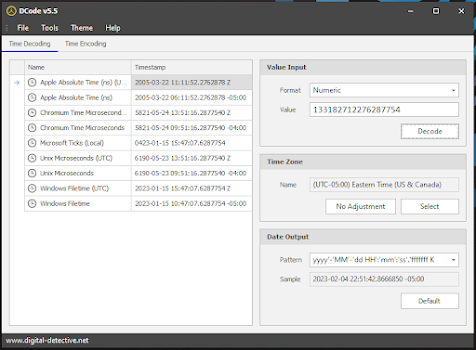
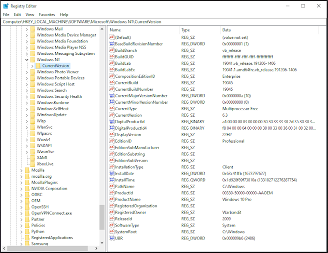

The Windows registry is a central repository of configuration data for the Windows operating system and its applications. One important aspect of the registry is the section involving the Windows install time. This information can be used in a variety of ways, both for normal system usage and for malicious purposes.


## Finding the InstallDate/InstallTime Registry

To find the registry section involving the Windows install time and timezone, you can navigate to the following location in the file system:

```
HKEY_LOCAL_MACHINE\SOFTWARE\Microsoft\Windows NT\CurrentVersion\
```

Within this section, you will find the following valuable key values:

- **InstallDate** - contains the Windows install date in decimal format.
    1. **HEX:** 63c41ffb
    2. **DEC:** 1673797627
    3. **DATE:** 2023-01-15

- **InstallTime** - contains the Windows Install date and time
    1. **HEX:** 1d928f89f73810a
    2. **DEC:** 133182712276287754
    3. **DATE:** 2023-01-15 15:47:07.6287754 Z

- **CurrentBuild** - contains information about the current build of Windows.
- **CurrentBuildNumber** - contains the build number of the current version of Windows.
- **CurrentType** - contains information about the type of installation, such as client or server.
- **CurrentVersion** - contains the version number of the current version of Windows.
- **ProductId** - contains the product ID for the current version of Windows.
- **RegisteredOrganization** - contains the registered organization name for the current version of Windows.
- **RegisteredOwner** - contains the registered owner name for the current version of Windows.
- **ProductName** - contains the product name for the current version of Windows.
- **EditionID** - contains the edition ID for the current version of Windows.
- **InstallationType** - contains information about the type of installation, such as full or upgrade.
- **~~InstallationSourcePath~~ SystemRoot** - contains the installation source path for the current version of Windows.

> **Note:** Your Forensic VM should have decode installed to make decoding times easier if not through other means:



**Windows FileTime (UTC) = 2023-01-15 15:47:07.6287754 Z**



**A slight alternative if you were to look at the SYSTEM hive:**

```
HKEY_LOCAL_MACHINE\SYSTEM\Setup\BuildUpdate
```

Within this section, you can look at the RecoveryDestination to see potentially the last upgrade / restore point date which may be the same as the last install / upgrade / reset this pc.

## Normal Use Case

In a normal use case, the Windows install time can be used to determine the age of a system and to adjust the time settings accordingly. For example, a system administrator may use this information to determine when a particular machine was last updated, or to troubleshoot problems that may have arisen since the installation.

## Malicious Use Case

On the other hand, the Windows install time can also be used for malicious purposes. For example, an attacker may use this information to determine the age of a system and to target it with specific types of attacks that are more likely to be successful on older systems.

Additionally, the timezone information may be used to determine the physical location of a target, which can be useful in spear-phishing attacks or other types of social engineering.

### Conclusion

In conclusion, the registry section involving the Windows install time is an important aspect of the Windows registry that can be used for both normal and malicious purposes. Understanding this information and how to access it can be valuable for system administrators, security professionals, and anyone interested in the inner workings of the Windows operating system.

<!---->

[https://www.sans.org/posters/windows-forensic-analysis/](https://www.sans.org/posters/windows-forensic-analysis/)

## Additional Sources:

1. Syngress [Windows Registry Forensics](https://paper.bobylive.com/Security/Windows%20Registry%20Forensics%20%20Advanced%20Digital%20Forensic%20Analysis%20of%20the%20Windows%20Registry.pdf) White Paper *by Harlan Carvey*
2. SANS [Wireless Networks and the Windows Registry](https://www.sans.org/white-papers/33659/) *by Janathan Risto*
