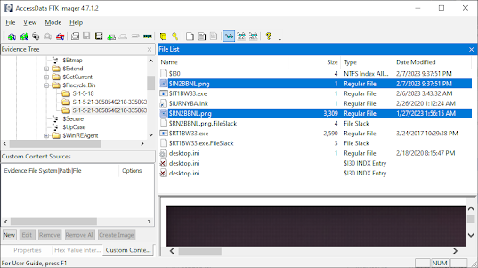
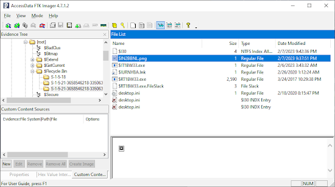
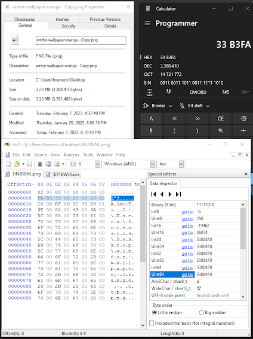
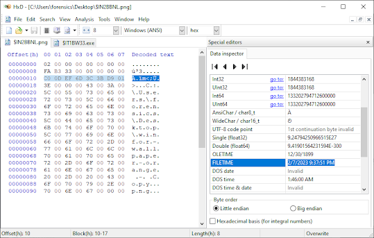
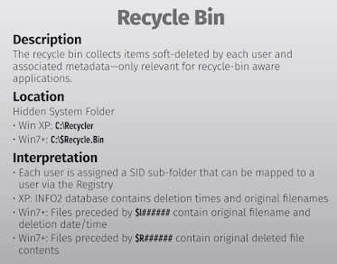

The Recycling Bin is a well-known feature in Windows operating systems that acts as a temporary storage location for deleted files. However, what many users may not know is that the Recycling Bin is also a valuable forensic artifact that can provide valuable information in both normal and malicious use cases. In this blog post, we will explore the Recycling Bin and its role as a forensic artifact, including the connection between the "$I" and "$R" values created in the **Master File Table (MFT)**, the normal and malicious use cases of the Recycling Bin, and how to permanently delete files to skip the Recycling Bin, as well as how to set the Recycling Bin in the registry.

## File System Bin

In the example below, I deleted a PNG file. The file was moved over to the $Recycle.Bin folder under the appropriate SID S-1-5-21-*. You can see that both a "$IN2BBNL.png" and "$RIN2BBNL.png" are the most recently created. The $R####### file will continue to hold the metadata of the original file as this file IS the original file renamed and moved. The $I####### file is newly created as an Index file for the file to hold the original filename, path, file size, and when the file was deleted in the event recovery of the file is requested.



Additionally you can see the $I30 was also updated. This in short tracks the files that was or is in the folder. I don't intend to elaborate on it in this post.

Once a file is recovered, the $I####### file does remain, however the $R####### file is relocated back to its appropriate location and will not continue to reside in the Recycle.Bin. As seen in the following image.



## $I####### - IndexFile Format

### Structure Overview

The $I index files contain metadata about deleted files in a specific binary format:

### UInt8 (Bytes) Format

```
0x02, 0x00, 0x00, 0x00, 0x00, 0x00, 0x00, 0x00, // Header (0x02 of 8 Byte)
0xFA, 0xB3, 0x33, 0x00, 0x00, 0x00, 0x00, 0x00, // Size (Bytes - 3,388,410)
0xC0, 0x0D, 0xEF, 0x6D, 0x3C, 0x0B, 0xD9, 0x01, // Deletion Date (64-Bit)
0x3E, 0x00, 0x00, 0x00,                         // String Path Length (62)
                        0x43, 0x00, 0x3A, 0x00, // <String Path> + 3x Bytes of 0x00
0x~~                                             // The Remaining Path
```

### File Size Header

You can see in the image below the file size in bytes which is represented in Little Endian on the second set of 8 Bytes.



### Date Header Analysis



## MFT Integration

The Master File Table (MFT) tracks both the $I and $R files when items are moved to the Recycling Bin:

- **$I Files**: Contain metadata about the deleted file (original path, size, deletion time)
- **$R Files**: Contain the actual file content, renamed with the recycling prefix

### Forensic Significance

- **Timeline Analysis**: Deletion timestamps provide precise timing information
- **File Recovery**: Original file paths and names preserved in $I files
- **User Activity**: Patterns of file deletion can indicate user behavior
- **Data Exfiltration**: Large files moved to recycle bin may indicate staging for theft

## Normal Use Cases

### Typical User Behavior:
- **Accidental Deletion Protection**: Safety net for mistakenly deleted files
- **File Management**: Temporary storage before permanent deletion
- **System Cleanup**: Automated deletion of temporary files
- **Application Cleanup**: Software uninstallation processes

### Administrative Functions:
- **Disk Space Management**: Clearing space while maintaining recovery options
- **Data Organization**: Moving unwanted files before final cleanup
- **Backup Validation**: Verifying files before permanent removal

## Malicious Use Cases

### Data Hiding Techniques:
- **Evidence Concealment**: Moving incriminating files to recycle bin
- **Staged Deletion**: Preparing files for permanent deletion after investigation
- **False Security**: Users thinking files are "deleted" when they're recoverable

### Attack Vectors:
- **Data Staging**: Using recycle bin as temporary storage for stolen data
- **Anti-Forensics**: Manipulating recycle bin to confuse timeline analysis
- **Social Engineering**: Tricking users into "permanently" deleting evidence

## Registry Configuration

The Recycling Bin behavior can be modified through registry settings:

### Registry Location:
```
HKEY_CURRENT_USER\Software\Microsoft\Windows\CurrentVersion\Explorer\Bitbucket
```

### Key Settings:
- **NukeOnDelete**: Bypass recycle bin (permanent deletion)
- **MaxCapacity**: Maximum recycle bin size per drive
- **PurgeInfo**: Automatic purging settings

## Forensic Analysis Techniques

### File Recovery:
1. **$I File Analysis**: Extract original file metadata
2. **$R File Recovery**: Restore actual file content
3. **Timeline Construction**: Build deletion timeline from timestamps
4. **Cross-Reference**: Correlate with MFT and file system journals

### Investigation Methods:
- **Hex Analysis**: Manual examination of $I file structure
- **Automated Tools**: Use specialized recycle bin analysis tools
- **Timeline Correlation**: Match deletions with user activity
- **Volume Analysis**: Examine recycle bin across multiple drives

## Bypassing the Recycling Bin

### Permanent Deletion Methods:
- **Shift + Delete**: Direct permanent deletion
- **Command Line**: Using `del` command with appropriate switches
- **Registry Modification**: Setting NukeOnDelete to bypass recycle bin
- **Third-Party Tools**: Secure deletion utilities

### Forensic Implications:
- Files bypassing recycle bin leave fewer traces
- Registry settings may indicate intentional evidence destruction
- File system journals may still contain deletion evidence
- Unallocated space analysis becomes critical

## Analysis Tools and Techniques

### Specialized Tools:
- **rifiuti2**: Command-line recycle bin analysis tool
- **RecycleBinAnalyzer**: GUI-based analysis tool
- **Registry Analyzers**: Tools for examining recycle bin settings
- **Hex Editors**: Manual $I file structure analysis

### Best Practices:
1. **Preserve Original**: Never modify original recycle bin files
2. **Document Structure**: Record $I and $R file relationships
3. **Timeline Integration**: Include deletion events in master timeline
4. **Cross-Validation**: Verify findings with multiple tools



## Conclusion

The Windows Recycling Bin represents a critical forensic artifact that provides detailed information about file deletion activities. Understanding the relationship between $I index files and $R content files enables investigators to:

- Reconstruct detailed deletion timelines
- Recover deleted file content and metadata
- Identify patterns of user behavior
- Detect evidence of anti-forensics activities

The binary structure of $I files contains precise timestamps, original file paths, and size information that persists even after files are restored or permanently deleted. This makes the Recycling Bin an invaluable source of evidence for digital forensic investigations.

Proper analysis of Recycling Bin artifacts requires understanding both the file system implementation and the forensic tools available for examination. The integration with the MFT and the persistence of metadata make this artifact particularly valuable for timeline analysis and data recovery efforts.