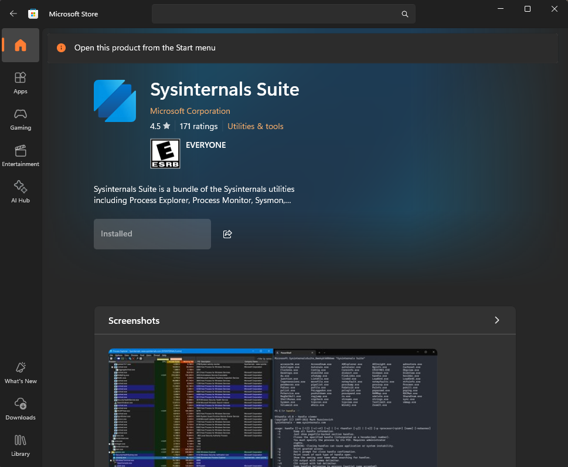
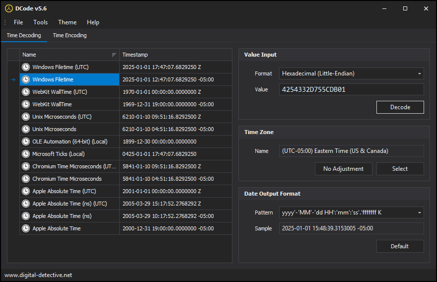

+++
title = "SysInternals Tools Registry Forensics"
description = "Comprehensive guide to SysInternals tools for Windows forensics. Learn registry artifacts, forensic analysis techniques, and DFIR investigation methods for tracking SysInternals tool usage."
keywords = ["SysInternals Tools", "Windows forensics", "registry analysis", "digital forensics", "DFIR", "Process Explorer", "Process Monitor", "SysInternals Suite", "forensic artifacts", "execution tracking", "Windows registry", "SysInternals documentation", "forensic tools", "incident response"]
date = "2023-01-01"
lastmod = "2025-10-11"
draft = false
tags = ["4n6", "digital forensics", "windows forensics", "registry", "sysinternals", "DFIR", "process management", "forensic analysis", "incident response"]
categories = ["4n6", "Digital Forensics", "Windows Forensics", "Registry Analysis"]
type = "Artifacts"
seo_title = "SysInternals Registry Forensics - Windows Tool Usage Analysis"
canonical = "/artifacts/registry-sysinternals/"
aliases = ["/artifacts/registry-sysinternals/"]
featured_image = "/images/featured/RegistryBlock.png"
schema_type = "TechArticle"
author = "JonesCKevin"
sitemap_priority = 0.8
sitemap_changefreq = "monthly"
+++

## SysInternals Tools - Registry Forensics and Analysis


## What is SysInternals?

SysInternals is a suite of advanced system utilities for Microsoft Windows that provides deep technical insight into the operating system. These tools are designed to help IT professionals, system administrators, and software developers manage, troubleshoot, and diagnose Windows systems effectively. From process management to network monitoring, SysInternals offers a wide range of utilities that enhance system performance, security, and reliability.

## Key Features of SysInternals Tools

The SysInternals suite includes a diverse set of tools that cater to various system management needs:

- **Process Management:** Tools like Process Explorer and Process Monitor offer detailed insights into running processes, threads, and system activity.
- **Network Monitoring:** Utilities like TCPView and PsPing help monitor network connections, diagnose network issues, and optimize performance.
- **Security Analysis:** Tools like Autoruns and AccessChk provide in-depth security analysis, including permissions, autorun configurations, and more.
- **File System Management:** Utilities like Disk2vhd and DiskView assist in managing disk space, analyzing disk usage, and creating virtual hard disks.
- **Registry Tools:** Tools like Regmon and RegDelNull help analyze and manage the Windows Registry, including monitoring registry activity and deleting problematic keys.

## How to Use SysInternals Tools

Using SysInternals tools is straightforward and typically involves downloading the desired utility from the official Microsoft website. As of Windows 11, the Microsoft Store contains an AppPackage that can be installed. The package installs/downloads the tools to `C:\Users\%username%\AppData\Local\Microsoft\WindowsApps\SysinternalsSuite`.



Once downloaded, the tool can be run directly from the executable file without requiring installation. You can leverage the command-line interface or graphical user interface (GUI) to interact with the tool. Each tool comes with detailed documentation and usage instructions to help make the most of its capabilities.

## Registry Keys Affected

Below are the common registry keys affected by each SysInternals tool:

In the registry keys below, the `USER-SID-1001` is a placeholder for the user's Security Identifier (SID) and will vary depending on the user's profile. The `USER-SID-1001` is used as an example in this case, showing strings as an example for the registry keys affected by the SysInternals tools.

When one of the tools is used for the first time, the registry keys are created in the HKU hive, which is the user's profile hive. The HKU hive is a subkey of the HKEY_USERS hive, containing user-specific settings for each user who is currently logged on. The HKU hive is loaded when a user logs on and is specific to the user who is currently logged on. The HKU hive is unloaded when the user logs off and is stored in the `C:\Users\%username%\NTUSER.DAT` file. If you want more information on User Hive Data, click [here](https://docs.microsoft.com/en-us/sysinternals/).

### Registry Keys Added

- The registry subkey `HAM\AUI` is a placeholder for the `HostActivityManager\ActivityUserInformation`.

```
\Software\Microsoft\Windows NT\CurrentVersion\HostActivityManager\CommitHistory\Microsoft.SysinternalsSuite_8wekyb3d8bbwe!strings
```

- The registry subkey **LU** is a placeholder for the LocalUser.

```
Microsoft.SysinternalsSuite_8wekyb3d8bbwe\HAM\AUI\strings\V1\LU
```

- The registry subkey **Strings** is a placeholder for the tool when used.

```
\Software\Sysinternals\Strings
```

### Registry Values Added

The PCT and PTT values are used to store process creation and termination times, respectively. These values are stored in LE hexadecimal format and represent the timestamp data for the process.



- **PCT:**
  - **Hex:** `42 54 33` 2D 75 5C DB 01
  - **Date:** 2025-01-01 12:47:07.6`829250` -05:00

- **PTT:**
  - **Hex:** `80 B7 35` 2D 75 5C DB 01
  - **Date:** 2025-01-01 12:47:07.6`985728` -05:00

#### In the Current User

- **Mixed:** This registry value holds mixed data types, which could include various forms of information necessary for the functioning of associated programs or settings. The hexadecimal data here indicates that the Mixed value is set to zero, implying no mixed data types are stored in this key at this moment.

```
Microsoft.SysinternalsSuite_8wekyb3d8bbwe!strings\Mixed:
 - 00 00 00 00 00 00 00 00
```

- **Process Creation Time (PCT):** This registry value logs the exact time when a process was initiated. The hexadecimal sequence represents timestamp data, which is used to track when a process began execution.

```
Microsoft.SysinternalsSuite_8wekyb3d8bbwe\HAM\AUI\strings\V1\LU\PCT:
 - 42 54 33 2D 75 5C DB 01
```

- **Process Termination Time (PTT):** This registry value records the exact time when a process ended. Like PCT, the PTT value uses hexadecimal data to record the termination timestamp of a specific process.

```
Microsoft.SysinternalsSuite_8wekyb3d8bbwe\HAM\AUI\strings\V1\LU\PTT:
 - 80 B7 35 2D 75 5C DB 01
```

- The data held in **EulaAccepted** represents a placeholder indicating whether the End User License Agreement (EULA) has been accepted. If this becomes 0x00000001, it means the EULA has been accepted. If it is 0x00000000, it means the EULA has not been accepted and will prompt a popup when executed.

```
Sysinternals\Strings\EulaAccepted:
 - 0x00000001
```

#### In the Current User Classes

**Key:** `Microsoft.SysinternalsSuite_8wekyb3d8bbwe\HAM\AUI\strings\V1\LU\PCT`  
**Value:** `42 54 33 2D 75 5C DB 01`

**Key:** `Microsoft.SysinternalsSuite_8wekyb3d8bbwe\HAM\AUI\strings\V1\LU\PTT`  
**Value:** `80 B7 35 2D 75 5C DB 01`

**Key:** `HKU\S-1-5-21-USER-SID-1001\Software\Microsoft\Windows NT\CurrentVersion\HostActivityManager\CommitHistory\Microsoft.SysinternalsSuite_8wekyb3d8bbwe!strings\Mixed`  
**Value:** `00 00 00 00 00 00 00 00`

**Key:** `HKU\S-1-5-21-USER-SID-1001\Software\Classes\Local Settings\Software\Microsoft\Windows\CurrentVersion\AppModel\SystemAppData\Microsoft.SysinternalsSuite_8wekyb3d8bbwe\HAM\AUI\strings\V1\LU\PCT`  
**Value:** `42 54 33 2D 75 5C DB 01`

**Key:** `HKU\S-1-5-21-USER-SID-1001\Software\Classes\Local Settings\Software\Microsoft\Windows\CurrentVersion\AppModel\SystemAppData\Microsoft.SysinternalsSuite_8wekyb3d8bbwe\HAM\AUI\strings\V1\LU\PTT`  
**Value:** `80 B7 35 2D 75 5C DB 01`

**Key:** `HKLM\SYSTEM\CurrentControlSet\Services\bam\State\UserSettings\S-1-5-21-USER-SID-1001\Microsoft.SysinternalsSuite_8wekyb3d8bbwe`  
**Value:** `87 39 25 B4 74 5C DB 01 00 00 00 00 00 00 00 00 01 00 00 00 02 00 00 00`

**Key:** `HKLM\SYSTEM\CurrentControlSet\Services\bam\State\UserSettings\S-1-5-21-USER-SID-1001\Microsoft.SysinternalsSuite_8wekyb3d8bbwe`  
**Value:** `B0 7F 2F 2F 75 5C DB 01 00 00 00 00 00 00 00 00 01 00 00 00 02 00 00 00`

**Secondary, you can always find file usage in the prefetch:**

- `C:\WINDOWS\Prefetch\STRINGS.EXE-1BD7A361.pf`

## SysInternals Tools Reference

| Tool & Link to Resource                                                                   | Description                                                                                                                                                    |
| ----------------------------------------------------------------------------------------- | -------------------------------------------------------------------------------------------------------------------------------------------------------------- |
| [`accesschk`](https://learn.microsoft.com/en-us/sysinternals/downloads/accesschk)         | Command-line tool for viewing the effective permissions on files, registry keys, services, processes, and more.                                                |
| [`AccessEnum`](https://learn.microsoft.com/en-us/sysinternals/downloads/accessenum)       | Shows who has what access to directories, files, and Registry keys on your systems.                                                                            |
| [`ADExplorer`](https://learn.microsoft.com/en-us/sysinternals/downloads/adexplorer)       | Advanced Active Directory (AD) viewer and editor.                                                                                                              |
| [`ADInsight`](https://learn.microsoft.com/en-us/sysinternals/downloads/adinsight)         | Real-time monitoring of Active Directory (AD) events.                                                                                                          |
| [`adrestore`](https://learn.microsoft.com/en-us/sysinternals/downloads/adrestore)         | Undelete Server 2003 Active Directory objects.                                                                                                                 |
| [`Autologon`](https://learn.microsoft.com/en-us/sysinternals/downloads/autologon)         | Enable automatic logon to Windows.                                                                                                                             |
| [`Autoruns`](https://learn.microsoft.com/en-us/sysinternals/downloads/autoruns)           | Shows programs configured to start automatically during system boot or login, along with the full list of registry and file locations for auto-start settings. |
| [`autorunsc`](https://learn.microsoft.com/en-us/sysinternals/downloads/autoruns)          | Command-line equivalent of Autoruns.                                                                                                                           |
| [`Bginfo`](https://learn.microsoft.com/en-us/sysinternals/downloads/bginfo)               | Generates desktop backgrounds that include system information such as IP addresses, computer name, and network adapters.                                       |
| [`Cacheset`](https://learn.microsoft.com/en-us/sysinternals/downloads/cacheset)           | Allows control of the Cache Manager's working set size using NT functions.                                                                                     |
| [`Clockres`](https://learn.microsoft.com/en-us/sysinternals/downloads/clockres)           | View the resolution of the system clock, which is also the maximum timer resolution.                                                                           |
| [`Contig`](https://learn.microsoft.com/en-us/sysinternals/downloads/contig)               | Defragment your frequently used files and create new contiguous files.                                                                                         |
| [`Coreinfo`](https://learn.microsoft.com/en-us/sysinternals/downloads/coreinfo)           | Shows the mapping between logical processors and physical processor, NUMA node, and socket they reside on.                                                     |
| [`CPUSTRES`](https://learn.microsoft.com/en-us/sysinternals/downloads/cpustres)           | Simulate high CPU consumption by running multiple threads.                                                                                                     |
| [`Dbgview`](https://learn.microsoft.com/en-us/sysinternals/downloads/debugview)           | View debug output from local or remote systems.                                                                                                                |
| [`Desktops`](https://learn.microsoft.com/en-us/sysinternals/downloads/desktops)           | Create and manage up to four virtual desktops.                                                                                                                 |
| [`disk2vhd`](https://learn.microsoft.com/en-us/sysinternals/downloads/disk2vhd)           | Create a Virtual Hard Disk (VHD) from a physical disk.                                                                                                         |
| [`diskext`](https://learn.microsoft.com/en-us/sysinternals/downloads/diskext)             | Display volume disk mappings.                                                                                                                                  |
| [`Diskmon`](https://learn.microsoft.com/en-us/sysinternals/downloads/diskmon)             | Monitor and log all hard disk activity.                                                                                                                        |
| [`DiskView`](https://learn.microsoft.com/en-us/sysinternals/downloads/diskview)           | Graphical disk sector display tool.                                                                                                                            |
| [`du`](https://learn.microsoft.com/en-us/sysinternals/downloads/du)                       | Disk usage statistics.                                                                                                                                         |
| [`efsdump`](https://learn.microsoft.com/en-us/sysinternals/downloads/efsdump)             | Dump the contents of encrypted files on NTFS volumes.                                                                                                          |
| [`FindLinks`](https://learn.microsoft.com/en-us/sysinternals/downloads/findlinks)         | Show the various hard links/Reparse points to a specific file path.                                                                                            |
| [`handle`](https://learn.microsoft.com/en-us/sysinternals/downloads/handle)               | Show open handles for any process in the system.                                                                                                               |
| [`hex2dec`](https://learn.microsoft.com/en-us/sysinternals/downloads/hex2dec)             | Convert hexadecimal to decimal and back.                                                                                                                       |
| [`junction`](https://learn.microsoft.com/en-us/sysinternals/downloads/junction)           | Create and manage directory Junctions (symbolic links) on NTFS volumes.                                                                                        |
| [`Listdlls`](https://learn.microsoft.com/en-us/sysinternals/downloads/listdlls)           | List system DLLs currently loaded, including their version numbers and memory addresses.                                                                       |
| [`livekd`](https://learn.microsoft.com/en-us/sysinternals/downloads/livekd)               | Enable live hyperkernel debugging using Microsoft Kernel Debugger (KD).                                                                                        |
| [`LoadOrd`](https://learn.microsoft.com/en-us/sysinternals/downloads/loadord)             | Show the load order of kernel mode drivers at boot time.                                                                                                       |
| [`LoadOrdC`](https://learn.microsoft.com/en-us/sysinternals/downloads/loadordc)           | Command-line equivalent of LoadOrd.                                                                                                                            |
| [`logonsessions`](https://learn.microsoft.com/en-us/sysinternals/downloads/logonsessions) | List currently active logon sessions.                                                                                                                          |
| [`movefile`](https://learn.microsoft.com/en-us/sysinternals/downloads/movefile)           | Schedule a move or delete command for the next reboot.                                                                                                         |
| [`notmyfault`](https://learn.microsoft.com/en-us/sysinternals/downloads/notmyfault)       | Crash your system in various ways, generating minidump files for troubleshooting.                                                                              |
| [`notmyfaultc`](https://learn.microsoft.com/en-us/sysinternals/downloads/notmyfault)      | Command-line version of NotMyFault.                                                                                                                            |
| [`ntfsinfo`](https://learn.microsoft.com/en-us/sysinternals/downloads/ntfsinfo)           | Show information about NTFS volumes and their clusters.                                                                                                        |
| [`pendmoves`](https://learn.microsoft.com/en-us/sysinternals/downloads/pendmoves)         | Enumerate pending file rename/move operations.                                                                                                                 |
| [`pipelist`](https://learn.microsoft.com/en-us/sysinternals/downloads/pipelist)           | List named pipes on your system, including each pipe's instances.                                                                                              |
| [`procdump`](https://learn.microsoft.com/en-us/sysinternals/downloads/procdump)           | Monitor application CPU spikes and generate crash dumps during a spike.                                                                                        |
| [`procexp`](https://learn.microsoft.com/en-us/sysinternals/downloads/process-explorer)    | Detailed process management tool that shows information about running processes.                                                                               |
| [`Procmon`](https://learn.microsoft.com/en-us/sysinternals/downloads/procmon)             | Monitor and display real-time file system, registry, and process/thread activity.                                                                              |
| [`PsExec`](https://learn.microsoft.com/en-us/sysinternals/downloads/psexec)               | Execute processes remotely.                                                                                                                                    |
| [`psfile`](https://learn.microsoft.com/en-us/sysinternals/downloads/psfile)               | Show or close remotely opened files.                                                                                                                           |
| [`PsGetsid`](https://learn.microsoft.com/en-us/sysinternals/downloads/psgetsid)           | Display the SID (Security Identifier) for a computer or a user.                                                                                                |
| [`PsInfo`](https://learn.microsoft.com/en-us/sysinternals/downloads/psinfo)               | List information about a system.                                                                                                                               |
| [`pskill`](https://learn.microsoft.com/en-us/sysinternals/downloads/pskill)               | Kill processes by name or process ID.                                                                                                                          |
| [`pslist`](https://learn.microsoft.com/en-us/sysinternals/downloads/pslist)               | Show detailed information about processes.                                                                                                                     |
| [`PsLoggedon`](https://learn.microsoft.com/en-us/sysinternals/downloads/psloggedon)       | Display all the users logged on locally and via resources for either the specified computer or for the specified users.                                        |
| [`psloglist`](https://learn.microsoft.com/en-us/sysinternals/downloads/psloglist)         | Dump event log records for various logs (e.g., applications, system, etc.).                                                                                    |
| [`pspasswd`](https://learn.microsoft.com/en-us/sysinternals/downloads/pspasswd)           | Changes user account passwords on the system.                                                                                                                  |
| [`psping`](https://learn.microsoft.com/en-us/sysinternals/downloads/psping)               | Test network performance.                                                                                                                                      |
| [`PsService`](https://learn.microsoft.com/en-us/sysinternals/downloads/psservice)         | View and control services.                                                                                                                                     |
| [`psshutdown`](https://learn.microsoft.com/en-us/sysinternals/downloads/psshutdown)       | Shut down or reboot a computer.                                                                                                                                |
| [`pssuspend`](https://learn.microsoft.com/en-us/sysinternals/downloads/pssuspend)         | Suspend and resume processes.                                                                                                                                  |
| [`RAMMap`](https://learn.microsoft.com/en-us/sysinternals/downloads/rammap)               | Collect and display physical memory usage.                                                                                                                     |
| [`RDCMan`](https://learn.microsoft.com/en-us/sysinternals/downloads/rdcman)               | Manage multiple remote desktop connections.                                                                                                                    |
| [`RegDelNull`](https://learn.microsoft.com/en-us/sysinternals/downloads/regdelnull)       | Scan and delete registry keys that have embedded null-characters which are otherwise impossible to delete.                                                     |
| [`regjump`](https://learn.microsoft.com/en-us/sysinternals/downloads/regjump)             | Open Regedit with the location at a particular registry key or value.                                                                                          |
| [`Regmon`](https://learn.microsoft.com/en-us/sysinternals/downloads/regmon)               | Monitor and display real-time registry activity.                                                                                                               |
| [`ru`](https://learn.microsoft.com/en-us/sysinternals/downloads/ru)                       | Shows the number of reparse points on a volume.                                                                                                                |
| [`sdelete`](https://learn.microsoft.com/en-us/sysinternals/downloads/sdelete)             | Securely delete files and clean free space.                                                                                                                    |
| [`ShareEnum`](https://learn.microsoft.com/en-us/sysinternals/downloads/shareenum)         | Scan file shares on your network.                                                                                                                              |
| [`ShellRunas`](https://learn.microsoft.com/en-us/sysinternals/downloads/shellrunas)       | Launch programs as a different user via the context menu.                                                                                                      |
| [`Sigcheck`](https://learn.microsoft.com/en-us/sysinternals/downloads/sigcheck)           | Verify file versions, signatures, and certificates.                                                                                                            |
| [`streams`](https://learn.microsoft.com/en-us/sysinternals/downloads/streams)             | Show NTFS alternate data streams.                                                                                                                              |
| [`strings`](https://learn.microsoft.com/en-us/sysinternals/downloads/strings)             | Search for ANSI and Unicode strings in binary files.                                                                                                           |
| [`sync`](https://learn.microsoft.com/en-us/sysinternals/downloads/sync)                   | Flush file system buffers.                                                                                                                                     |
| [`Sysmon`](https://learn.microsoft.com/en-us/sysinternals/downloads/sysmon)               | System activity monitor.                                                                                                                                       |
| [`Tcpview`](https://learn.microsoft.com/en-us/sysinternals/downloads/tcpview)             | View detailed listings of all TCP and UDP endpoints on your system.                                                                                            |
| [`vmmap`](https://learn.microsoft.com/en-us/sysinternals/downloads/vmmap)                 | Process virtual and physical memory usage.                                                                                                                     |
| [`Zoomit`](https://learn.microsoft.com/en-us/sysinternals/downloads/zoomit)               | Screen zoom and annotation tool for technical presentations.                                                                                                   |
