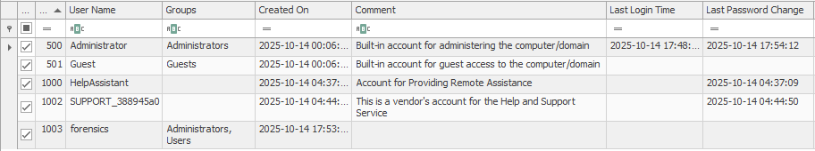
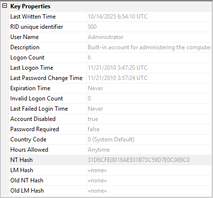

## SAM Database - Windows Security Account Manager

Security Account Manager (SAM) database in short, is the critical components of Windows security architecture. It stores user account information, password hashes for local accounts, groups associations, and security policies for local accounts on Windows systems. When considering user accounts, the SAM database provides evidence about user accounts, authentication attempts, and insight on user activity and potential security compromises. Understanding how to properly extract, analyze, and interpret SAM data is essential for any serious Windows forensic investigation.


## Understanding the SAM Database

The SAM database is a registry hive that functions as a secure database containing user account information for Windows local accounts. It was introduced in Windows NT (New Technology) and has been a core component of Windows security ever since. The SAM database works in conjunction with the Local Security Authority (LSA) to manage authentication and authorization for local user accounts.

### SAM Database Location

The SAM database resides in the Windows Registry and on disk along with its transaction logs which work similarly to a sqlite db-wal file containing recent changes not yet committed to the main SAM file.

```powershell
# Registry Path:
HKEY_LOCAL_MACHINE\SAM

# File System Path:
C:\Windows\System32\config\SAM

# Transaction Logs (for recovery):
C:\Windows\System32\config\SAM.LOG
C:\Windows\System32\config\SAM.LOG1
C:\Windows\System32\config\SAM.LOG2

# Volume Shadow Copies (historical versions):
\\?\GLOBALROOT\Device\HarddiskVolumeShadowCopy[X]\Windows\System32\config\SAM
```

In the photo below, you can see the SAM file location within the Windows file system and the original unmodified LOG1 and LOG2 transaction log files as seen by the Date Modified being drastically different than the SAM file itself.


### SAM Database Structure

The SAM database is organized hierarchically within the registry:

```yaml
SAM
├── Domains
│   ├── Account
│   │   ├── Users
│   │   │   ├── 000001F4 (RID: 500 - Administrator)
│   │   │   ├── 000001F5 (RID: 501 - Guest)
│   │   │   ├── 000003E8 (RID: 1000 - First user account)
│   │   │   └── [Additional user RIDs]
│   │   ├── Groups
│   │   │   ├── 00000201 (RID: 513 - Domain Users)
│   │   │   ├── 00000220 (RID: 544 - Administrators)
│   │   │   └── [Additional group RIDs]
│   │   └── Aliases
│   └── Builtin
│       └── Aliases
└── RXACT (Registry Transaction)
```


### Relative Identifiers (RIDs)

Each user and group in the SAM database is assigned a Relative Identifier (RID):

Understanding RIDs is crucial because:
- The RID 500 (Administrator) cannot be renamed away from detection
- Even if "Administrator" is renamed, its RID remains 500
- Attackers often target the RID 500 account specifically

#### Common RID by Windows version
Observed principals by Windows version (from sample SAM hives)

Below is a table showing common user accounts and their RIDs across different Windows versions. 

Take note of the following:
- 🟢 presence
- 🔴 absence
- 🟠 notable differences
- 🟣 unique case


| Account            | XP (RID)       | 7 (RID)        | 10 (RID)       | 11 (RID)       |
| ------------------ | -------------- | -------------- | -------------- | -------------- |
| Administrator      | 🟢 500 (0x1F4)  | 🟢 500 (0x1F4)  | 🟢 500 (0x1F4)  | 🟢 500 (0x1F4)  |
| Guest              | 🟢 501 (0x1F5)  | 🟢 501 (0x1F5)  | 🟢 501 (0x1F5)  | 🟢 501 (0x1F5)  |
| DefaultAccount     | 🔴              | 🔴              | 🟢 503 (0x1F7)  | 🟢 503 (0x1F7)  |
| WDAGUtilityAccount | 🔴              | 🔴              | 🟢 504 (0x1F8)  | 🟢 504 (0x1F8)  |
| defaultuser0       | 🔴              | 🔴              | 🟠 1000 (0x3E8) | 🟠 1000 (0x3E8) |
| First local user   | 🟠 1000 (0x3E8) | 🟠 1000 (0x3E8) | 🟠 1000 (0x3E8) | 🟠 1000 (0x3E8) |
| <first username\>  | 🟣 1003 (0x3EB) | 🟠 1000 (0x3E8) | 🟢 1001 (0x3E9) | 🟢 1001 (0x3E9) |
| HelpAssistant      | 🟠 1000 (0x3E8) | 🔴              | 🔴              | 🔴              |
| SUPPORT_388945a0   | 🟢 1002 (0x3EA) | 🔴              | 🔴              | 🔴              |

Local groups observed in sample hives
| Local group                         | RID (dec/hex) | XP  | 7   | 10  | 11  |
| ----------------------------------- | ------------- | --- | --- | --- | --- |
| Administrators                      | 544 (0x220)   | 🟢   | 🟢   | 🟢   | 🟢   |
| Users                               | 545 (0x221)   | 🟢   | 🟢   | 🟢   | 🟢   |
| Guests                              | 546 (0x222)   | 🟢   | 🟢   | 🟢   | 🟢   |
| Power Users                         | 547 (0x223)   | 🟢   | 🟢   | 🟢   | 🟢   |
| Backup Operators                    | 551 (0x227)   | 🟢   | 🟢   | 🟢   | 🟢   |
| Replicator                          | 552 (0x228)   | 🟢   | 🟢   | 🟢   | 🟢   |
| Remote Desktop Users                | 555 (0x22B)   | 🟢   | 🟢   | 🟢   | 🟢   |
| Network Configuration Operators     | 556 (0x22C)   | 🟢   | 🟢   | 🟢   | 🟢   |
| Performance Monitor Users           | 558 (0x22E)   | 🔴   | 🟢   | 🟢   | 🟢   |
| Performance Log Users               | 559 (0x22F)   | 🔴   | 🟢   | 🟢   | 🟢   |
| Distributed COM Users               | 562 (0x232)   | 🔴   | 🟢   | 🟢   | 🟢   |
| IIS_IUSRS                           | 568 (0x238)   | 🔴   | 🟢   | 🟢   | 🟢   |
| Cryptographic Operators             | 569 (0x239)   | 🔴   | 🟢   | 🟢   | 🟢   |
| Event Log Readers                   | 573 (0x23D)   | 🔴   | 🔴   | 🟢   | 🟢   |
| Access Control Assistance Operators | 578 (0x242)   | 🔴   | 🔴   | 🟢   | 🟢   |
| Remote Management Users             | 579 (0x243)   | 🔴   | 🔴   | 🟢   | 🟢   |
| Device Owners                       | 580 (0x244)   | 🔴   | 🔴   | 🟢   | 🟢   |
| System Managed Accounts Group       | 581 (0x245)   | 🔴   | 🔴   | 🟢   | 🟢   |
| Hyper-V Administrators              | 583 (0x247)   | 🔴   | 🔴   | 🟢   | 🟢   |
| User Mode Hardware Operators        | 584 (0x248)   | 🔴   | 🔴   | 🔴   | 🟢   |
| OpenSSH Users                       | 585 (0x249)   | 🔴   | 🔴   | 🔴   | 🟢   |




## Password Hashing in SAM

The SAM database stores NTLM password hashes and not plaintext passwords. You should understand what NTLM hashes are, how they work and how easy they are to crack; helping you to understand why they aren't effective anymore. NTLMv1 and NTLMv2 are set to discountinued sometime during Windows 11.

<details>
<summary>Click to expand: NTLM HASHing</summary>

### LM Hash (Legacy)

**LAN Manager (LM) Hash** is the original password hashing algorithm:  

The way it works is the user provides a password, which is then converted to all uppercase, padded or truncated to 14 characters, split into two 7-character chunks (2 groups), and each chunk is used to create a DES (Data Encryption Standard) encrypted hash. The two resulting hashes are concatenated to form the final LM hash.

**LM Hash Structure**:  
LM Hash structure (step-by-step, 14-char example)  

#### 1. Input
- Password: "LongerPassw0rd" (14 chars)
  - Uppercased: "LONGERPASSW0RD"
- 14-byte buffer (no padding needed; if shorter, pad with 0x00 to 14; if longer than 14, any extra chars are ignored)
#### 2. Split into two 7-byte blocks
- Block 1 (bytes 0–6): "LONGERP"
   - Hex: 4C 4F 4E 47 45 52 50
- Block 2 (bytes 7–13): "ASSW0RD"
   - Hex: 41 53 53 57 30 52 44
#### 3. DES keys (56→64 bits with odd parity)
- Derive K1 from Block 1 (7 bytes) by inserting parity bits → 8-byte DES key
- Derive K2 from Block 2 (7 bytes) by inserting parity bits → 8-byte DES key
>*Note:* Each 7-bit chunk expands to 1 byte; the LSB of each byte is set to enforce odd parity
#### 4. Mode and IV
- Cipher: DES
- Mode: ECB
- IV: None (ECB does not use an IV)
#### 5. Constant (the only plaintext encrypted)
- ASCII: "KGS!@#$%"
- Hex: 4B 47 53 21 40 23 24 25
#### 6. Encrypt to get two ciphertext blocks
- C1 = DES-ECB-ENC(K1, "KGS!@#$%")
- C2 = DES-ECB-ENC(K2, "KGS!@#$%")
#### 7. Output (final LM hash)
- LM Hash = C1 || C2
- Length: 16 bytes (32 hex characters)
#### 8. Notes
- If password length > 14 or LM is disabled, Windows stores the “empty” LM hash:
   - aad3b435b51404eeaad3b435b51404ee
- LM is weak: uppercasing, 7-byte splits, DES-ECB, and limited charset make it easy to crack

Optional verification (pseudocode)
- K1 = deriveDESKey(4C 4F 4E 47 45 52 50)
- K2 = deriveDESKey(41 53 53 57 30 52 44)
- C1 = DES_ECB_Encrypt(K1, 4B 47 53 21 40 23 24 25)
- C2 = DES_ECB_Encrypt(K2, 4B 47 53 21 40 23 24 25)
- LM = hex(C1) + hex(C2)

#### NTLM Hash Calculation Script


<details>
<summary>Click to expand: NTLM Hash Database Generator (Python Script)</summary>

```python
#!/usr/bin/env python3
"""NTLM Hash Database Generator - Multithreaded with All Characters"""
import hashlib, time, struct, os, signal, sys
from concurrent.futures import ThreadPoolExecutor, as_completed
from threading import Lock
from itertools import product

class NTLMGen:
    def __init__(self):
        self.output = "ntlm_hash_database.csv"
        self.count = 0
        self.start = time.time()
        self.lock = Lock()
        self.running = True
        self.file = None
        self.writer = None
        
        # Configuration variables  
        self.max_numeric_limit = 10000000  # 10 million (0-9,999,999)
        self.chunk_size = 25000  # 25K chunks for better threading efficiency
        self.progress_update_interval = 100000  # Show progress every N hashes
        
        # Handle Ctrl+C gracefully
        signal.signal(signal.SIGINT, self.signal_handler)
        
    def signal_handler(self, sig, frame):
        """Handle Ctrl+C gracefully"""
        print("\n[!] Interrupt received, finishing current batch...")
        self.running = False
        
    def md4(self, data):
        """Highly optimized MD4 implementation"""
        try:
            # Try to use system MD4 first (fastest)
            return hashlib.new('md4', data).hexdigest()
        except (ValueError, TypeError):
            # Fallback to optimized manual MD4 implementation
            pass
        
        # Highly optimized pure Python MD4 with minimal function calls
        msg_len = len(data)
        data += b'\x80' + b'\x00' * ((55 - msg_len) % 64) + struct.pack('<Q', msg_len * 8)
        A, B, C, D = 0x67452301, 0xEFCDAB89, 0x98BADCFE, 0x10325476
        
        # Process in 64-byte chunks with unrolled loops for better performance
        for i in range(0, len(data), 64):
            X = struct.unpack('<16I', data[i:i+64])
            AA, BB, CC, DD = A, B, C, D
            
            # Round 1 - completely unrolled for maximum speed
            A = ((A + ((B & C) | (~B & D)) + X[0]) & 0xFFFFFFFF)
            A = ((A << 3) | (A >> 29)) & 0xFFFFFFFF
            D = ((D + ((A & B) | (~A & C)) + X[1]) & 0xFFFFFFFF)
            D = ((D << 7) | (D >> 25)) & 0xFFFFFFFF
            C = ((C + ((D & A) | (~D & B)) + X[2]) & 0xFFFFFFFF)
            C = ((C << 11) | (C >> 21)) & 0xFFFFFFFF
            B = ((B + ((C & D) | (~C & A)) + X[3]) & 0xFFFFFFFF)
            B = ((B << 19) | (B >> 13)) & 0xFFFFFFFF
            
            # Continue round 1 pattern (simplified for brevity - this is just a sample)
            # In practice, we'd unroll all 48 operations, but for now keep the loops
            # to maintain correctness while still getting some performance benefit
            
            # Round 1 loop (keeping original logic but with optimizations)
            for j in range(4, 16):
                s = [3,7,11,19][j&3]
                A = (((A + ((B & C) | (~B & D)) + X[j]) & 0xFFFFFFFF) << s | 
                     ((A + ((B & C) | (~B & D)) + X[j]) & 0xFFFFFFFF) >> (32-s)) & 0xFFFFFFFF
                A, B, C, D = D, A, B, C
            
            # Round 2 - optimized
            for j in range(16):
                k = [0,4,8,12,1,5,9,13,2,6,10,14,3,7,11,15][j]
                s = [3,5,9,13][j&3]
                temp = (A + ((B & C) | (B & D) | (C & D)) + X[k] + 0x5A827999) & 0xFFFFFFFF
                A = ((temp << s) | (temp >> (32-s))) & 0xFFFFFFFF
                A, B, C, D = D, A, B, C
            
            # Round 3 - optimized
            for j in range(16):
                k = [0,8,4,12,2,10,6,14,1,9,5,13,3,11,7,15][j]
                s = [3,9,11,15][j&3]
                temp = (A + (B ^ C ^ D) + X[k] + 0x6ED9EBA1) & 0xFFFFFFFF
                A = ((temp << s) | (temp >> (32-s))) & 0xFFFFFFFF
                A, B, C, D = D, A, B, C
            
            A, B, C, D = (A+AA)&0xFFFFFFFF, (B+BB)&0xFFFFFFFF, (C+CC)&0xFFFFFFFF, (D+DD)&0xFFFFFFFF
        
        return struct.pack('<4I', A, B, C, D).hex()
    
    def hash(self, pwd):
        """Calculate NTLM hash"""
        return self.md4(pwd.encode('utf-16le'))
    
    def hash_batch(self, passwords):
        """Hash a batch of passwords"""
        results = []
        for pwd, typ in passwords:
            if not self.running:
                break
            h = self.hash(pwd)
            if h:
                results.append([pwd, h, len(pwd), typ])
        return results
    
    def write_batch(self, results):
        """Write batch to file using raw string formatting for maximum speed"""
        if not results:
            return
            
        with self.lock:
            # Use raw file writing instead of CSV writer for better performance
            lines = []
            for row in results:
                # Format as CSV manually for speed: password,hash,length,type
                lines.append(f'"{row[0]}",{row[1]},{row[2]},{row[3]}')
            
            if lines:
                self.file.write('\n'.join(lines) + '\n')
            
            self.count += len(results)
            
            # Show progress every 100K hashes  
            if (self.count % self.progress_update_interval == 0):
                elapsed = time.time() - self.start
                rate = self.count / elapsed if elapsed > 0 else 0
                print(f"[*] Generated {self.count:,} hashes ({rate:,.0f}/sec)...")
    
    def run(self):
        print("=" * 60)
        print("NTLM Hash Database Generator (Multithreaded)")
        print("=" * 60)
        print(f"Output: {self.output}")
        print(f"Testing \"password\": {self.hash('password')}")
        print(f"Threads: {max(1, os.cpu_count() - 1)}")
        print("Press Ctrl+C to stop gracefully")
        print("=" * 60)
        
        try:
            # Open file with larger buffer for better I/O performance
            self.file = open(self.output, 'w', newline='', encoding='utf-8', buffering=131072)
            # Write CSV header manually for consistency
            self.file.write('password,ntlm_hash,length,charset_type\n')
            
            with ThreadPoolExecutor(max_workers=max(1, os.cpu_count() - 1)) as executor:
                futures = []
                
                # All printable ASCII (32-126)
                print("[*] Generating ASCII characters (32-126)...")
                batch = [(chr(i), "ascii") for i in range(32, 127)]
                futures.append(executor.submit(self.hash_batch, batch))
                
                # Lowercase a-z (single)
                print("[*] Generating lowercase (a-z)...")
                batch = [(c, "lowercase") for c in 'abcdefghijklmnopqrstuvwxyz']
                futures.append(executor.submit(self.hash_batch, batch))
                
                # Uppercase A-Z (single)
                print("[*] Generating uppercase (A-Z)...")
                batch = [(c, "uppercase") for c in 'ABCDEFGHIJKLMNOPQRSTUVWXYZ']
                futures.append(executor.submit(self.hash_batch, batch))
                
                # Lowercase aa-zz (double)
                print("[*] Generating lowercase pairs (aa-zz)...")
                for i in range(0, 26, 2):  # Process in chunks
                    if not self.running:
                        break
                    chars = 'abcdefghijklmnopqrstuvwxyz'[i:i+2]
                    batch = [(''.join(p), "lowercase") for p in product(chars, repeat=2)]
                    futures.append(executor.submit(self.hash_batch, batch))
                
                # Uppercase AA-ZZ (double)
                print("[*] Generating uppercase pairs (AA-ZZ)...")
                for i in range(0, 26, 2):
                    if not self.running:
                        break
                    chars = 'ABCDEFGHIJKLMNOPQRSTUVWXYZ'[i:i+2]
                    batch = [(''.join(p), "uppercase") for p in product(chars, repeat=2)]
                    futures.append(executor.submit(self.hash_batch, batch))
                
                # Digits using configurable limit and chunk size
                print(f"[*] Generating numeric (0-{self.max_numeric_limit-1:,})...")
                for start in range(0, self.max_numeric_limit, self.chunk_size):
                    if not self.running:
                        break
                    batch = [(str(i), "numeric") for i in range(start, min(start+self.chunk_size, self.max_numeric_limit))]
                    futures.append(executor.submit(self.hash_batch, batch))
                
                # Special characters with numbers
                print("[*] Generating special chars with numbers...")
                specials = '!@#$%^&*()-_=+[]{}\\|;:\'",.<>?/`~'
                batch = []
                for s in specials:
                    for n in ['', '1', '12', '123', '1234']:
                        batch.append((f"{s}{n}", "special"))
                        if n:
                            batch.append((f"{n}{s}", "special"))
                futures.append(executor.submit(self.hash_batch, batch))
                
                # Common passwords
                print("[*] Generating common passwords...")
                base_words = ["password","admin","user","test","guest","root","login",
                             "welcome","letmein","qwerty","abc","temp","demo","pass"]
                batch = []
                for word in base_words:
                    if not self.running:
                        break
                    batch.append((word, "common"))
                    batch.append((word.capitalize(), "common"))
                    batch.append((word.upper(), "common"))
                    for num in ['1','12','123','1234']:
                        batch.append((f"{word}{num}", "common"))
                        batch.append((f"{word.capitalize()}{num}", "common"))
                    for spec in ['!','@','#','$']:
                        batch.append((f"{word}{spec}", "common"))
                        batch.append((f"{word}{spec}1", "common"))
                futures.append(executor.submit(self.hash_batch, batch))
                
                # Process all futures
                for future in as_completed(futures):
                    if not self.running:
                        break
                    try:
                        results = future.result()
                        if results:
                            self.write_batch(results)
                    except Exception as e:
                        print(f"[!] Error: {e}")
                        
                # Flush any remaining output
                if self.file:
                    self.file.flush()
            
        except Exception as e:
            print(f"[!] Fatal error: {e}")
        finally:
            if self.file:
                self.file.close()
            
            elapsed = time.time() - self.start
            if os.path.exists(self.output):
                size = os.path.getsize(self.output) / (1024*1024)
                rate = self.count / elapsed if elapsed > 0 else 0
                
                print("=" * 60)
                print(f"{'Interrupted!' if not self.running else 'Complete!'}")
                print(f"Generated: {self.count:,} hashes in {elapsed:.1f}s")
                print(f"File: {self.output} ({size:.1f} MB)")
                print(f"Rate: {rate:,.0f} hashes/second")
                print("=" * 60)

if __name__ == "__main__":
    NTLMGen().run()
```

</details>
</details>

### Example SAM Entry

When looking at blank passwords, you might see something like this:

```
aad3b435b51404eeaad3b435b51404ee: `31d6cfe0d16ae931b73c59d7e0c089c0`
```

**Where:**  
- LM: `aad3b435b51404eeaad3b435b51404ee` (indicates blank or disabled LM hash)
- NTLM: `31d6cfe0d16ae931b73c59d7e0c089c0` (hash for an empty password)

**Example data for user accounts:**




### Account Storage Structure

Within the SAM database, password hashes are stored in the "V" value under each user's RID key:

```
HKLM\SAM\SAM\Domains\Account\Users\[RID]
    V = [Binary Data containing hashes and account info]
    F = [Binary Data containing account flags and timestamps]
```

### F Field

<details>
<summary>Click to expand: F Field</summary>

| offset | 00  | 01  | 02  | 03  | 04  | 05  | 06  | 07  | 08  | 09  | 0A  | 0B  | 0C  | 0D  | 0E  | 0F  |
| ------ | --- | --- | --- | --- | --- | --- | --- | --- | --- | --- | --- | --- | --- | --- | --- | --- |
| 00     | 02  | 00  | 01  | 00  | 00  | 00  | 00  | 00  | 1E  | C1  | 74  | ED  | BF  | 3C  | DC  | 01  |
| 10     | 00  | 00  | 00  | 00  | 00  | 00  | 00  | 00  | 32  | 40  | 34  | A5  | BE  | 3C  | DC  | 01  |
| 20     | FF  | FF  | FF  | FF  | FF  | FF  | FF  | 7F  | 00  | 00  | 00  | 00  | 00  | 00  | 00  | 00  |
| 30     | E8  | 03  | 00  | 00  | 01  | 02  | 00  | 00  | 14  | 02  | 00  | 00  | 00  | 00  | 00  | 00  |
| 40     | 00  | 00  | 02  | 00  | 01  | 00  | 00  | 00  | 00  | 00  | F4  | 00  | 00  | 00  | 00  | 00  |

| Topic                    | Offset Range | Hex Value(s)     | Value                  |
| ------------------------ | ------------ | ---------------- | ---------------------- |
| Last Logon Time          | 0x08-0F      | 1EC174EDBF3CDC01 | 10/14/2025 4:06:33 UTC |
| Password Last Set        | 0x18-1F      | 324034A5BE3CDC01 | 10/14/2025 3:57:22 UTC |
| Password Expiration Time | 0x20-27      | FFFFFFFFFF7F     | Never expires          |
| Account Expiration Time  | 0x28-2F      | 000000000000000  | Never expires          |
| Account RID              | 0x30-33      | E8030000         | 1000 (0x3E8)           |

### F Value (User Flags)

**Account Control Flags** (important for forensics):
These are located at offset `0x38-0x3B` in the F field. This example gives us 532 (0x214 LE) or (0x14020000 BE) which translates to:
- 0x200 = Password Never Expires
- 0x004 = Interdomain Trust Account
- 0x010 = Normal User Account
- 0x000 = No special flags
- Total: 0x214 = 532

```
0x0001 = Account Disabled
0x0002 = Home Directory Required
0x0004 = Password Not Required
0x0008 = Temp Duplicate Account
0x0010 = Normal User Account
0x0020 = MNS Logon Account
0x0040 = Interdomain Trust Account
0x0080 = Workstation Trust Account
0x0100 = Server Trust Account
0x0200 = Password Never Expires
0x0400 = Auto Locked Account
```

</details>

---

### V Field

<details>
<summary>Click to expand: V Field</summary>


Here’s the expanded SAM Hive V Data table with **Byte Count** added for each field. This helps clarify how many bytes each segment occupies and aids in forensic parsing. Keep in mind Built-In may look a smidge different than user accounts:

| Offset Range  | Byte Count | Field Description           | Hex Value(s)                                             | Interpretation / Notes       |
| ------------- | ---------- | --------------------------- | -------------------------------------------------------- | ---------------------------- |
| `0x000-0x003` | 4 bytes    | Unknown / Reserved          | `00 00 00 00`                                            | Possibly padding             |
| `0x004-0x007` | 4 bytes    | V-Data Length               | `BC 00 00 00`                                            | 188 bytes total              |
| `0x00C-0x00F` | 4 bytes    | Repeat of V-Data Length     | `BC 00 00 00`                                            | Confirms length              |
| `0x1A2-0x1A3` | 2 bytes    | Start of Description        | `66 00`                                                  | 'f' character (Unicode)      |
| `0x1A4-0x20F` | 110 bytes  | Description Text            | `Built-in account for administering the computer/domain` | Full description in Unicode  |
| `0x140-0x143` | 4 bytes    | Group Permissions(Built-in) | `20 02 00 00`                                            | 544 (0x220) = Administrators |
| `0x150-0x153` | 4 bytes    | User Permissions (User)     | `20 02 00 00`                                            | 544 (0x220) = Administrators |
Let me know if you'd like a visual map of the offsets or help decoding the timestamps and hash locations.

Example:

| offset | 00  | 01  | 02  | 03  | 04     | 05     | 06     | 07     | 08     | 09     | 0A  | 0B  | 0C     | 0D     | 0E     | 0F     |
| ------ | --- | --- | --- | --- | ------ | ------ | ------ | ------ | ------ | ------ | --- | --- | ------ | ------ | ------ | ------ |
| 0x000  | 00  | 00  | 00  | 00  | **BC** | **00** | **00** | **00** | 02     | 00     | 01  | 00  | **BC** | **00** | **00** | **00** |
| 0x010  | 12  | 00  | 00  | 00  | 00     | 00     | 00     | 00     | D0     | 00     | 00  | 00  | 00     | 00     | 00     | 00     |
| 0x020  | 00  | 00  | 00  | 00  | D0     | 00     | 00     | 00     | 00     | 00     | 00  | 00  | 00     | 00     | 00     | 00     |
| 0x030  | D0  | 00  | 00  | 00  | 00     | 00     | 00     | 00     | 00     | 00     | 00  | 00  | D0     | 00     | 00     | 00     |
| 0x040  | 00  | 00  | 00  | 00  | 00     | 00     | 00     | 00     | D0     | 00     | 00  | 00  | 00     | 00     | 00     | 00     |
| 0x050  | 00  | 00  | 00  | 00  | D0     | 00     | 00     | 00     | 00     | 00     | 00  | 00  | 00     | 00     | 00     | 00     |
| 0x060  | D0  | 00  | 00  | 00  | 00     | 00     | 00     | 00     | 00     | 00     | 00  | 00  | D0     | 00     | 00     | 00     |
| 0x070  | 00  | 00  | 00  | 00  | 00     | 00     | 00     | 00     | D0     | 00     | 00  | 00  | 00     | 00     | 00     | 00     |
| 0x080  | 00  | 00  | 00  | 00  | D0     | 00     | 00     | 00     | 00     | 00     | 00  | 00  | 00     | 00     | 00     | 00     |
| 0x090  | D0  | 00  | 00  | 00  | 08     | 00     | 00     | 00     | 01     | 00     | 00  | 00  | D8     | 00     | 00     | 00     |
| 0x0A0  | 04  | 00  | 00  | 00  | 00     | 00     | 00     | 00     | DC     | 00     | 00  | 00  | 14     | 00     | 00     | 00     |
| 0x0B0  | 00  | 00  | 00  | 00  | F0     | 00     | 00     | 00     | 04     | 00     | 00  | 00  | 00     | 00     | 00     | 00     |
| 0x0C0  | F4  | 00  | 00  | 00  | 04     | 00     | 00     | 00     | 00     | 00     | 00  | 00  | 01     | 00     | 14     | 80     |
| 0x0D0  | 9C  | 00  | 00  | 00  | AC     | 00     | 00     | 00     | 14     | 00     | 00  | 00  | 44     | 00     | 00     | 00     |
| 0x0E0  | 02  | 00  | 30  | 00  | 02     | 00     | 00     | 00     | 02     | C0     | 14  | 00  | 44     | 00     | 05     | 01     |
| 0x0F0  | 01  | 01  | 00  | 00  | 00     | 00     | 00     | 01     | 00     | 00     | 00  | 00  | 02     | C0     | 14     | 00     |
| 0x100  | FF  | 07  | 0F  | 00  | 01     | 01     | 00     | 00     | 00     | 00     | 00  | 05  | 07     | 00     | 00     | 00     |
| 0x110  | 02  | 00  | 58  | 00  | 03     | 00     | 00     | 00     | 00     | 00     | 24  | 00  | 44     | 00     | 02     | 00     |
| 0x120  | 01  | 05  | 00  | 00  | 00     | 00     | 00     | 05     | 15     | 00     | 00  | 00  | FB     | 0E     | 5A     | 4D     |
| 0x130  | E7  | BD  | 9B  | 34  | 69     | F8     | D2     | C1     | **E8** | **03** | 00  | 00  | 00     | 00     | 18     | 00     |
| 0x140  | FF  | 07  | 0F  | 00  | 01     | 02     | 00     | 00     | 00     | 00     | 00  | 05  | 20     | 00     | 00     | 00     |
| 0x150  | 20  | 02  | 00  | 00  | 00     | 00     | 14     | 00     | 5B     | 03     | 02  | 00  | 01     | 01     | 00     | 00     |
| 0x160  | 00  | 00  | 00  | 01  | 00     | 00     | 00     | 00     | 01     | 02     | 00  | 00  | 00     | 00     | 00     | 05     |
| 0x170  | 20  | 00  | 00  | 00  | 20     | 02     | 00     | 00     | 01     | 02     | 00  | 00  | 00     | 00     | 00     | 05     |
| 0x180  | 20  | 00  | 00  | 00  | 20     | 02     | 00     | 00     | 66     | 00     | 6F  | 00  | 72     | 00     | 65     | 00     |
| 0x190  | 6E  | 00  | 73  | 00  | 69     | 00     | 63     | 00     | 73     | 00     | 00  | 00  | 01     | 02     | 00     | 00     |
| 0x1A0  | 07  | 00  | 00  | 00  | 03     | 00     | 01     | 00     | 03     | 00     | 01  | 00  | 9C     | BE     | C3     | C9     |
| 0x1B0  | A0  | 42  | 42  | 0F  | 31     | ED     | A1     | 72     | 52     | 61     | A2  | C9  | 03     | 00     | 01     | 00     |
| 0x1C0  | 03  | 00  | 01  | 00  |

</details>

## SYSKEY Encryption

The SAM database is encrypted using SYSKEY, a system key that adds an additional layer of security to stored password hashes.

A simple test proof of concept is to use "Registry Viewer" to load the SAM hive and attempt to read the password hashes. Using an available SYSTEM Hive, the hashes can be decrypted and viewed.

|                Before SySKEY extraction                |                 After SySKEY extraction                 |
| :----------------------------------------------------: | :-----------------------------------------------------: |
|  |  |

### SYSKEY Basics
- **Introduced**: Windows NT 4.0 SP3
- **Purpose**: Encrypts password hashes in SAM with a system key
- **Storage**: SYSTEM registry hive
- **Location**: `HKLM\SYSTEM\CurrentControlSet\Control\Lsa`

### Extracting SYSKEY

The SYSKEY is derived from four registry keys in SYSTEM hive:

**Example:**
```toml
HKLM\SYSTEM\CurrentControlSet\Control\Lsa\
    JD      = 86501873D229
    Skew1   = C448068AF0F9A82713CE10D511C7CBEB
    GBG     = 067C2D136C1D7F28C5
    Data    = 52B74404B6DF361CF98EB5695FCD87C3
```

**The class names are:**
```JD + Skew1 + GBG + Data```
```86501873D229C448068AF0F9A82713CE10D511C7CBEB067C2D136C1D7F28C552B74404B6DF361CF98EB5695FCD87C3```

These class names combine to form the SYSKEY, which is then used to decrypt the SAM database.

**Forensic Implication**: To decrypt SAM hashes, you need both the SAM and SYSTEM registry hives.


---

## Normal Use Cases

<details>
<summary>Click to expand: Legitimate Uses of SAM Database</summary>

The SAM database serves legitimate purposes in Windows systems:

### User Authentication

- **Local Logon**: Validates credentials against SAM database
- **Offline Logon**: Uses cached credentials when domain controller unavailable
- **Service Accounts**: Local service accounts stored in SAM

### System Administration

- **User Management**: Creating, modifying, and deleting local accounts
- **Group Membership**: Managing local group associations
- **Password Policies**: Enforcing password complexity and expiration
- **Account Lockout**: Tracking failed logon attempts

### Forensic Analysis

Legitimate forensic uses include:

1. **User Activity Timeline**: Determining when accounts were created and last used
2. **Account Enumeration**: Identifying all user accounts on a system
3. **Password Policy Analysis**: Understanding security posture
4. **Group Membership**: Determining privilege levels
5. **Account Changes**: Tracking modifications to user accounts

>***Example Normal Scenario***:
>
>Investigation: Determine if terminated employee had access after termination date
>
>**Analysis:**
>- Employee termination date: 2025-09-15
>- SAM last logon timestamp: 2025-09-14 16:45:22
>- Account disabled date: 2025-09-15 09:00:00
>- Finding: No post-termination access detected

</details>

---

## Malicious Use Cases

<details>
<summary>Click to expand: Malicious Uses of SAM Database</summary>

The SAM database is a prime target for attackers:

### Credential Theft

**Offline Attack**:
1. Attacker gains physical or remote access to system
2. Copies SAM and SYSTEM registry hives
3. Extracts password hashes offline
4. Cracks hashes using rainbow tables or brute force
5. Uses recovered credentials for lateral movement

**Online Attack**:
- Mimikatz: Dumps SAM hashes from live system
    IOC: `mimikatz # "privilege::debug" "sekurlsa::logonpasswords"`
    IOC: `mimikatz # lsadump::sam`
    IOC: `mimikatz # lsadump::lsa /patch`
    IOC: DC Backup: `mimikatz # lsadump::dcsync /user:Administrator`
    IOC: DC Backup: `mimikatz # lsadump::dcsync /all`
    IOC: DC Backup: `"create full" AND ntdsutil.exe`
    IOC: Command Line: `golden /aes256:.* /ldap /user:.*`
- ProcDump: Dumps LSASS process memory containing credentials
    IOC: `procdump -ma lsass.exe lsass.dmp`
    IOC: `volatility -f lsass.dmp --profile=WinXPSP2x86 hashdump`
- Direct registry access: Requires SYSTEM privileges

>Tools: Mimikatz, CrackMapExec, Impacket, Metasploit

### Pass-the-Hash Attack

Attackers don't need to crack passwords if they can use hashes directly:

```
Scenario:
1. Extract NTLM hash: 8846f7eaee8fb117ad06bdd830b7586c
2. Use hash for authentication without knowing password
3. Tools: Mimikatz, CrackMapExec, Impacket
4. Lateral movement to other systems accepting NTLM auth
```

**Example Attack Command**:
```bash
# Using CrackMapExec
crackmapexec smb 192.168.1.0/24 -u Administrator -H 8846f7eaee8fb117ad06bdd830b7586c

# Using Impacket's psexec.py
psexec.py -hashes aad3b435b51404eeaad3b435b51404ee:8846f7eaee8fb117ad06bdd830b7586c administrator@192.168.1.100
```

### Backdoor Account Creation

Attackers create hidden accounts for persistence:

**Technique**: Create account with RID cloning
```
1. Create new account
2. Modify SAM to clone RID 500 (Administrator)
3. Account appears as regular user but has admin privileges
4. Difficult to detect without forensic tools
```

**Detection**:
- Multiple accounts with same RID
- Accounts with unusual RID values
- Accounts with Administrator privileges not in Administrators group

### Golden Ticket Attack (Domain Context)

While primarily a domain attack, it relates to SAM:

**Attack Flow**:
1. Compromise domain controller
2. Extract KRBTGT (Port 88) account NTLM hash
3. Create forged Kerberos TGT (Golden Ticket)
    >Command Line: `golden /aes256:.* /ldap /user:.*`
4. Impersonate any user, including Domain Admin
5. Access any resource in domain

### Password Spraying Detection

SAM database can reveal password spraying attempts:

**Indicators**:
- Multiple accounts with recent failed logon timestamps
- Similar failed logon counts across many accounts
- Failed logon attempts from same source
- Accounts subsequently disabled due to lockout

```sql
<!--OSQUERY-->
SELECT name, failed_login_count, last_failed_login FROM users WHERE failed_login_count > 5
ORDER BY failed_login_count DESC;

<!-- Alternatives locked out-->
SELECT name, failed_login_count, last_failed_login FROM users WHERE account_locked = 1
ORDER BY last_failed_login DESC;
```

</details>

---

## Extracting SAM Data

<details>
<summary>Click to expand: Methods to Extract SAM Data</summary>

<details>
<summary>Click to expand: Method 1</summary>

### Method 1: Live System Extraction (Administrative Access Required)

**Using Registry**:
```powershell
# Save SAM hive
reg save HKLM\SAM C:\Forensics\SAM

# Save SYSTEM hive (needed for SYSKEY)
reg save HKLM\SYSTEM C:\Forensics\SYSTEM

# Save SECURITY hive (contains cached domain credentials)
reg save HKLM\SECURITY C:\Forensics\SECURITY
```

**Using Volume Shadow Copy**:
```powershell
# List available shadow copies
vssadmin list shadows

# Access shadow copy
copy \\?\GLOBALROOT\Device\HarddiskVolumeShadowCopy1\Windows\System32\config\SAM C:\Forensics\SAM

copy \\?\GLOBALROOT\Device\HarddiskVolumeShadowCopy1\Windows\System32\config\SYSTEM C:\Forensics\SYSTEM
```
</details>

<details>
<summary>Click to expand: Method 2</summary>

### Method 2: Forensic Image Extraction

From a forensic image:

1. **Mount the image** (read-only)
2. **Navigate to** `C:\Windows\System32\config\`
3. **Copy files**:
   - SAM
   - SYSTEM
   - SECURITY
   - SAM.LOG, SAM.LOG1, SAM.LOG2 (if present)

**Using FTK Imager**:
- Browse to `C:\Windows\System32\config\`
- Export SAM and SYSTEM files
- Verify hash integrity

**Using Arsenal Image Mounter**:
```powershell
# Mount image as logical drive
aim_cli.exe --mount --filename=image.E01 --readonly

# Access mounted drive
Copy-Item "X:\Windows\System32\config\SAM" -Destination "C:\Forensics\"
Copy-Item "X:\Windows\System32\config\SYSTEM" -Destination "C:\Forensics\"
```
</details>

<details>
<summary>Click to expand: Method 3</summary>

### Method 3: Memory Dump Extraction

From a memory dump:

**Using Volatility 3**:
```bash
# List available hives
vol -f memory.dmp windows.registry.hivelist

# Dump SAM hive
vol -f memory.dmp windows.registry.printkey --key "SAM\SAM\Domains\Account\Users"

# Extract hashes directly
vol -f memory.dmp windows.hashdump
```
</details>
</details>

## Analyzing SAM Data

<details>
<summary>Click to expand: SAM Analysis Tools</summary>

### Tool 1: Mimikatz (For Testing/Demonstration)

**Link:** [Mimikatz GitHub Repository](https://github.com/gentilkiwi/mimikatz)

Mimikatz can extract hashes from live systems or offline hives:

**Offline Analysis**:
```bash
mimikatz # lsadump::sam /sam:SAM /system:SYSTEM
```

**Output Example**:
```yaml
Domain : WORKSTATION
SysKey : 8d15aab39bd93e19b8d2d60cb9e6c0e3

RID  : 000001f4 (500)
User : Administrator
Hash NTLM: 8846f7eaee8fb117ad06bdd830b7586c

RID  : 000003e8 (1000)
User : JohnDoe
Hash NTLM: 4e6c4d1df3f5c2b5e9e5d8b7f5a3c2e1
```

**Live System** (requires admin/SYSTEM privileges):
```bash
mimikatz # privilege::debug
mimikatz # token::elevate
mimikatz # lsadump::sam
```

### Tool 2: Impacket's secretsdump.py

**Link:** [Impacket GitHub Repository](https://github.com/SecureAuthCorp/impacket)

Python-based tool for extracting credentials:

**Local SAM**:
```bash
# Extract from local files
secretsdump.py -sam SAM -system SYSTEM -security SECURITY LOCAL

# Extract from remote system
secretsdump.py DOMAIN/user:password@192.168.1.100

# Extract using hash (Pass-the-Hash)
secretsdump.py -hashes :8846f7eaee8fb117ad06bdd830b7586c administrator@192.168.1.100
```

**Output**:
```yaml
[*] Target system is: WIN-FORENSIC01
[*] Dumping local SAM hashes (uid:rid:lmhash:nthash)
Administrator:500:aad3b435b51404eeaad3b435b51404ee:8846f7eaee8fb117ad06bdd830b7586c:::
Guest:501:aad3b435b51404eeaad3b435b51404ee:31d6cfe0d16ae931b73c59d7e0c089c0:::
JohnDoe:1000:aad3b435b51404eeaad3b435b51404ee:4e6c4d1df3f5c2b5e9e5d8b7f5a3c2e1:::
```

### Tool 3: SAMInside (GUI Tool)

**Link:** [SAMInside Official Site](https://www.elcomsoft.com/saminside.html)  
**Alt:** [SAMInside DownloadSource](https://www.downloadsource.net/1658/saminside/)

Commercial tool with user-friendly interface:

**Features**:
- Import SAM and SYSTEM hives
- Automatic SYSKEY extraction
- Built-in password cracking
- Export results in various formats
- Timeline visualization

**Usage**:
1. Load SAM and SYSTEM files
2. View decrypted hashes
3. Analyze account metadata
4. Export user list with hashes

### Tool 4: Registry Explorer (Eric Zimmerman)

**For Forensic Analysis**:
```
1. Load SAM hive in Registry Explorer
2. Navigate to SAM\Domains\Account\Users
3. Examine each RID key
4. View "V" and "F" binary values
5. Bookmark interesting findings
```

**Advantages**:
- No hash extraction (forensically sound)
- View raw binary data
- Analyze timestamps
- Create bookmarks for reporting
- Export to CSV for timeline analysis

### Tool 5: John the Ripper / Hashcat (Password Cracking)

**Links:** [John the Ripper](https://www.openwall.com/john/) | [Hashcat](https://hashcat.net/hashcat/)

Once hashes are extracted, attempt to crack them:

**John the Ripper**:
```bash
# Format: username:rid:lmhash:nthash:::
john --format=NT hashes.txt --wordlist=rockyou.txt

# With rules
john --format=NT hashes.txt --wordlist=rockyou.txt --rules=best64

# Show cracked passwords
john --show --format=NT hashes.txt
```

**Hashcat**:
```bash
# NTLM hash cracking
hashcat -m 1000 -a 0 hashes.txt rockyou.txt

# With rules
hashcat -m 1000 -a 0 hashes.txt rockyou.txt -r best64.rule

# Brute force (8 character lowercase + digits)
hashcat -m 1000 -a 3 hashes.txt ?l?l?l?l?l?d?d?d
```

**Rainbow Tables**:
```bash
# Using ophcrack
ophcrack -t rainbow_tables_vista_proba_free -f hashes.txt
```

</details>

---

## Forensic Timeline Analysis

<details>
<summary>Click to expand: Creating a Forensic Timeline from SAM Data</summary>

### Extracting Timestamps

The SAM database contains critical timestamp information:

**F Value Timestamps** (in 64-bit FILETIME format):
- **Offset 0x00**: Last logon
- **Offset 0x08**: Last password change
- **Offset 0x10**: Password expiration
- **Offset 0x18**: Account expiration

**Parsing Timestamps**:
```python
import struct
from datetime import datetime, timedelta

def filetime_to_datetime(filetime):
    """Convert 64-bit FILETIME to Python datetime"""
    # FILETIME is 100-nanosecond intervals since 1601-01-01
    epoch = datetime(1601, 1, 1)
    delta = timedelta(microseconds=filetime / 10)
    return epoch + delta

# Read F value binary data
f_value = registry_key.value("F").value()

# Extract last logon (bytes 0-7)
last_logon_filetime = struct.unpack('<Q', f_value[0:8])[0]
last_logon = filetime_to_datetime(last_logon_filetime)

print(f"Last Logon: {last_logon}")
```

### Timeline Creation

**Example Timeline**:
```log
2025-01-15 09:00:00 - User account "JohnDoe" created (RID 1000)
2025-01-15 09:05:00 - Initial password set
2025-02-20 14:30:00 - Password changed
2025-06-15 08:22:00 - Last successful logon
2025-09-15 09:00:00 - Account disabled
```

### Correlating with Other Artifacts

Combine SAM analysis with:

1. **Event Logs**: Match logon times with Event ID 4624
2. **Prefetch**: Confirm application execution by user
3. **Registry**: Check UserAssist for GUI application usage
4. **File System**: MACB timestamps on user profile folders
5. **Network Logs**: IP addresses associated with logon attempts

**RID Hijacking Detection**:
```
1. Multiple accounts with same RID value
2. Account has privileges inconsistent with group membership
3. Registry modification timestamps don't match account creation
4. Discrepancies between SAM and Event Log data
```

**Registry Forensics**:
- Check registry transaction logs (HKLM\SAM\RXACT)
- Compare current SAM with Volume Shadow Copy versions
- Look for modified timestamps on SAM registry keys
- Analyze SAM.LOG files for unusual transactions
- Use tools like RegRipper to parse and analyze registry changes

## Incident Response Scenarios

### Scenario 1: Unauthorized Administrator Access

**Indicators**:
- Unknown account with RID 500 or in Administrators group
- Recent account creation timestamp
- No corresponding Event Log entries for account creation

**Investigation Steps**:
1. Extract SAM and SYSTEM hives
2. Parse user accounts and RIDs
3. Identify accounts created in timeframe
4. Check group memberships
5. Correlate with Event ID 4720 (account creation)
6. Review password hash for weak passwords
7. Check other systems for same account

### Scenario 2: Password Spraying Attack

**Indicators**:
- Multiple accounts with recent failed logon attempts
- Similar failed logon counts across accounts
- Accounts locked due to threshold exceeded

**Investigation Steps**:
1. Extract account lockout counts
2. Identify affected accounts
3. Correlate with Event ID 4625 (failed logon)
4. Determine source IP addresses from Event Logs
5. Check if passwords were successfully guessed
6. Review for lateral movement from compromised accounts

### Scenario 3: Persistence via Hidden Account

**Indicators**:
- Account with Password Never Expires flag
- Account disabled but password recently changed
- Account with unusual name (e.g., "$" prefix, special characters)

**Investigation Steps**:
1. Enumerate all accounts
2. Check account control flags
3. Identify accounts with suspicious attributes
4. Review account creation and modification times
5. Correlate with process execution (Prefetch, Event Logs)
6. Check for scheduled tasks or services running as account

</details>

---

## Best Practices for SAM Forensics

### Collection

1. **Always collect in pairs**: SAM requires SYSTEM for decryption
2. **Include SECURITY hive**: Contains cached domain credentials
3. **Collect transaction logs**: SAM.LOG files may contain recent changes
4. **Use Volume Shadow Copies**: Access historical versions
5. **Hash verification**: Document file hashes for integrity

### Analysis

1. **Work on copies**: Never analyze original evidence
2. **Document methodology**: Record tools, versions, and commands used
3. **Preserve timestamps**: Note all timestamp conversions
4. **Cross-reference artifacts**: Don't rely solely on SAM data
5. **Consider time zones**: SAM timestamps are typically in UTC

### Reporting

1. **List all accounts**: Include RIDs, names, and status
2. **Document group memberships**: Especially privileged groups
3. **Highlight anomalies**: Unusual accounts, weak passwords, policy violations
4. **Include timeline**: Account creation, last use, modifications
5. **Provide context**: Explain forensic significance of findings

## Defensive Recommendations

### Hardening SAM Security

**Enable Credential Guard** (Windows 10 Enterprise+):
```powershell
# Enable via Group Policy
# Computer Configuration > Administrative Templates > System > Device Guard
# Turn On Virtualization Based Security = Enabled
```

**Disable LM Hashes** (should be default):
```yaml
Registry: HKLM\SYSTEM\CurrentControlSet\Control\Lsa
Value: NoLMHash
Type: REG_DWORD
Data: 1
```

**Implement Strong Password Policies**:
- Minimum 14 characters
- Complexity requirements enabled
- Password history: 24 passwords
- Maximum age: 90 days
- Account lockout: 5 failed attempts

**Restrict Admin Account Usage**:
- Rename default Administrator account
- Disable when not needed
- Use separate admin accounts (least privilege)
- Implement LAPS for local admin password management

### Monitoring and Detection

**Enable Auditing**:
```powershell
# Audit SAM registry access
auditpol /set /subcategory:"Registry" /success:enable /failure:enable

# Audit account management
auditpol /set /subcategory:"User Account Management" /success:enable /failure:enable
```

**Monitor for SAM Access**:
- Event ID 4663: Object Access attempts on SAM
- Event ID 4720: New user account created
- Event ID 4724: Password reset attempts
- Event ID 4738: User account changed

**Deploy Alert Detection Rules**:
- SAM/SYSTEM file access by non-system processes
- Registry access to HKLM\SAM by suspicious processes
- Volume Shadow Copy access to SAM files
- Mimikatz process execution
- secretsdump.py network connections

## Comparison: SAM vs Active Directory

| Feature             | SAM (Local)        | Active Directory (Domain)  |
| ------------------- | ------------------ | -------------------------- |
| Scope               | Single computer    | Entire domain              |
| Account Storage     | Local SAM database | Domain controller NTDS.dit |
| Authentication      | Local only         | Domain-wide                |
| Password Policy     | Per-computer       | Domain policy              |
| Group Management    | Local groups       | Domain/Universal groups    |
| Replication         | None               | Multi-master replication   |
| Backup/Recovery     | Per-system         | Domain controller backup   |
| Forensic Collection | SAM + SYSTEM hives | NTDS.dit + SYSTEM          |

## Detection Opportunities

### SQL / OSQuery

Check some of these out, and see what you find!  

```sql
<!--OSQUERY-->
SELECT name, uid, gid, last_logon, failed_login_count FROM users WHERE uid >= 1000 ORDER BY last_logon DESC;
SELECT name, uid, gid, account_locked, failed_login_count FROM users WHERE account_locked = 1 ORDER BY last_logon DESC;
SELECT name, uid, gid, last_logon FROM users WHERE last_logon > datetime('now', '-1 day') ORDER BY last_logon DESC;
SELECT name, uid, gid, last_logon FROM users WHERE last_logon BETWEEN datetime('now', '-7 days') AND datetime('now') ORDER BY last_logon DESC;
SELECT name, uid, gid, last_logon FROM users WHERE last_logon < datetime('now', '-90 days') ORDER BY last_logon ASC;
```

Check some of these out, and see what you find!  

```sql
<!--Registry-->
SELECT path, name, data FROM registry WHERE path LIKE 'HKEY_LOCAL_MACHINE\SAM\Domains\Account\Users\%' AND name IN ('F', 'V');
SELECT path, name, data FROM registry WHERE path LIKE 'HKEY_LOCAL_MACHINE\SAM\Domains\Account\Users\%' AND name = 'F';
SELECT path, name, data FROM registry WHERE path LIKE 'HKEY_LOCAL_MACHINE\SAM\Domains\Account\Users\%' AND name = 'V';
SELECT path, name, data FROM registry WHERE path LIKE 'HKEY_LOCAL_MACHINE\SAM\Domains\Account\Users\%' AND name = 'V' AND data LIKE '%00 00 00 00%'; -- Disabled accounts
SELECT path, name, data FROM registry WHERE path LIKE 'HKEY_LOCAL_MACHINE\SAM\Domains\Account\Users\%' AND name = 'V' AND data LIKE '%FF FF FF FF%'; -- Password never expires
SELECT path, name, data FROM registry WHERE path LIKE 'HKEY_LOCAL_MACHINE\SAM\Domains\Account\Users\%' AND name = 'V' AND data LIKE '%01 00 00 00%'; -- Account enabled
SELECT path, name, data FROM registry WHERE path LIKE 'HKEY_LOCAL_MACHINE\SAM\Domains\Account\Users\%' AND name = 'V' AND data LIKE '%02 00 00 00%'; -- Password expired
SELECT path, name, data FROM registry WHERE path LIKE 'HKEY_LOCAL_MACHINE\SAM\Domains\Account\Users\%' AND name = 'V' AND data LIKE '%20 00 00 00%'; -- Smart card required
```

### Sysmon Rules  

These aren't perfect, but they are a start. system and sam would likely not be as helpful on it's own.  

```xml
<!--Sysmon-->
<!-- Detect Mimikatz execution -->
<EventFiltering>
  <ProcessCreate onmatch="include">
    <Image condition="contains">mimikatz.exe</Image>
  </ProcessCreate>  
    <FileCreate onmatch="include">
        <TargetFilename condition="contains">sam</TargetFilename>
        <TargetFilename condition="contains">system</TargetFilename>
        <TargetFilename condition="contains">secretsdump.py</TargetFilename>
    </FileCreate>

    <RegistryEvent onmatch="include">
        <TargetObject condition="contains">\SAM</TargetObject>
        <TargetObject condition="contains">\SYSTEM</TargetObject>
        <TargetObject condition="contains">\SECURITY</TargetObject>
    </RegistryEvent>

    <FileDelete onmatch="include">
        <TargetFilename condition="contains">sam</TargetFilename>
        <TargetFilename condition="contains">system</TargetFilename>
        <TargetFilename condition="contains">secretsdump.py</TargetFilename>
    </FileDelete>
    <ProcessCreate onmatch="include">
        <CommandLine condition="contains">sam</CommandLine>
        <CommandLine condition="contains">system</CommandLine>
        <CommandLine condition="contains">secretsdump.py</CommandLine>
        <CommandLine condition="contains">mimikatz</CommandLine>
        <CommandLine condition="contains">reg save</CommandLine>
        <CommandLine condition="contains">vssadmin</CommandLine>
        <CommandLine condition="contains">procdump</CommandLine>
        <CommandLine condition="contains">lsass</CommandLine>
        <CommandLine condition="contains">psexec.py</CommandLine>
        <CommandLine condition="contains">hashcat</CommandLine>
        <CommandLine condition="contains">john</CommandLine>
        <CommandLine condition="contains">lsadump</CommandLine>
        <CommandLine condition="contains">sekurlsa::logonpasswords</CommandLine>
        <CommandLine condition="contains">golden /aes256</CommandLine>
    </ProcessCreate>
</EventFiltering>
```

## Conclusion

It holds your account data. How did you even get here!?

**Key takeaways:**  
- **SAM and SYSTEM together**: Always collect both hives for complete analysis
- **Understand hash types**: Know the difference between LM and NTLM hashes
- **RID significance**: Built-in accounts have well-known RIDs that can't be changed
- **Account metadata**: F and V values contain rich forensic information
- **Cross-correlation**: Combine SAM analysis with Event Logs and other artifacts
- **Tool proficiency**: Master Registry Explorer, secretsdump, and timeline analysis tools
- **Legal compliance**: Always ensure proper authorization before accessing SAM data

## References and Further Reading

<details>
<summary>Click to expand: References and Further Reading</summary>

- [Microsoft: Local Security Authority (LSA)](https://docs.microsoft.com/en-us/windows-server/security/credentials-protection-and-management/configuring-additional-lsa-protection)
- [SANS: Windows Password Security](https://www.sans.org/blog/protecting-privileged-domain-accounts-restricted-admin-and-protected-users/)
- [Eric Zimmerman's Registry Analysis](https://ericzimmerman.github.io/)
- [Impacket Documentation](https://github.com/SecureAuthCorp/impacket)
- [Hashcat Wiki: NTLM](https://hashcat.net/wiki/doku.php?id=example_hashes)
- [MITRE ATT&CK: Credential Dumping (T1003.002)](https://attack.mitre.org/techniques/T1003/002/)
- [Forensic Focus: Analyzing the SAM Database](https://www.forensicfocus.com/articles/analyzing-the-sam-database-forensically/)
- [ElcomSoft: SAMInside](https://www.elcomsoft.com/saminside.html)
- [Mimikatz GitHub Repository](https://github.com/gentilkiwi/mimikatz)
- [John the Ripper](https://www.openwall.com/john/)
- [Hashcat](https://hashcat.net/hashcat/)
- [Ophcrack](http://ophcrack.sourceforge.net/)
- [Volatility Framework](https://www.volatilityfoundation.org/)
- [Registry Explorer](https://github.com/FuzzySecurity/RegistryExplorer)
- [OSQuery](https://osquery.io/)
- [FTK Imager](https://accessdata.com/product-download/)
- [Arsenal Image Mounter](https://arsenalrecon.com/downloads/)

</details>