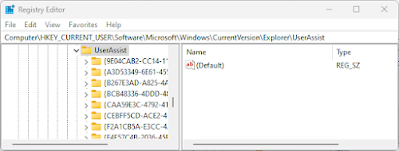
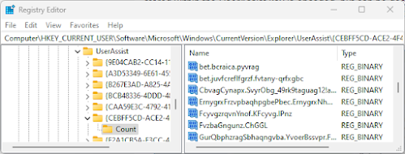
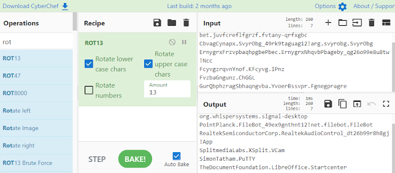
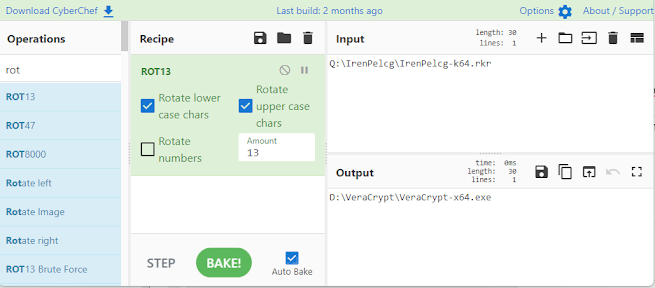
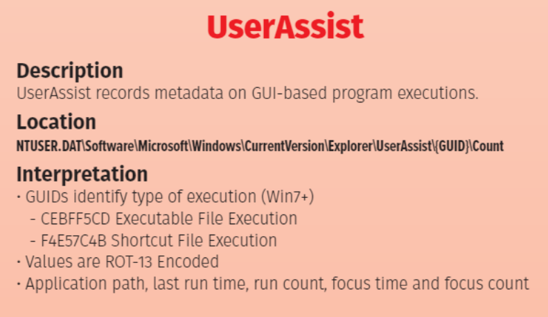

+++
title = "Registry- UserAssist"
description = "Complete guide to UserAssist registry analysis for digital forensics. Learn how Windows tracks program execution, forensic artifacts, and DFIR investigation techniques for UserAssist entries."
keywords = ["UserAssist registry", "Windows forensics", "program execution tracking", "digital forensics", "registry analysis", "DFIR", "Windows artifacts", "execution evidence", "forensic investigation", "malware analysis", "user activity tracking", "registry forensics"]
date = "2023-01-01"
lastmod = "2025-10-11"
tags = ["UserAssist", "Explorer UserAssist", "NTUSER.DAT", "ROT13 decoding", "Program execution evidence", "Run Count", "Focus Time", "DFIR timeline", "Windows 10 forensics", "Windows 11 forensics", "Registry artifacts", "Prefetch correlation", "AppCompatCache", "RECmd", "Registry Explorer", "RegRipper", "CyberChef", "UEME_RUNPATH", "UEME_RUNPIDL", "GUID CEBFF5CD-ACE2-4F4F-9178-9926F41749EA", "GUID F4E57C4B-2036-45F0-A9AB-443BCFE33D9F"]
categories = ["4n6", "Digital Forensics", "Windows Forensics", "Registry Analysis"]
type = "Artifacts"
seo_title = "UserAssist Registry Analysis - Windows Program Execution Forensics"
canonical = "/artifacts/userassist/"
aliases = ["/artifacts/userassist/", "/2023/02/userassist.html"]
featured_image = "/images/featured/Windows11Explorer.png"
schema_type = "TechArticle"
author = "JonesCKevin"
sitemap_priority = 0.8
sitemap_changefreq = "monthly"
[social_media]
  og_title = "UserAssist Registry Analysis - Windows Forensics Guide"
  og_description = "Complete guide to UserAssist registry analysis for tracking program execution in Windows digital forensics investigations."
  og_image = "/images/4n6post/userassist-social.png"
  og_type = "article"
  twitter_card = "summary_large_image"
  twitter_title = "UserAssist Registry Forensics Guide"
  twitter_description = "Learn UserAssist registry analysis for Windows forensics - program execution tracking and DFIR techniques."
  twitter_image = "/images/4n6post/userassist-twitter.png"
+++

## UserAssist Registry Analysis - Windows Program Execution Tracking


**UserAssist** is a feature of the Windows operating system that keeps track of the programs that are launched on a user's profile. This information is stored in the registry, a database that contains configuration settings for the operating system and other software. In this blog post, we'll explore what UserAssist is, its normal use cases, and how it can be abused by malicious actors.

## Normal Use Cases

UserAssist is designed to provide a quick and convenient way for users to launch their frequently used programs. Whenever a user launches a program, Windows stores the information in the UserAssist registry key. This information is then used to generate a list of recently used programs that can be accessed through the Start menu or the Run dialog box.

The UserAssist key is a registry key within the Windows operating system that stores information about a user's activity on the system. The key is stored within the registry, which is a hierarchical database that contains configuration information for the operating system and its applications. 

## Registry Location

The UserAssist key is located under the following path in the registry:

```
NTUSER.DAT\Software\Microsoft\Windows\CurrentVersion\Explorer\UserAssist\
```



The UserAssist registry contains subkeys with GUID identifiers that categorize different types of user activities:

- **{CEBFF5CD-ACE2-4F4F-9178-9926F41749EA}**: Executable file runs
- **{F4E57C4B-2036-45F0-A9AB-443BCFE33D9F}**: Shortcut file runs



## Data Structure and Encoding

UserAssist entries contain several important pieces of information:

### Encoded Program Names
Program names and paths are stored in ROT13 encoding (Caesar cipher with 13-character shift). This simple obfuscation requires decoding to reveal the actual program names.



### Execution Count and Timestamps
Each entry contains:
- **Run Count**: Number of times the program was executed
- **Last Execution Time**: Timestamp of most recent execution
- **Focus Time**: Total time the application had focus
- **Session ID**: Session identifier for the execution

## Decoding UserAssist Data

To properly analyze UserAssist data, the ROT13 encoding must be decoded. This can be accomplished using various tools:

### Manual Decoding
ROT13 shifts each letter 13 positions in the alphabet:
- A becomes N, B becomes O, etc.
- N becomes A, O becomes B, etc.

### CyberChef Analysis
CyberChef provides an excellent platform for decoding UserAssist data:



Using CyberChef's ROT13 operation, analysts can quickly decode:
- Program paths and names
- File extensions and types
- Full execution paths

## Forensic Significance

UserAssist provides valuable forensic evidence for:

### Program Execution Analysis
- **Proof of Execution**: Demonstrates specific programs were run
- **Usage Patterns**: Shows frequency and timing of program usage
- **Timeline Construction**: Provides timestamps for program execution
- **User Behavior**: Reveals user habits and preferences

### Malware Detection
UserAssist can reveal:
- Execution of suspicious programs
- Malware persistence mechanisms
- Unusual program execution patterns
- Anti-forensics tool usage

### Timeline Correlation
UserAssist timestamps help establish:
- Sequence of program executions
- User activity periods
- Correlation with other system events
- Evidence of specific user actions

## Malicious Use Cases

While UserAssist primarily serves legitimate purposes, it can also reveal malicious activities:

### Indicators of Compromise
- Execution of known malware families
- Running of hacking tools
- Anti-forensics software execution
- Suspicious system utility usage

### Attack Vector Analysis
- Initial infection vectors
- Lateral movement tools
- Data exfiltration utilities
- Cleanup tool execution

### Persistence Mechanisms
- Malware startup entries
- Scheduled task execution
- Service installation tools
- Registry modification utilities

## Analysis Tools and Techniques

### Registry Analysis Tools
- **Registry Explorer**: GUI-based registry analysis
- **RECmd**: Command-line registry parsing
- **RegRipper**: Automated registry analysis
- **UserAssist plugins**: Specialized parsing tools

### Timeline Analysis
1. Extract UserAssist timestamps
2. Correlate with other system artifacts
3. Build comprehensive timeline
4. Identify patterns and anomalies

### Artifact Correlation
Cross-reference UserAssist data with:
- Prefetch files
- Application compatibility cache
- Event logs
- File system timestamps

## Forensic Best Practices

### Data Preservation
1. **Image Registry Hives**: Capture complete NTUSER.DAT files
2. **Document Findings**: Record all relevant UserAssist entries
3. **Timeline Integration**: Include UserAssist data in master timeline
4. **Validation**: Cross-reference with other execution artifacts

### Analysis Methodology
1. **Decode Entries**: Convert ROT13 encoding to readable text
2. **Timestamp Analysis**: Examine execution times and patterns
3. **Program Identification**: Research unknown or suspicious programs
4. **Context Evaluation**: Consider user role and expected behavior

## Limitations and Considerations

### Data Persistence
- UserAssist data persists across system reboots
- Limited by registry size constraints
- May be cleared by system cleaning tools
- Subject to registry corruption

### Coverage Limitations
- Only tracks GUI-launched programs
- Does not record command-line executions
- May miss some program types
- Dependent on Windows version



## Conclusion

UserAssist registry analysis provides crucial insights into user program execution behavior. For digital forensic investigators, this artifact offers concrete evidence of program execution with precise timestamps and execution counts.

The combination of execution proof, timing data, and usage patterns makes UserAssist an invaluable tool for:
- Establishing program execution timelines
- Detecting malicious software execution
- Understanding user behavior patterns
- Correlating with other forensic artifacts

Despite its limitations, UserAssist remains one of the most reliable sources of program execution evidence in Windows forensics, providing investigators with detailed execution history that persists across system activities and reboots.