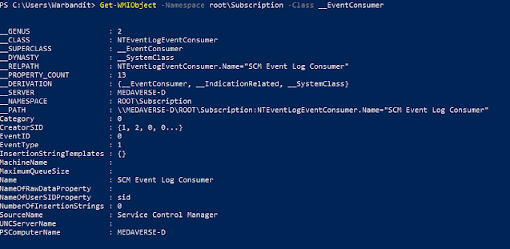

+++
title = "WMI Filter Query Consumer"
date = "2023-01-01"
draft = false
tags = ["4n6", "digital forensics", "windows forensics", "WMI", "persistence", "DFIR"]
categories = ["4n6", "Digital Forensics"]
type = "Artifacts"
author = "JonesCKevin"
seo_title = "WMI Forensics - Event Filter Consumer Persistence Analysis"
description = "Complete guide to WMI forensic analysis for detecting malicious persistence. Learn WMI event filters, consumers, bindings, Objects.data parsing, and DFIR investigation techniques for Windows forensics."
keywords = ["WMI forensics", "WMI persistence", "event filter consumer", "WMI malware", "Objects.data", "Windows forensics", "digital forensics", "DFIR", "malware persistence", "WMI repository", "forensic investigation", "threat hunting"]
canonical = "/artifacts/WMI-Filter-Query-Consumer/"
aliases = ["/artifacts/WMI-Filter-Query-Consumer/", "/2023/03/wmi-filterqueryconsumer.html"]
featured_image = "/images/featured/artifacts/Windows11Explorer.png"
schema_type = "Article"
+++


Windows Management Instrumentation (WMI) is a Microsoft technology that provides a unified way of managing Windows operating systems and applications. WMI is a management infrastructure that is built into Windows operating systems, and it provides a standardized interface for accessing system management information. WMI is used by system administrators to gather information about the state of their systems, to automate system management tasks, and to perform remote administration. In this blog post, we will take a closer look at what WMI is, how it works, and some examples of its normal and malicious use cases.

## What is Windows Management Instrumentation (WMI)?

WMI is a technology that enables developers and system administrators to access and manipulate information about Windows operating systems and applications through a standardized interface. WMI provides a set of objects and methods that can be used to query and manage system resources, such as hardware devices, software applications, and network settings. WMI also provides an infrastructure for monitoring and controlling system events and processes, such as system startup, shutdown, and user logon.

The WMI information is stored in a file called Objects.DATA. This can be found at:

```
%SYSTEMROOT%\system32\wbem\Repository\OBJECTS.DATA
```

OBJECTS.DATA can be a valuable source of information for system administrators and security professionals, as it provides a list of WMI classes that can be used to gather information, execute code, and create persistence mechanisms for both Normal and Malicious Purposes.

## How does WMI work?

WMI is based on the Common Information Model (CIM), which is a standard for representing management information in a consistent way. CIM defines a set of classes, properties, and methods that can be used to access and manipulate management information. WMI provides a CIM-based interface for accessing management information on Windows systems. 

WMI consists of three main components: 
- **WMI service**: The core service that manages WMI operations
- **WMI repository**: Database storing management information
- **WMI providers**: Components that supply data to the WMI service

## WMI Event Consumers

WMI Event Consumers are components that can respond to specific WMI events. There are several types:

### Filter Components:
- **Event Filters**: Define the events to monitor
- **Event Consumers**: Define the actions to take when events occur
- **Filter-to-Consumer Bindings**: Link filters to consumers

### Consumer Types:
- **ActiveScript Event Consumer**: Executes scripts (VBScript, JScript)
- **CommandLine Event Consumer**: Executes command-line programs
- **LogFile Event Consumer**: Writes events to log files
- **NT Event Log Consumer**: Writes to Windows Event Log
- **SMTP Event Consumer**: Sends email notifications

## PowerShell WMI Analysis

PowerShell provides powerful capabilities for analyzing WMI components:



### Key PowerShell Commands:

```powershell
# List Event Filters
Get-WMIObject -Namespace root\Subscription -Class __EventFilter

# List Event Consumers  
Get-WMIObject -Namespace root\Subscription -Class __EventConsumer

# List Filter-to-Consumer Bindings
Get-WMIObject -Namespace root\Subscription -Class __FilterToConsumerBinding

# List CommandLine Event Consumers
Get-WMIObject -Namespace root\Subscription -Class CommandLineEventConsumer

# List ActiveScript Event Consumers
Get-WMIObject -Namespace root\Subscription -Class ActiveScriptEventConsumer
```

## Normal Use Cases

### Legitimate Administrative Functions:
- **System Monitoring**: Tracking system performance and health
- **Event Notification**: Alerting administrators to system events
- **Automated Maintenance**: Running scheduled maintenance tasks
- **Resource Management**: Monitoring disk space, memory usage
- **Security Monitoring**: Detecting security-related events

### Enterprise Management:
- Network monitoring and reporting
- Software deployment and inventory
- Hardware asset management
- Performance baseline monitoring
- Compliance reporting and auditing

## Malicious Use Cases

### Persistence Mechanisms:
WMI Event Consumers are commonly abused by attackers for persistence:

- **Malware Execution**: Automatically executing malware when specific events occur
- **Backdoor Activation**: Triggering backdoors based on system events
- **Credential Harvesting**: Capturing credentials during logon events
- **Anti-Forensics**: Detecting and responding to forensic tools

### Attack Techniques:
- **Living off the Land**: Using legitimate WMI functionality maliciously
- **Fileless Malware**: Storing malicious code in WMI repository
- **Lateral Movement**: Using WMI for remote command execution
- **Data Exfiltration**: Monitoring file access and stealing data

### Common Malicious Patterns:
- Event filters monitoring user logons
- Consumers executing PowerShell scripts
- Bindings that trigger on specific processes
- Scripts that download additional payloads

## Forensic Analysis Techniques

### WMI Artifact Locations:
```
C:\Windows\System32\wbem\Repository\
C:\Windows\System32\wbem\Logs\
Registry: HKLM\SOFTWARE\Microsoft\Wbem\
```

### Investigation Steps:

1. **Enumerate WMI Components**
   - List all event filters, consumers, and bindings
   - Identify suspicious or unusual configurations
   - Document creation times and authors

2. **Analyze Event Filters**
   - Review filter queries for suspicious patterns
   - Check for filters monitoring security events
   - Identify overly broad or unusual event criteria

3. **Examine Event Consumers**
   - Analyze consumer actions and commands
   - Look for PowerShell scripts or executables
   - Check for network communications or file operations

4. **Timeline Analysis**
   - Correlate WMI component creation times
   - Match with other system events and malware activity
   - Identify patterns of malicious WMI usage

### Detection Indicators:
- Unusual WMI event consumers
- Suspicious PowerShell or command execution
- WMI components created outside business hours
- Event filters monitoring security-sensitive events
- Consumer actions involving network communications

## Investigation Best Practices

### Data Collection:
1. **Repository Backup**: Copy WMI repository files
2. **PowerShell Enumeration**: Use PowerShell to list all WMI components
3. **Log Analysis**: Review WMI-related event logs
4. **Timeline Construction**: Map WMI activity to other system events

### Analysis Methodology:
1. **Component Inventory**: Catalog all WMI filters and consumers
2. **Baseline Comparison**: Compare against known-good systems
3. **Anomaly Detection**: Identify unusual or suspicious configurations
4. **Context Analysis**: Consider business requirements and normal usage

## Remediation and Prevention

### Immediate Response:
- Remove malicious WMI components
- Block network communications from identified malware
- Examine other systems for similar compromise
- Update security monitoring to detect WMI abuse

### Prevention Strategies:
- Monitor WMI component creation and modification
- Implement PowerShell logging and monitoring
- Use application whitelisting to prevent unauthorized scripts
- Regular auditing of WMI configurations
- Network segmentation to limit WMI remote access

## Conclusion

WMI Filter Query Consumer analysis is crucial for detecting advanced persistent threats and understanding sophisticated attack techniques. The ability to create persistent, event-driven execution mechanisms makes WMI a powerful tool for both legitimate administration and malicious activities.

Forensic investigators must understand:
- WMI architecture and component relationships
- PowerShell techniques for WMI analysis
- Common attack patterns using WMI
- Detection and analysis methodologies

Regular monitoring and analysis of WMI components can reveal both current compromises and historical attack activity, making it an essential component of comprehensive digital forensic investigations and threat hunting activities.