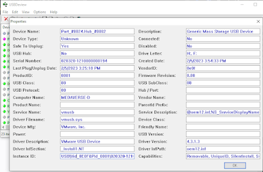
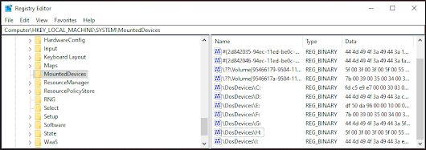
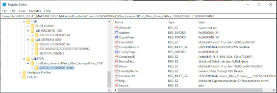
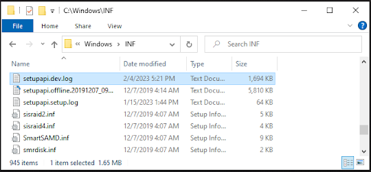
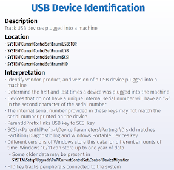
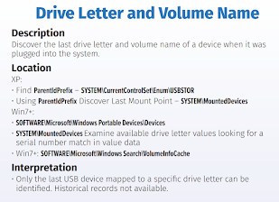
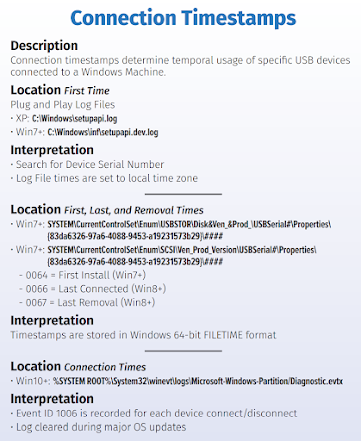

+++
title = "Windows USB Connection Analysis"
date = "2023-01-01"
draft = false
tags = ["4n6", "digital forensics", "windows forensics", "USB forensics", "registry", "DFIR"]
categories = ["4n6", "Digital Forensics"]
type = "Artifacts"
author = "JonesCKevin"
seo_title = "Windows USB Forensics - Device Connection Analysis Guide"
description = "Comprehensive guide to Windows USB forensic analysis. Learn USBSTOR registry, setupapi.dev.log parsing, MountedDevices tracking, and external device investigation for DFIR."
keywords = ["USB forensics", "USBSTOR registry", "setupapi.dev.log", "Windows USB analysis", "MountedDevices", "external device tracking", "digital forensics", "DFIR", "data exfiltration", "USB device history", "registry artifacts", "device forensics"]
canonical = "/artifacts/Windows-USB-Connection/"
aliases = ["/artifacts/Windows-USB-Connection/", "/2023/02/windows-usb-connections.html"]
featured_image = "/images/featured/artifacts/RegistryBlock.png"
schema_type = "Article"
+++


**USB connections** are a commonly used method for transferring data between computers and other electronic devices. In Windows, the use of USB connections can affect the registry in several ways, including within the registry are the **USB**, **USBSTOR** and **MountPoints** keys. In this post, we'll explore the connection between USB Mountpoints and the setupapi.dev.log, and provide examples of both normal and malicious use cases.

## USB Forensics Overview

USB device forensics involves analyzing multiple Windows artifacts to track USB device usage, including:

- **Registry Keys**: USB, USBSTOR, and MountedDevices
- **Log Files**: setupapi.dev.log and setupapi.app.log
- **Event Logs**: System and Security event logs
- **File System**: LNK files and recent document lists

## Registry Locations

### USB Device Registry Keys

The primary registry locations for USB forensics are:

```
HKEY_LOCAL_MACHINE\SYSTEM\CurrentControlSet\Enum\USB
HKEY_LOCAL_MACHINE\SYSTEM\CurrentControlSet\Enum\USBSTOR
HKEY_LOCAL_MACHINE\SYSTEM\MountedDevices
```



### MountedDevices Registry

The MountedDevices registry key contains information about all mounted storage devices:



This key maps:
- **Volume GUIDs** to physical device identifiers
- **Drive Letters** to device signatures
- **Device Serial Numbers** to mount points

### USBSTOR Registry Analysis

The USBSTOR key provides detailed information about USB storage devices:



Key information includes:
- **Vendor ID**: Manufacturer identifier
- **Product ID**: Device model identifier
- **Device Serial Number**: Unique device identifier
- **Device Class**: Type of USB device


Each device entry contains:
- **First Installation Time**: When device was first connected
- **Last Connection Time**: Most recent connection timestamp
- **Device Properties**: Hardware characteristics and capabilities


## Setup API Device Log Analysis

The setupapi.dev.log file provides detailed information about device installation and connection events:



The log contains:
- **Device Installation Events**: When devices are first recognized
- **Driver Installation**: Driver loading and configuration
- **Connection Timestamps**: Precise connection and disconnection times
- **Error Messages**: Installation failures or device conflicts

### Log File Locations

```
C:\Windows\inf\setupapi.dev.log
C:\Windows\inf\setupapi.app.log
```

These logs provide:
- Chronological device activity
- Device identification details
- Installation success/failure status
- Driver compatibility information

## Normal Use Cases

### Legitimate USB Activities:
- **File Transfers**: Moving documents between systems
- **Backup Operations**: Regular data backup to external drives
- **Software Installation**: Installing software from USB media
- **Peripheral Devices**: Keyboards, mice, printers, cameras

### Business Environment Usage:
- Employee file transfers for legitimate work
- IT administration and system maintenance
- Approved backup and storage operations
- Authorized software installations

## Malicious Use Cases

### Data Exfiltration:
- **Unauthorized File Copying**: Stealing sensitive documents
- **Database Dumps**: Extracting large datasets
- **Intellectual Property Theft**: Copying proprietary information
- **Personal Data Harvesting**: Stealing customer or employee data

### Malware Introduction:
- **USB-Based Malware**: Introducing viruses or trojans
- **Autorun Exploits**: Exploiting autorun functionality
- **Lateral Movement**: Moving malware between air-gapped systems
- **Persistence Mechanisms**: Installing backdoors via USB

### Anti-Forensics:
- **Evidence Destruction**: Using USB tools to wipe evidence
- **Registry Cleaning**: Removing traces of USB activity
- **Log File Manipulation**: Altering or deleting device logs
- **Timestamp Modification**: Changing file modification times

## Forensic Analysis Techniques

### Timeline Construction

1. **Registry Timestamp Analysis**
   - Extract first installation times
   - Identify last connection times
   - Correlate with user activity

2. **Log File Correlation**
   - Parse setupapi.dev.log entries
   - Match device events with registry data
   - Build comprehensive timeline

3. **Cross-Artifact Analysis**
   - Correlate with Event Logs
   - Analyze LNK files for USB access
   - Review recent document lists

### Device Identification

- **Vendor/Product ID Lookup**: Identify specific device models
- **Serial Number Tracking**: Follow individual device usage
- **Capacity Analysis**: Determine storage device sizes
- **Connection Pattern Analysis**: Identify regular vs. anomalous usage

## SANS USB Analysis References







## Investigation Best Practices

### Data Collection
1. **Registry Hive Extraction**: Capture SYSTEM and SOFTWARE hives
2. **Log File Preservation**: Collect setupapi logs and Event Logs
3. **Timeline Documentation**: Create comprehensive timeline of USB activity
4. **Cross-Reference Analysis**: Correlate multiple data sources

### Analysis Methodology
1. **Device Enumeration**: Catalog all USB devices ever connected
2. **Timeline Analysis**: Map device usage patterns over time
3. **Anomaly Detection**: Identify unusual device connection patterns
4. **Data Correlation**: Cross-reference with other forensic artifacts

### Reporting Considerations
- Document all USB devices and connection times
- Highlight suspicious or policy-violating activities
- Provide context for legitimate business usage
- Correlate findings with other investigative evidence

## Limitations and Challenges

### Data Persistence
- Registry entries may be overwritten
- Log files have size limitations
- Some data may be cleared by system maintenance
- Anti-forensics tools can remove traces

### Technical Limitations
- USB hub connections may complicate analysis
- Virtual machine USB redirection affects tracking
- Some USB devices may not generate full registry entries
- Encrypted devices may limit analysis capabilities

## Conclusion

Windows USB connection analysis provides crucial insights into data transfer activities and potential security incidents. The combination of registry analysis, log file examination, and timeline correlation enables investigators to:

- Track unauthorized data exfiltration attempts
- Identify malware introduction vectors
- Establish patterns of legitimate vs. suspicious USB usage
- Provide concrete evidence of device connections and usage

Effective USB forensics requires systematic analysis of multiple data sources, careful timeline construction, and thorough understanding of Windows USB device management. This analysis capability is essential for data loss prevention investigations, insider threat detection, and comprehensive incident response activities.