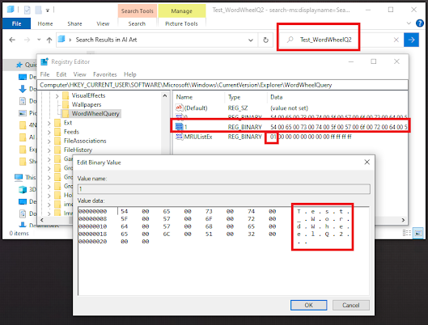
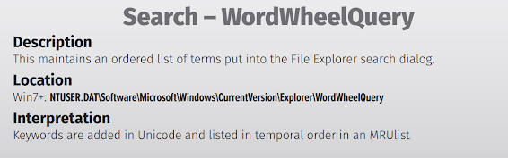

+++
title = "WordWheelQuery"
date = "2023-01-01"
draft = false
tags = ["4n6", "digital forensics", "windows forensics", "registry", "search history", "DFIR"]
categories = ["4n6", "Digital Forensics"]
type = "Artifacts"
author = "JonesCKevin"
seo_title = "WordWheelQuery Forensics - Windows Search History Analysis"
description = "Comprehensive guide to WordWheelQuery registry forensic analysis for tracking Windows search history. Learn search term extraction, user intent analysis, and DFIR investigation techniques."
keywords = ["WordWheelQuery registry", "Windows search history", "search forensics", "user search tracking", "registry analysis", "digital forensics", "DFIR", "Windows Explorer search", "forensic artifacts", "search terms", "user activity", "forensic investigation"]
canonical = "/artifacts/WordWheelQuery/"
aliases = ["/artifacts/WordWheelQuery/", "/2023/02/registry-wordwheelquery.html"]
featured_image = "/images/featured/RegistryBlock.png"
schema_type = "Article"
+++


## The Registry Section of WordWheelQuery: An Overview for Digital Forensic Investigators

The WordWheelQuery registry section is a critical component for digital forensic investigations, as it contains information about the user's search queries made using the Windows operating system. In this blog post, we'll take a closer look at what exactly can be found in the WordWheelQuery registry section and its significance for both normal and malicious use cases.

## Finding the WordWheelQuery Registry

### What is the Significance of the Registry Section of WordWheelQuery?

The registry section of WordWheelQuery is significant for digital forensic investigations because it contains information about the user's search queries made using the Windows operating system. This information can be extremely valuable for investigations, as it can provide insight into what a user was searching for on their computer.

The WordWheelQuery registry section stores the search terms that a user has entered into the Windows search bar. This information is stored in the following registry location:

```
HKEY_CURRENT_USER\Software\Microsoft\Windows\CurrentVersion\Explorer\WordWheelQuery
```



### What Information Can Be Found in the WordWheelQuery Registry Section?

The WordWheelQuery registry section contains information about the search terms that a user has entered into the Windows search bar. This information includes:

- **Search terms**: The actual words or phrases that the user searched for
- **Search frequency**: How often each search term was used
- **Search order**: The order in which search terms were entered (indicated by the MRUList)

The registry entries are stored with keys like "0", "1", "2", etc., and the **MRUList** value indicates the order of usage, with the most recent searches listed first.

## Normal Use Cases

In normal use cases, the WordWheelQuery registry section is used to store search terms that a user has entered into the Windows search bar. This information is used by the Windows operating system to provide auto-complete suggestions when the user starts typing in the search bar.

### Examples of Normal Use:
- Searching for applications: "calculator", "notepad", "chrome"
- Searching for files: "document", "report", "photos"
- Searching for system settings: "control panel", "network", "display"

## Malicious Use Cases

While the WordWheelQuery registry section is primarily used for legitimate purposes, it can also provide valuable forensic evidence in cases involving malicious activity.

### Examples of Malicious Indicators:
- **Surveillance**: Searches for terms like "keylogger", "remote access", "steganography"
- **Data Exfiltration**: Searches for "USB", "external drive", "cloud storage", "encryption"
- **Anti-Forensics**: Searches for "delete history", "secure delete", "registry cleaner"
- **Malware Research**: Searches for specific malware names, exploit techniques, or hacking tools

## Forensic Analysis Considerations

When analyzing WordWheelQuery registry entries, forensic investigators should consider:

1. **Timeline Correlation**: Cross-reference search times with other system activities
2. **Context Analysis**: Consider the search terms in relation to other evidence
3. **User Behavior Patterns**: Look for unusual or suspicious search patterns
4. **Data Persistence**: WordWheelQuery data persists even after clearing browser history



## Conclusion

The WordWheelQuery registry section provides valuable insight into user search behavior on Windows systems. For digital forensic investigators, this artifact can reveal user intent, research activities, and potentially malicious behavior. Understanding how to locate and interpret this data is essential for comprehensive forensic analysis.

The persistence of search query data in the registry makes it a reliable source of evidence, even when users attempt to clear their browsing history or other traces of their activities. As with all forensic artifacts, WordWheelQuery data should be analyzed in context with other system evidence to build a complete picture of user activity.