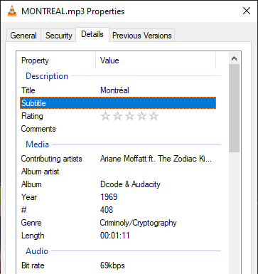
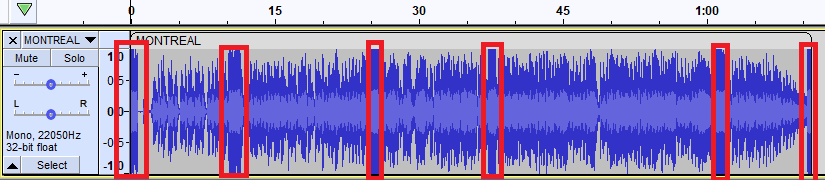
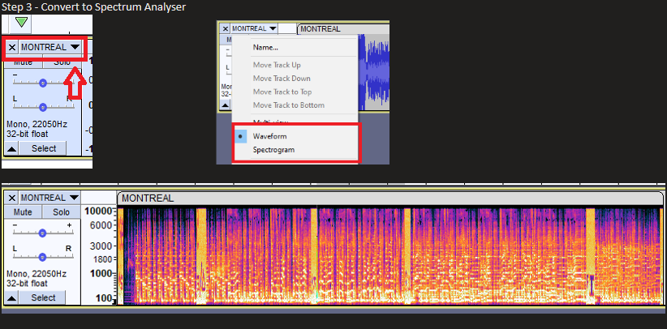
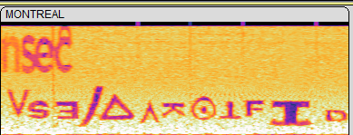

## Context

I play this tune every time I'm headed home and land at Montréal-Pierre Elliott Trudeau International Airport! It has a special meaning for this year. Can you find it?

> **Warning:** This remixed version of the song has some really loud parts. Keep your volume low.

---

### Provided File

- [MONTREAL.mp3](MONTREAL.mp3)

---

## Solution Steps

### 1. Check Metadata

Inspect the file properties for metadata clues:

---

### 2. Analyze Audio in Audacity

Open the file in Audacity or play it to observe the unusually high, chunked waveforms:

---

### 3. (Optional) Trim Audio

You may choose to cut out the sections in between or proceed to the next step.

---

### 4. Cut Excess Audio

Remove unnecessary parts to focus on the relevant audio segments.

---
