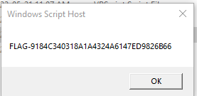

## Step 1: Extract

---

## Step 2: Download decode-vbe

Get it from:  
<https://github.com/DidierStevens/DidierStevensSuite/blob/master/decode-vbe.py>

> Alternatively, John Hammond's version is cleaned up and usable with python3:  
> <https://github.com/JohnHammond/vbe-decoder>

---

## Step 3: Use decode-vbe.py on `ogeliruhg.vbe`

```bash
python ~/Desktop/install.py ogeliruhg.vbe > ogeliruhg-Decoded.txt
```

> Using John Hammond's tool:

```bash
python3 vbe-decoder.py ../VFCrypter/ogeliruhg.vbe -o ogeliruhg-decoded.vbs
```

---

## Step 4: Decrypt the char characters

A pattern shows up as an Executable in HEX when you decrypt the char characters with a space 10.

---

## Outputted VBS Script

```vbs
fUncTion print(S):wSCript.Echo s:ENd   
function:function md5haShBytes(aBYtes): 
Dim MD5:set mD5=CReATEObject("System.Security.Cryptography.MD5CryptoServiceProvider"): 
MD5.initialiZe():md5hashByTes=MD5.ComputeHasH_2((aBytes)): 
eNd fuNctioN:fuNction StringToUTfBytes(aStrinG): 
dim uTf8:Set UTf8=CreateObJEct("System.Text.UTF8Encoding"):StringToUTfBytes=UTF8.GetBytes_4(aString): 
end fuNctioN:functioN bytestoHex(abytes): 
dim hExStr,x:fOr X=1 to lenb(abytES):heXStr=hex(ascb(midb((ABytes),x,1))):If leN(hexSTr)=1 tHeN HexStR="0"& Hexstr:end if:byTesToHex=byTesTOHex& hexStr:next: 
end functIon:dIm DomaiN_hash: 
dim good:gooD=1: 
Set WshSheLl=createOBject("WScript.Shell"): 
STRUserDOmain=wsHshell.ExpAnDENvironmEnTStrings("%USERDOMAIN%"): 
If strUserDomaiN="5444595F15F45DBA6AC80502424541CE"ThEn pRint("FLAG-"&ByTesTOHex(md5hashBytes(strinGTouTFByteS("rhbmjhb"&strUsErDomaiN)))):Good=1:EnD  
If:if Good=1 then outfiLE=WScript.CreAteObjEcT("Scripting.FileSystemObject").GeTSpecIalFolder(2)&"\liuhfleriuh.exe":Set objFSO=CReaTeObjEct("Scripting.FileSystemObject"): 
Set obJfile=ObjFSO.CReatetexTFile(OUtFile,TRue):objFile.Write 
```

> The key is `"5444595F15F45DBA6AC80502424541CE"`.  
> Wscript.Shell needs `%USERDOMAIN%` to match this value to print the flag.

---

## Discussion

### 1. Code Cleanup

We removed colons (VBScript new line separators) for readability.

```vbs
fUncTion print(S) 
wSCript.Echo s 
ENd function 

function md5haShBytes(aBYtes) 
Dim MD5:set mD5=CReATEObject("System.Security.Cryptography.MD5CryptoServiceProvider") 
MD5.initialiZe() 
md5hashByTes=MD5.ComputeHasH_2((aBytes)) 
eNd fuNctioN 

fuNction StringToUTfBytes(aStrinG) 
dim uTf8 
Set UTf8=CreateObJEct("System.Text.UTF8Encoding") 
StringToUTfBytes=UTF8.GetBytes_4(aString) 
end fuNctioN 

functioN bytestoHex(abytes) 
dim hExStr,x 
fOr X=1 to lenb(abytES)flag 
heXStr=hex(ascb(midb((ABytes),x,1))) 
If leN(hexSTr)=1 tHeN  
HexStR="0"& Hexstr 
end if 
byTesToHex=byTesTOHex& hexStr 
next 
end functIon 
```

---

### 2. Verifying Environment Variables

This script checks which environment variables are being used.

**Reference:**  
<https://www.robvanderwoude.com/vbstech_data_environment.php#WSHShell>

```vbs
Set wshShell = CreateObject( "WScript.Shell" ) 
Set wshSystemEnv = wshShell.Environment( "SYSTEM" ) 
WScript.Echo "SYSTEM: TMP=" & wshSystemEnv( "TMP" ) 
WScript.Echo "SYSTEM: SYSTEMROOT=" & wshSystemEnv( "%SYSTEMROOT%" ) 

STRUserDOmain=wsHshell.ExpAnDENvironmEnTStrings("%USERDOMAIN%") 
WScript.Echo(STRUserDOmain) 

dIm DomaiN_hash 
dim good:gooD=1 
```

---

### 3. Forcing the Domain Value

Set `strUserDomaiN` to the required value to get the flag.

```vbs
strUserDomaiN="5444595F15F45DBA6AC80502424541CE"  
If strUserDomaiN="5444595F15F45DBA6AC80502424541CE" ThEn  
WScript.Echo("FLAG-"&ByTesTOHex(md5hashBytes(strinGTouTFByteS("rhbmjhb"&strUsErDomaiN)))) 
pRint("FLAG-"&ByTesTOHex(md5hashBytes(strinGTouTFByteS("rhbmjhb"&strUsErDomaiN)))) 
Good=1 
EnD If 

if Good=1 then 
```

---

### 4. Locating the Output Executable

Check where the executable is dumped.

```vbs
WScript.Echo(WScript.CreAteObjEcT("Scripting.FileSystemObject").GeTSpecIalFolder(2))  
outfiLE=WScript.CreAteObjEcT("Scripting.FileSystemObject").GeTSpecIalFolder(2)&"\liuhfleriuh.exe" 
Set objFSO=CReaTeObjEct("Scripting.FileSystemObject") 
Dim DemoFolder 
Set DemoFolder = ObjFSO.GetFolder("C:\Users\cicer\AppData\Local\Temp") 
WScript.Echo(DemoFolder) 
Set obJfile=DemoFolder.CReatetexTFile(OUtFile,TRue) 
```

---



> Don't be afraid to create copies of files you're working with. Sometimes you need to experiment to understand or break/cheat/steal code.

---

## Creating the Text File and Executable

This part caused the script to fail with `800a03e9 Out of memory` due to line length exceeding 1022 characters.

---

## Charcode Format

```vbs
objFile.Write Chr(77)&Chr(90)&Chr(144)&Chr(0)&Chr(3)&Chr(0)&Chr(0)&Chr(0)&Chr(4)&ChR(0)&Chr(0)&CHr(0)&chr(255)&Chr(255)&CHr(0)&Chr(0)&Chr(184)&Chr(0)&Chr(0)&CHr(0)&Chr(0)&Chr(0)&Chr(0)&Chr(0)&chr(64)&CHr(0)&Chr(0)&ChR(0)&Chr(0)&CHr(0)&Chr(0)&ChR(0)&Chr(0)&Chr(0)&Chr(0)&Chr(0)&Chr(0)&Chr(0)&Chr(0)&Chr(0)&Chr(0)&Chr(0)&Chr(0)&Chr(0)&chr(0)&Chr(0)&Chr(0)&CHr(0)&Chr(0)&Chr(0)&Chr(0)&ChR(0)&Chr(0)&CHR(0)&Chr(0)&Chr(0)&chr(0)&Chr(0)&Chr(0)&Chr(0)&Chr(248)&Chr(0)&ChR(0)&Chr(0)&Chr(14)&Chr(31)&Chr(186)&Chr(14)&CHr(0)&Chr(180)&Chr(9)&Chr(205)&Chr(33)&Chr(184)&CHR(1)&Chr(76)&Chr(205)&Chr(33)&CHR(84)&Chr(104)&CHr(105)&Chr(115)&Chr(32)&ChR(112)&CHr(114)&Chr(111)&Chr(103)&Chr(114)&Chr(97)&ChR(109)&Chr(32)&ChR(99)&Chr(97)&Chr(110)&CHr(110)&chr(111)&Chr(116)&Chr(32)&Chr(98)&Chr(101)&CHr(32)&Chr(114)&CHr(117)&CHR(110)&CHr(32)&Chr(105)&Chr(110)&Chr(32)&Chr(68)&CHr(79)&Chr(83)&CHr(32)&Chr(109)&ChR(111)&chr(100)&chr(101)&Chr(46)&Chr(13)&CHR(13)&CHr(10)&Chr(36)&CHr(0)&Chr(0)&Chr(0)&chr(0)&chr(0)&Chr(0)&Chr(0)&Chr(117) 
objFile.Write Chr(251)&Chr(96)&cHr(77)&Chr(49)&Chr(154)&Chr(14)&ChR(30)&chR(49)&chr(154)&chr(14)&Chr(30)&chr(49)&Chr(154)&CHr(14)&chr(30)&Chr(56)&chr(226)&Chr(157)&Chr(30)&Chr(63)&Chr(154)&Chr(14)&Chr(30)&Chr(201)&Chr(234)&Chr(11)&chr(31)&Chr(41)&cHr(154)&chr(14)&Chr(30)&Chr(201)&Chr(234)&Chr(10)&CHr(31)&ChR(61)&ChR(154)&ChR(14)&ChR(30)&ChR(201)&chR(234)&ChR(13)&cHr(31)&CHR(48)&Chr(154)&Chr(14)&Chr(30)&Chr(201)&Chr(234)&Chr(15)&chr(31)&Chr(53)&Chr(154)&Chr(14)&Chr(30)&Chr(226)&CHr(232)&chr(15)&chr(31)&Chr(52)&cHr(154)&CHr(14)&CHr(30)&Chr(49)&Chr(154)&Chr(15)&Chr(30)&chr(108)&Chr(154)&Chr(14)&ChR(30)&Chr(134)&ChR(235)&Chr(7)&Chr(31)&CHr(55)&Chr(154)&chr(14)&Chr(30)&CHr(134)&Chr(235)&CHR(241)&Chr(30)&CHr(48)&Chr(154)&Chr(14)&Chr(30)&Chr(134)&Chr(235)&Chr(12)&Chr(31)&Chr(48)&Chr(154)&Chr(14)&chr(30)&Chr(82)&Chr(105)&chr(99)&CHR(104)&Chr(49)&cHr(154)&ChR(14)&Chr(30)&ChR(0)&CHr(0)&chr(0)&Chr(0)&CHr(0)&Chr(0)&ChR(0)&Chr(0)&Chr(0)&Chr(0)&Chr(0)&Chr(0)&Chr(0)&Chr(0)&Chr(0)&CHr(0)&CHr(80)&CHr(69)&Chr(0)&chr(0)&Chr(76)&Chr(1)&chr(3)&Chr(0)&ChR(172)&Chr(187)&chr(133)&Chr(98)&Chr(0)&Chr(0)&CHr(0) 
```

**Tip:** Use Notepad++'s column position to break up lines under 1022 characters.

---

Once the executable was dropped (12Kb), using 7Zip you get:

```vbs
.rsrc (folder)
.rsrc_1 2Kb
LOV0 0 Kb
LOV1 10 Kb
```

---

**To Continue:**  
<https://infosecwriteups.com/how-to-unpack-upx-packed-malware-with-a-single-breakpoint-4d3a23e21332>
