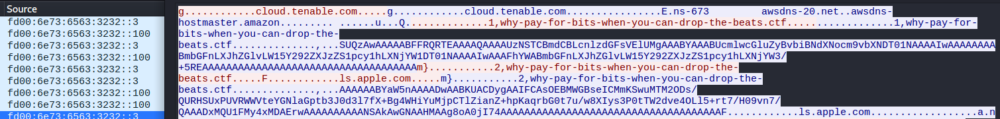
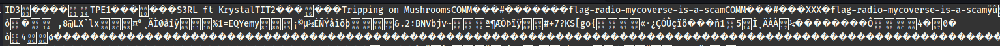
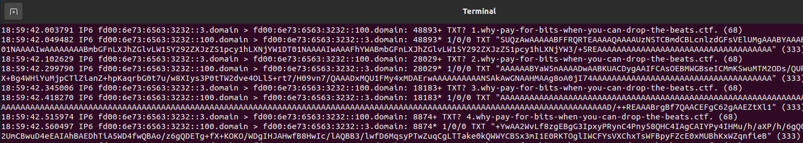
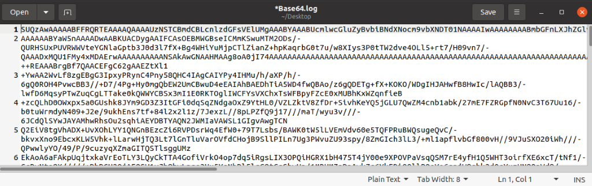
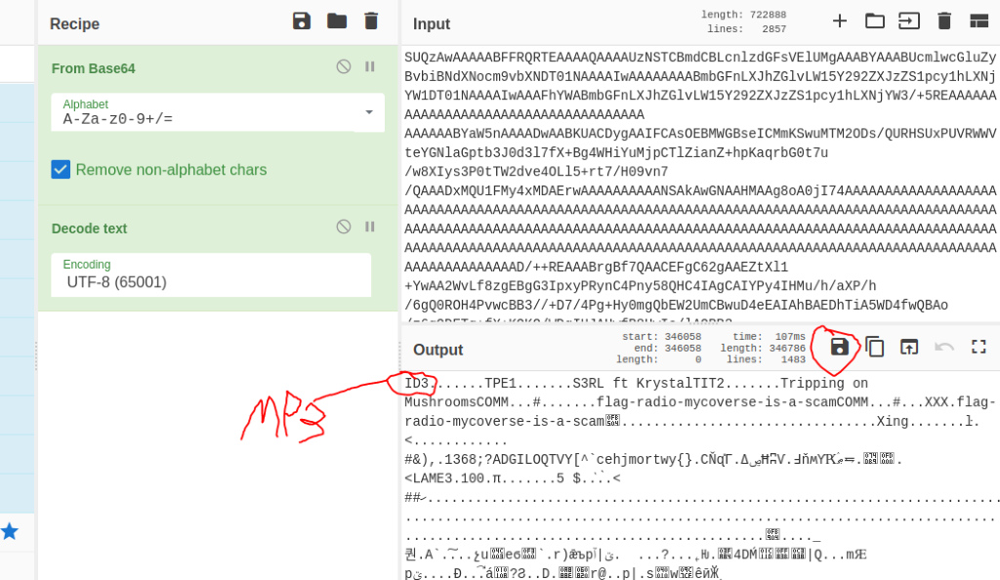
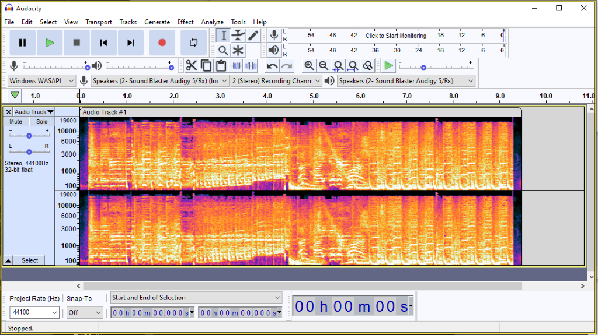
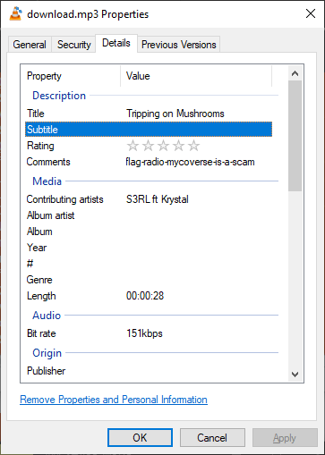
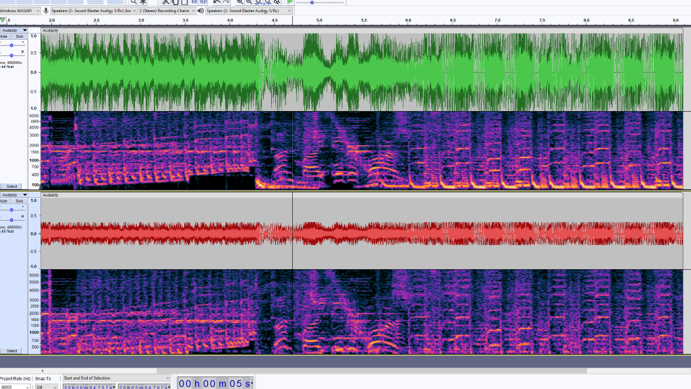

## Part 1 - Version 1

- `3232::3` had base64 encoded strings.



- After decoding, found a flag.
- `ID3` is the magic number for MP3 files, but can't get it to play as an MP3.
- "Tripping on Mushrooms" by S3RL is a real song, apparently.
- (See below for solution.)



```md
flag-radio-mycoverse-is-a-scam
```

---

## PART 1 and 2 - Version 2

Very similar. You can see in the original PCAP if you look at TXT records using:

```bash
tcpdump -r portobello53.pcapng | grep TXT
```



**Dump the destination IPv6 to a pcap and resize like prior to a log file for manipulation of the Base64 if required:**

```bash
tcpdump -nr portobello53.pcapng 'src fd00:6e73:6563:3232::100 and dst fd00:6e73:6563:3232::3' | cut -d " " -f 9- | cut -d " " -f –1
```

- This file just needs the quotes removed and any remaining junk such as (##)'s.



- This should give a solid-ish file. As this isn't primed for usage, I just loaded the file in CyberChef and saved as MP3. (This proved to be incomplete; see below for a better final version.)

---

## From here you can see FLAG 1



---

## Trying to find flag two

- Audacity does not give anything visually.



- Looking at the metadata comment gives what we saw earlier for flag 1.



- No new results. Cutting and manipulating the spectrum hasn't proven any results for me:



---

## Part 2 - Solution (Based on post write-up)

- `ID3` is a metadata container usually used in MP3.
- We can try to extract all the TXT records and create a single file out of them with this script:

```python
from scapy.all import *
import base64

raw = sniff(offline="portobello53.pcapng")

data = b''

for packet in raw:
    if packet[IPv6].src == 'fd00:6e73:6563:3232::100' and b'why-pay-for-bits-when-you-can-drop-the-beats' in packet[DNS].qd.qname and packet[DNS].ancount > 0:
        data = data + packet[DNS].an.rdata[0]

with open('output', 'wb') as f:
    f.write(base64.b64decode(data))
```

**This script will read the PCAP file, filter for packets with the specified source IP and DNS query, and decode the Base64 data found in the TXT records.**
- We can now use the `file` command to make sure what type of file it is:

```bash
$ file output
output: Audio file with ID3 version 2.3.0, contains: MPEG ADTS, layer III, v1, 128 kbps, 48 kHz, JntStereo
```


[File_Output](output)

```md
flag-radiocashmoneymushroom247
```

---

### Flag submission

| Challenge                        | Points | Description                                                                 |
|-----------------------------------|--------|-----------------------------------------------------------------------------|
| Portobello 53 - Anger (2/2)      | 2      | When the beat drops, expect the stocks to do the same. This gives me grief. |

---

### Forum message

> Listening to pirated radio channel from within the Mycoverse. I will let Eva and Anatoli know that we are missing out on profit.
