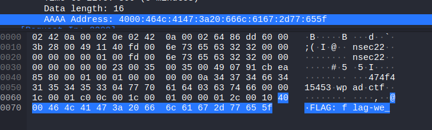
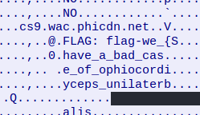
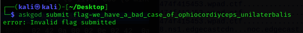
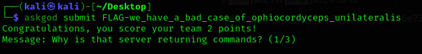
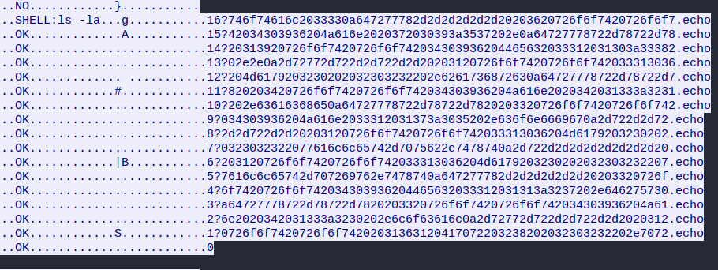
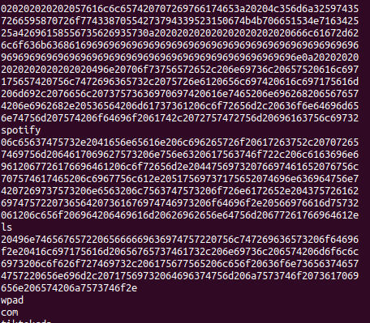
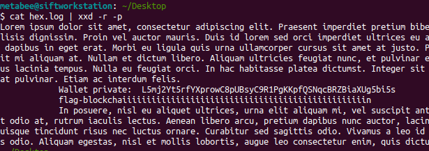

## Packet Analysis

Within your method of looking through the packets (using Wireshark), searching for the word `flag-` brought me directly to the flag.



Using the "Follow UDP Stream" feature in Wireshark, you can see the whole flag inline.



```txt
Flag-we_have_a_bad_case_of_ophiocordyceps_unilateralis
```





---

## Part 2 – Version 1

Farther down, the server returns commands:  

- `ls –la`  
- `cat wallet-priv.txt`  

The hex code is returned.



---

## Part 2 – Version 2

Converted to text:

This is my method of finding this.  
Narrowed down to host 23 to collect only these in `tcpdump`. I then cut out most of the before and after excess using:

```bash
tcpdump -nr portobello53.pcapng 'dst fd00:6e73:6563:3232::100 and src fd00:6e73:6563:3232::23' | cut -d " " -f 8- | cut -d "." -f -2 | cut -d "." -f 2- > hex.log
```

I used **CyberChef**, but after the excess is removed you can just type in Linux:

```bash
cat hex.log | xxd -r -p
```



---

Last flag is:

```txt
flag-bargaining_{md5 hash of the string CVE-xxx-yyyy}
```

---

## Second Version


