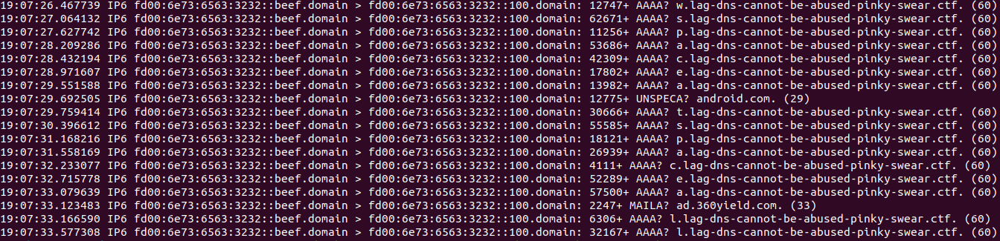
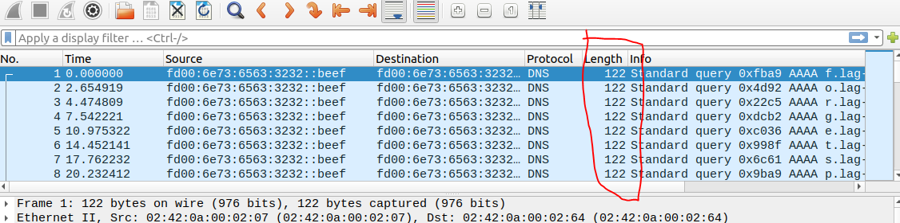
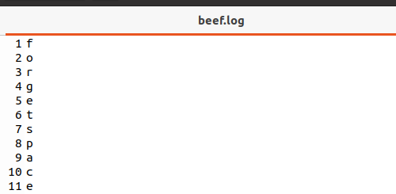
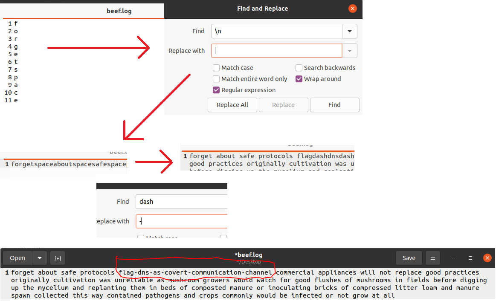

## Context

> Why do you need DNS logs anyway?  
> We both know that DNS servers are just address books of Internet resources and I’ve never seen anyone abuse a plain old address book.  
> The appliance would have blocked anything malicious anyway.  
> I bet you don’t even have a certification to understand the protocol anyway.

**Here’s a link to download the PCAP 5.**  
Don’t waste your time on the network capture, I skimmed through it and found that your test device `fd00:6e73:6563:3232::beef` did nothing suspicious.

---

## Part 1

### Step 1

```bash
tcpdump -r portobello53.pcapng 'src fd00:6e73:6563:3232::beef'
```

- `tcpdump -r portobello53.pcapng` will read the packet capture file.
- `'src fd00:6e73:6563:3232::beef'` will filter packets with the source IP address `fd00:6e73:6563:3232::beef`.

This is based on the hunt from the context. This will show all the DNS packets from this IPv6.



You can see at the DNS sub-domain there are single letters. In the example in the photo, you can spell the word "space".  
So let's remove all the excess by filtering only those represented by `60` at the end.  
I did this by exporting this tcpdump and opening it in Wireshark, filtering down to only size 122.

You could use a Wireshark filter to only show `beef` source IP and packets within the 122-byte range:

```sql
(ipv6.src == fd00:6e73:6563:3232::beef) && !(frame.len <= 120) && !(frame.len >= 123)
```

- `ipv6.src == fd00:6e73:6563:3232::beef` filters packets with the specified source IP.
- `!(frame.len <= 120)` excludes packets with a length of 120 bytes or less.
- `!(frame.len >= 123)` excludes packets with a length of 123 bytes or more.



### Step 3

```bash
tcpdump -r ~/Desktop/beef2.pcap | cut -d " " -f 8- | rev | cut -d "." -f 4-
```

- `tcpdump -r ~/Desktop/beef2.pcap` will read the packet capture file.
- `cut -d " " -f 8-` will cut out the first 7 fields of the packet, which are not needed.
- `rev` will reverse the string;
- `cut -d "." -f 4-` will cut out the first 3 fields of the packet, which are not needed.

This cuts out the extra characters on both sides of the snippet and will line them up.  
You can dump this into a file for text manipulation.

  


---

## Part 2

### Based on someone else's write-up

This one is similar to above with added filters.

```bash
tshark -r portobello53.pcapng -Y "ipv6.dst == fd00:6e73:6563:3232::beef" | grep pinky | grep -v "No such" | awk '{print $13}' | cut -d. -f1 | tr -d '\n'
```

- `tshark -r portobello53.pcapng` will read the packet capture file.
- `-Y "ipv6.dst == fd00:6e73:6563:3232::beef"` will filter packets with the destination IP address `fd00:6e73:6563:3232::beef`.
- `grep pinky` will filter packets that contain the word "pinky".
- `grep -v "No such"` will exclude packets that contain the phrase "No such".
- `awk '{print $13}'` will print the 13th field of each packet, which contains the subdomain.
- `cut -d. -f1` will cut the subdomain at the first dot, keeping only the first part.
- `tr -d '\n'` will remove any newline characters, concatenating the output into a single line.

```txt
flagdashdnsdashserverhidinginternetnoise
flag-dns-serverhidinginternetnoise
```

---

## Flag Submission

**Portobello 53 - Denial (2/2)**  
Ouch - A two-way covert communication channel. Watch the client proceed to the next stage of grief (2/2)

---

## Forum Message

> A server answering correctly to your arbitrary DNS queries. That’s not the kind of thing that would take the Mycoverse down.
