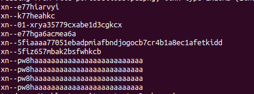

## Part 1 – PunnyCode

After noticing multiple `xn--` CNAMES in the PCAP, I narrowed down to host 9 and observed many of these entries.


After removing the excess and focusing on the head before it turns into junk, you can grab the first 6 sections to toss into the punycode converters:

```bash
tcpdump -nr portobello53.pcapng 'src fd00:6e73:6563:3232::9' | cut -d " " -f 8- | cut -d "." -f -1 | egrep xn-- | head
```



[Punycoder Converter](https://www.punycoder.com/)

```txt
FLAG-ART-SCREENSHOT-IS-DIGITAL-THEFT
```

**Flag submission:**  
Portobello 53 - Depression (1/3) | 2 | The Mycoverse needs its own flag (1/3)

**Forum message:**  
The user found a way to exfiltrate information using country flags? Where can I get a certification for this?

---

## Part 2 and 3 are from Other Write-ups

According to another write-up, using the following command achieves something similar to my approach in Part 1. If I had found a better converter, I might have seen the pattern the whole file was making. Below is my version for extracting just the `xn--` entries, even though a few were broken. I also include the decoded output via an ini file.

**My Version for `xn--`:**

```bash
tcpdump -nr portobello53.pcapng 'src fd00:6e73:6563:3232::9' | cut -d " " -f 8- | cut -d "." -f -1 | egrep "xn--" > punycode.log
```

**Write-up Version:**

```bash
tshark -r portobello53.pcapng | grep libera | grep "query 0x" | awk {'print $12'}
```

Either way, decode here: [https://www.punycoder.com/](https://www.punycoder.com/)

Part 2 reads:

```txt
FLAG-ART-MUSHROOM-ARE-HIDDEN-IN-PLAIN-SIGHT
```

See below for before and after – PART 3 is the QR Code.

---

**QR Code:**  

```txt
FLAG-ART-EXFIL-METHOD-IS-TRUE-MASTERPIECE
```

If you can't scan it, you might have to make it bigger and fix the black-to-white ratio since it isn't picking it up correctly.
