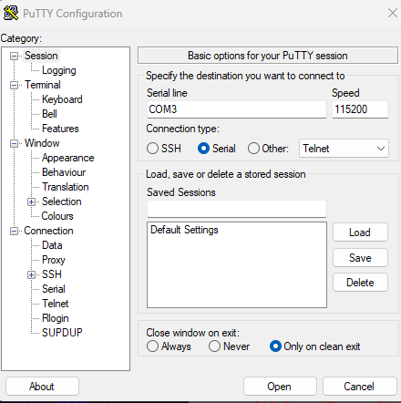

## Serial Connection

- **Connection Type:** Serial
- **Baud Rate/Speed:** 115200  
- **Port:** COM3  
- **Client:** PuTTY



## Reference

[Reverse Engineering of ESP32 Flash Dumps with Ghidra or IDA Pro (Medium)](https://olof-astrand.medium.com/reverse-engineering-of-esp32-flash-dumps-with-ghidra-or-ida-pro-8c7c58871e68)

## USB Command Example

```text
USB:
neopixel 3 70 0x990099
```
