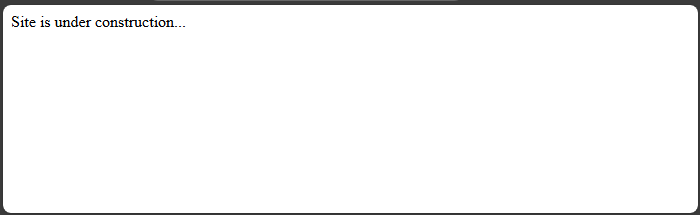
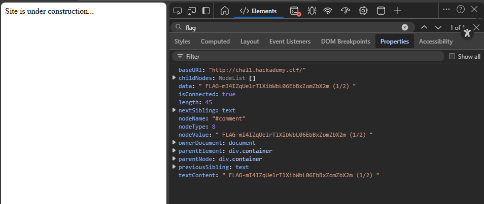
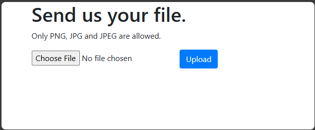
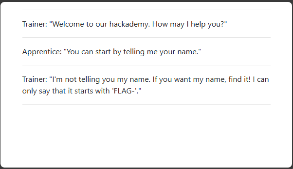
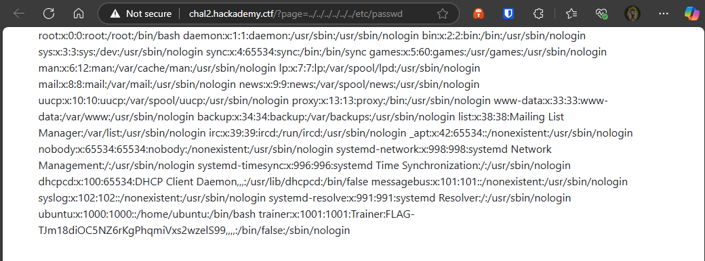
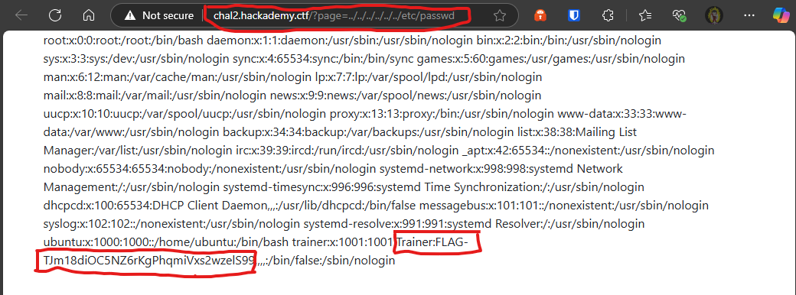
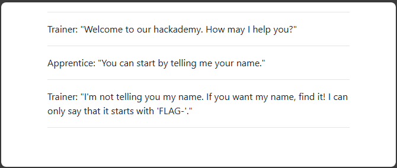
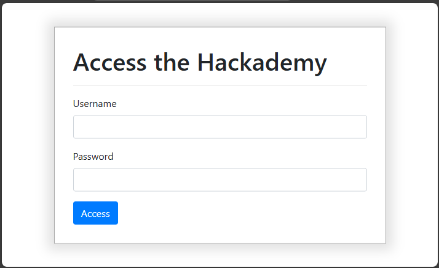

You know, I almost nicknamed you The Kid. But they told me that you are skilled. Let’s put this to the test with some fundamentals.

Training module: <http://hackademy.ctf>

Note: If this is your first NorthSec and that you are not in a competitive team (bottom 50% scores),
small hints and pointers can be given to you to help with this track. Use !help in Discord to ask.

---

## Serialize 101

> Serialize 101 :white_check_mark:

```php
<?php
    if(isset($_GET["source"])){
        highlight_string(preg_replace("/(FLAG-[a-f0-9]{32})/", "FLAG-".str_repeat("x", 32), file_get_contents(__file__)));
        die();
    }
    class Hackademy{
        private $call = "WelcomeMessage";

        public function __construct() {

        }

        public function __wakeup(){
            $this->{$this->call}();
        }

        public function WelcomeMessage(){
            echo "Hello World!";
        }

        public function GiveMeFlagPrettyPlease(){
            echo "FLAG-z4MvKIRJGPQ8kkTwkePVOrsHc038ADfC";
        }
    }
?>
<!DOCTYPE html>
<html>
    <head>
        <title>NorthSec Hackademy</title>
        <script type="text/javascript" src="https://code.jquery.com/jquery-3.5.1.js"></script>
        <script type="text/javascript" src="js/bootstrap.bundle.min.js"></script>
        <link rel="stylesheet" type="text/css" href="css/bootstrap.min.css">
    </head>
    <body>
        <div class="container">
            <a href="?source">Source here!</a><hr>
            <?php if(!isset($_GET["s"])){header("Location: ?s=".base64_encode(serialize(new Hackademy())));}else{unserialize(base64_decode($_GET["s"]));} ?>
        </div>
    </body>
</html>
```

```flag
FLAG-z4MvKIRJGPQ8kkTwkePVOrsHc038ADfC
```

---

## Automation 101

>Automatization 101 :white_check_mark:




```flag
FLAG-mI4IZqUelrTlXibWbL06EbBxZomZbX2m (1/2)
```

---

## Upload 101

>Upload 101 :white_check_mark:



---

## Inclusion 101

>Inclusion 101 :white_check_mark:







```flag
FLAG-TJm18diOC5NZ6rKgPhqmiVxs2wzelS99
```
---

## Inclusion 102

>Inclusion 102 :white_check_mark:



```html
http://chal3.hackademy.ctf/page?html=<script>alert(document.cookie)</script>

http://chal3.hackademy.ctf/page?html=<script>document.write("Cookies: " + document.cookie);</script>
```

**No Data Shown**

---

## Reverse 101

>Reverse 101 :white_check_mark:
>
>~[Image](reverse-1)~

---

## SQL 101

>SQL 101 :white_check_mark:
If you don’t already have, try to bypass the login (still with the injection). 1 of 2 flags.


