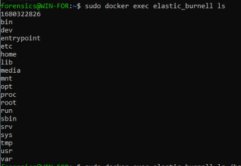
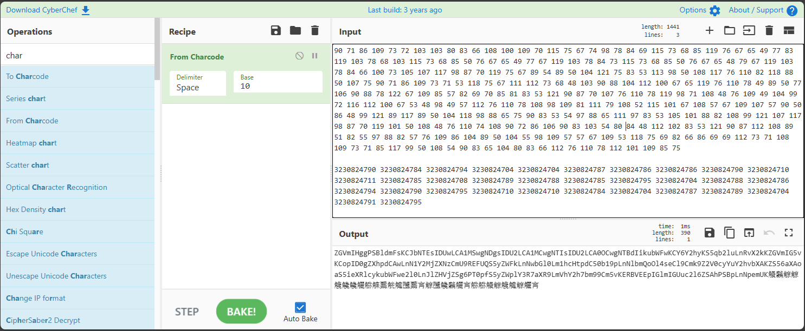
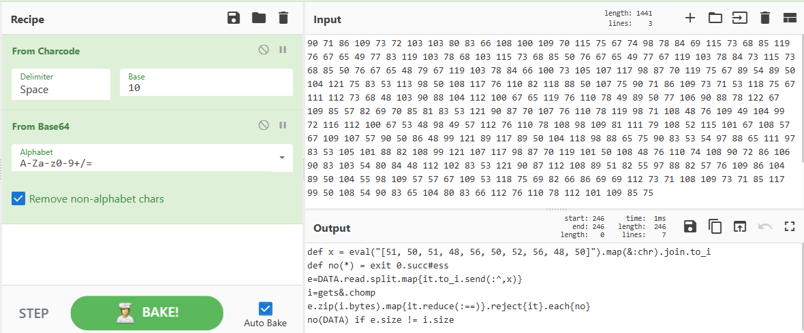
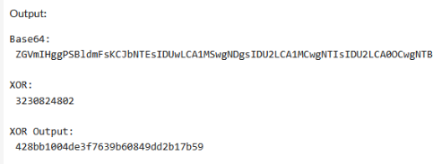
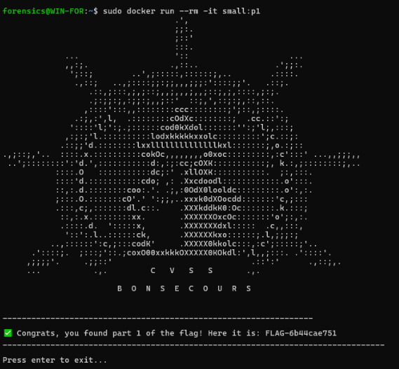
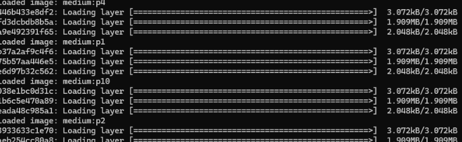
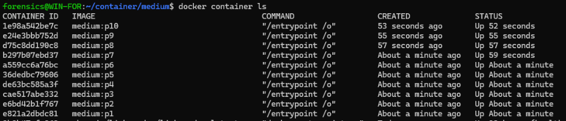
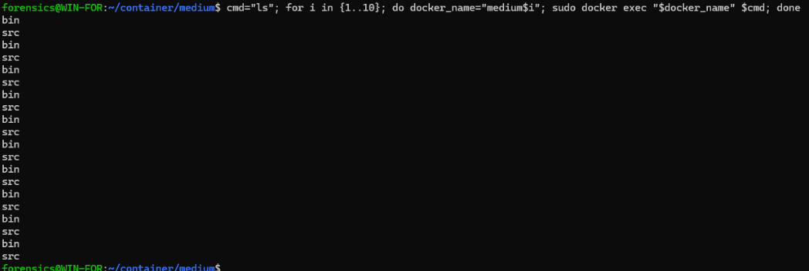
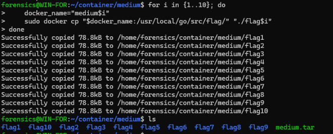

## Small Container

>While the Bonsecours is obviously a cruise ship, civilian ships can be chartered to carry cargo in containers. These containers are smaller than what you are used to see for haulage. To request a physical container, you need to prove ownership of the container to the stevedor.
>
>This cargo is interesting to us. Try to extract the hidden secrets in this container.
>
>- small.tar
>
>```bash
>docker load -i small.tar
>docker run --rm -it small:p1
>```

---

### Solution

After figuring a few things out, the hostname should not be changed. However the Docker name does not matter. After loading the container images, and doing a `docker ps`, you will see there are 3 available containers. You will end up doing the same thing for each one.

- **Create your dockers from 1-10**
This script will start each container so you can interact with them using exec. In this version you would have to stop them to use `docker run --rm -it small:p1` or exec after the fact to interact with them.

```bash
for i in {1..3}; do
    docker_name="small$i"
    image_name="small:p$i";
    docker run --name "$docker_name" -it -d "$image_name"
done
```

- Once they are running you can exec commands in all containers using the following command:

```bash
cmd="ls"
for i in {1..3}; do
    docker_name="small$i"
    docker exec "$docker_name" $cmd
done
```



You will see a different unique file in each container. The files are:

1. [`1680322826`](small1_1680322826)
2. [`2852721001`](small2_2852721001)
3. [`253297732`](small3_253297732)

You can then use the `cat` command to read the contents of each file or which ever method works for you to read / get the data out.

```bash
cmd="ls | head -n 1 | cat"
for i in {1..3}; do
    docker_name="small$i"
    docker exec "$docker_name" $cmd
done
```

<!-- Extra Code to look and Copy out the files
```bash
# OR:
sudo docker exec small1 ls | grep 1
#1680322826
sudo docker cp small1:/1680322826 small1_1680322826
> Successfully copied 3.58kB to /home/forensics/container/small1_1680322826

sudo docker exec small2 ls | grep 2 
> 2852721001
sudo docker cp small2:/2852721001 small2_2852721001
> Successfully copied 3.58kB to /home/forensics/container/small2_2852721001

sudo docker exec small3 ls | grep 2 
> 253297732
sudo docker cp small3:/253297732 small3_253297732
> Successfully copied 3.58kB to /home/forensics/container/small3_253297732
```
-->
---

Once you have the data, you will have something like this.

```ruby
require 'base64'
eval(Base64.urlsafe_decode64([90, 71, 86, 109, 73, 72, 103, 103, 80, 83, 66, 108, 100, 109, 70, 115, 75, 67, 74, 98, 78, 84, 69, 115, 73, 68, 85, 119, 76, 67, 65, 49, 77, 83, 119, 103, 78, 68, 103, 115, 73, 68, 85, 50, 76, 67, 65, 49, 77, 67, 119, 103, 78, 84, 73, 115, 73, 68, 85, 50, 76, 67, 65, 48, 79, 67, 119, 103, 78, 84, 66, 100, 73, 105, 107, 117, 98, 87, 70, 119, 75, 67, 89, 54, 89, 50, 104, 121, 75, 83, 53, 113, 98, 50, 108, 117, 76, 110, 82, 118, 88, 50, 107, 75, 90, 71, 86, 109, 73, 71, 53, 118, 75, 67, 111, 112, 73, 68, 48, 103, 90, 88, 104, 112, 100, 67, 65, 119, 76, 110, 78, 49, 89, 50, 77, 106, 90, 88, 78, 122, 67, 109, 85, 57, 82, 69, 70, 85, 81, 83, 53, 121, 90, 87, 70, 107, 76, 110, 78, 119, 98, 71, 108, 48, 76, 109, 49, 104, 99, 72, 116, 112, 100, 67, 53, 48, 98, 49, 57, 112, 76, 110, 78, 108, 98, 109, 81, 111, 79, 108, 52, 115, 101, 67, 108, 57, 67, 109, 107, 57, 90, 50, 86, 48, 99, 121, 89, 117, 89, 50, 104, 118, 98, 88, 65, 75, 90, 83, 53, 54, 97, 88, 65, 111, 97, 83, 53, 105, 101, 88, 82, 108, 99, 121, 107, 117, 98, 87, 70, 119, 101, 50, 108, 48, 76, 110, 74, 108, 90, 72, 86, 106, 90, 83, 103, 54, 80, 84, 48, 112, 102, 83, 53, 121, 90, 87, 112, 108, 89, 51, 82, 55, 97, 88, 82, 57, 76, 109, 86, 104, 89, 50, 104, 55, 98, 109, 57, 57, 67, 109, 53, 118, 75, 69, 82, 66, 86, 69, 69, 112, 73, 71, 108, 109, 73, 71, 85, 117, 99, 50, 108, 54, 90, 83, 65, 104, 80, 83, 66, 112, 76, 110, 78, 112, 101, 109, 85, 75].map(&:chr).join))
__END__
3230824790 3230824784 3230824794 3230824704 3230824704 3230824787 3230824786 3230824786 3230824790 3230824710 3230824711 3230824785 3230824708 3230824789 3230824788 3230824785 3230824795 3230824704 3230824788 3230824786 3230824794 3230824790 3230824795 3230824710 3230824710 3230824784 3230824704 3230824787 3230824789 3230824704 3230824791 3230824795
```

This isn't overaly relevant to the challenge, but it is a good example of how to decode a Base64.

Just for your awareness, the Char Code at the bottom after "END" translates to<br>
`𤞐𤞄𤞔𤜄𤜄𤞇𤞆𤞆𤞐𤜐𤜑𤞅𤜈𤞉𤞈𤞅𤞕𤜄𤞈𤞆𤞔𤞐𤞕𤜐𤜐𤞄𤜄𤞇𤞉𤜄𤞑𤞕`<br>
Which translate to:<br>
 `The sun rises in the east and sets in the west.`

I used shell prinf, but you can also get the results in cyberchef using CharCode Base10

```bash
printf '%s' $(printf '\\x%x' 90 71 86 109 73 72 103 103 80 83 66 108 100 109 70 115 75 67 74 98 78 84 69 115 73 68 85 119 76 67 65 49 77 83 119 103 78 68 103 115 73 68 85 50 76 67 65 49 77 67 119 103 78 84 73 115 73 68 85 50 76 67 65 48 79 67 119 103 78 84 66 100 73 105 107 117 98 87 70 119 75 67 89 54 89 50 104 121 75 83 53 113 98 50 108 117 76 110 82 118 88 50 107 75 90 71 86 109 73 71 53 118 75 67 111 112 73 68 48 103 90 88 104 112 100 67 65 119 76 110 78 49 89 50 77 106 90 88 78 122 67 109 85 57 82 69 70 85 81 83 53 121 90 87 70 107 76 110 78 119 98 71 108 48 76 109 49 104 99 72 116 112 100 67 53 48 98 49 57 112 76 110 78 108 98 109 81 111 79 108 52 115 101 67 108 57 67 109 107 57 90 50 86 48 99 121 89 117 89 50 104 118 98 88 65 75 90 83 53 54 97 88 65 111 97 83 53 105 101 88 82 108 99 121 107 117 98 87 70 119 101 50 108 48 76 110 74 108 90 72 86 106 90 83 103 54 80 84 48 112 102 83 53 121 90 87 112 108 89 51 82 55 97 88 82 57 76 109 86 104 89 50 104 55 98 109 57 57 67 109 53 118 75 69 82 66 86 69 69 112 73 71 108 109 73 71 85 117 99 50 108 54 90 83 65 104 80 83 66 112 76 110 78 112 101 109 85 75)
```



Once you decode the Base64, you will get the following Ruby code:

```ruby
def x = eval("[51, 50, 51, 48, 56, 50, 52, 56, 48, 50]").map(&:chr).join.to_i
def no(*) = exit 0.succ#ess
e=DATA.read.split.map{it.to_i.send(:^,x)}
i=gets&.chomp
e.zip(i.bytes).map{it.reduce(:==)}.reject{it}.each{no}
no(DATA) if e.size != i.size
```



This Ruby code defines a simple obfuscated input validation routine, likely used for checking a password or flag. The first line defines a method `x` that evaluates a string representation of an array of ASCII codes, converts each code to its character, joins them into a string, and then converts that string to an integer. This integer is used as a `key for XOR operations` later in the code.

The `no` method is a shortcut for exiting the program with a success status. The use of `0.succ` (which is 1) as the exit code is a playful way to write exit 1, but the comment suggests it is meant to indicate "success" in a tongue-in-cheek way.

The variable `e` reads data from the DATA section at the end of the file, splits it into parts, converts each part to an integer, and then XORs each integer with the value of x. This produces an array of expected byte values.

The variable `i` reads a line of input from the user and removes the trailing newline. The code then zips together the array `e` and the bytes of the user input, compares each pair for equality, and if any comparison fails, calls the `no` method to exit the program.

Finally, if the size of the processed data from `DATA` _(Which is the chinese characters from above)_ does not match the length of the user input, the program also exits. This ensures that the input is exactly the expected length.

Overall, this code is a compact and obfuscated way to check if user input matches a secret value, with the secret stored in an encoded form in the `DATA` section. The use of `XOR` and dynamic evaluation makes it harder to reverse-engineer the expected input.

When you Convert the Eval from the ruby code you get: `3230824802`

```bash
printf '%s' $(printf '\\x%x' 51 50 51 48 56 50 52 56 48 50)

> 3230824802
```

When you use this key to XOR the data from the DATA section, you will get the flag part. Now you just need to do it for each container.

**Python**

```python
def decode_bytecode(bytecode):
    return ''.join(chr(x) for x in bytecode)

def decode_code(code, key):
    return ''.join(chr(number ^ key) for number in code)

def main():
    # Char Code 10 to base64 Ascii of Ruby Code
    bytecode = [90, 71, 86, 109, 73, 72, 103, 103, 80, 83, 66, 108, 100, 109, 70, 115, 75, 67, 74, 98, 78, 84, 69, 115, 73, 68, 85, 119, 76, 67, 65, 49, 77, 83, 119, 103, 78, 68, 103, 115, 73, 68, 85, 50, 76, 67, 65, 49, 77, 67, 119, 103, 78, 84, 73, 115, 73, 68, 85, 50, 76, 67, 65, 48, 79, 67, 119, 103, 78, 84, 66, 100, 73, 105, 107, 117, 98, 87, 70, 119, 75, 67, 89, 54, 89, 50, 104, 121, 75, 83, 53, 113, 98, 50, 108, 117, 76, 110, 82, 118, 88, 50, 107, 75, 90, 71, 86, 109, 73, 71, 53, 118, 75, 67, 111, 112, 73, 68, 48, 103, 90, 88, 104, 112, 100, 67, 65, 119, 76, 110, 78, 49, 89, 50, 77, 106, 90, 88, 78, 122, 67, 109, 85, 57, 82, 69, 70, 85, 81, 83, 53, 121, 90, 87, 70, 107, 76, 110, 78, 119, 98, 71, 108, 48, 76, 109, 49, 104, 99, 72, 116, 112, 100, 67, 53, 48, 98, 49, 57, 112, 76, 110, 78, 108, 98, 109, 81, 111, 79, 108, 52, 115, 101, 67, 108, 57, 67, 109, 107, 57, 90, 50, 86, 48, 99, 121, 89, 117, 89, 50, 104, 118, 98, 88, 65, 75, 90, 83, 53, 54, 97, 88, 65, 111, 97, 83, 53, 105, 101, 88, 82, 108, 99, 121, 107, 117, 98, 87, 70, 119, 101, 50, 108, 48, 76, 110, 74, 108, 90, 72, 86, 106, 90, 83, 103, 54, 80, 84, 48, 112, 102, 83, 53, 121, 90, 87, 112, 108, 89, 51, 82, 55, 97, 88, 82, 57, 76, 109, 86, 104, 89, 50, 104, 55, 98, 109, 57, 57, 67, 109, 53, 118, 75, 69, 82, 66, 86, 69, 69, 112, 73, 71, 108, 109, 73, 71, 85, 117, 99, 50, 108, 54, 90, 83, 65, 104, 80, 83, 66, 112, 76, 110, 78, 112, 101, 109, 85, 75]
    newline = [51, 50, 51, 48, 56, 50, 52, 56, 48, 50]
    # XOR KEY is: "3230824784"
    code = [
        3230824790, 3230824784, 3230824794, 3230824704, 3230824704, 3230824787, 3230824786, 3230824786, 3230824790, 3230824710, 3230824711, 3230824785, 3230824708, 3230824789, 3230824788, 3230824785, 3230824795, 3230824704, 3230824788, 3230824786, 3230824794, 3230824790, 3230824795, 3230824710, 3230824710, 3230824784, 3230824704, 3230824787, 3230824789, 3230824704, 3230824791, 3230824795]
    # DATA Reference:  𤞐𤞄𤞔𤜄𤜄𤞇𤞆𤞆𤞐𤜐𤜑𤞅𤜈𤞉𤞈𤞅𤞕𤜄𤞈𤞆𤞔𤞐𤞕𤜐𤜐𤞄𤜄𤞇𤞉𤜄𤞑𤞕
    
    print("Base64:\n", decode_bytecode(bytecode), "\n") # Decoding the bytecode ruby code
    key = int(decode_bytecode(newline)); print("XOR:\n", key, "\n") # Decoding the XOR key from new line
    decoded = decode_code(code, key); print("XOR Output:\n", decoded, "\n") # Decoding the ruby, and XORing code with XOR key

if __name__ == "__main__":
    main()
```

The `XOR` Output is your Container Password.





### **Container Keys:**

1. **small:p1**
    - **Key**: `428bb1004de3f7639b60849dd2b17b59`
    - **Flag**: `6b44cae751805`
2. **small:p2**
    - **Key**: `b3e014e9725fa58c76a04defe9f9f15c`
    - **Flag**: `80580cb18e643e5`
3. **small:p3**
    - **Key**: `6e049bc38a417522cf424b4f157bbd0f`
    - **Flag**: `7c8a9cafc1c3e1f`

**Flag:** `FLAG-6b44cae75180580cb18e643e57c8a9cafc1c3e1f`

### Delete when you are done for cleanup

```bash
## Remove old images
```bash
sudo docker image rm small:p1
sudo docker image rm small:p2
sudo docker image rm small:p3

# OR
cmd="rm"
for i in {1..3}; do
    docker_name="small:p$i"
    sudo docker image $cmd "$docker_name" 
done
```

---

## Medium Container

>Good. This was a smaller container, but the merchandise inside will be important to the team for the operation.
>
>Now, try to steal more important loot from this container.
>
> - medium.tar
>
>```bash
>docker load -i medium.tar
>docker run --rm -it medium:p1
>```



## Solution Attempt

I started by running all 10 containers.

```bash
## Create your dockers from 1-10
for i in {1..10}; do
    docker_name="medium$i";
    image_name="medium:p$i";
    docker run --name "$docker_name" -it -d "$image_name";
done
```

- The following command will keep them in suspension while you run exec commands. Just run a stop rm when needed:

```bash
docker container stop /medium{1..10}
docker container rm /medium{1..10}
```

- I went hunting for some data, but in the end I am unsure what data was relevant other than needing to fix the ruby code to get the login code for the flag sections.
- The working folder was in the home folder. So using `ls` provided very little on it's own. I opted to start grouping my commands. I also used this concept in hopes to find a difference between the 10.

```bash
cmd="ls /bin/"; for i in {1..10};
do
    docker_name="medium$i";
    sudo docker exec "$docker_name" $cmd;
done | sort | uniq -c
```






> I did view the `printenv` and grep for the X=Variable since they were all different, but this did not seem to work for me.
>
>```bash
>X=674
>X=834
>X=236
>X=874
>X=917
>X=697
>X=425
>X=856
>X=897
>X=785
>```
>
>**NOT a flag:** `FLAG-674834236874917697425856897785`

We did find `/usr/local/go/src/flag` but it was unable to do much. My containers were not being very nice to me, where others had different results but still incomplete.

I did also try copying all files from all containers out to my host in hopes anything I try to run or find would be better assisted. It was not.



### MFT

---

## Large Container

> - [Large.Tar](large.tar)
>
>```bash
>docker load -i large.tar
>docker run --rm -it large:p1
>```
