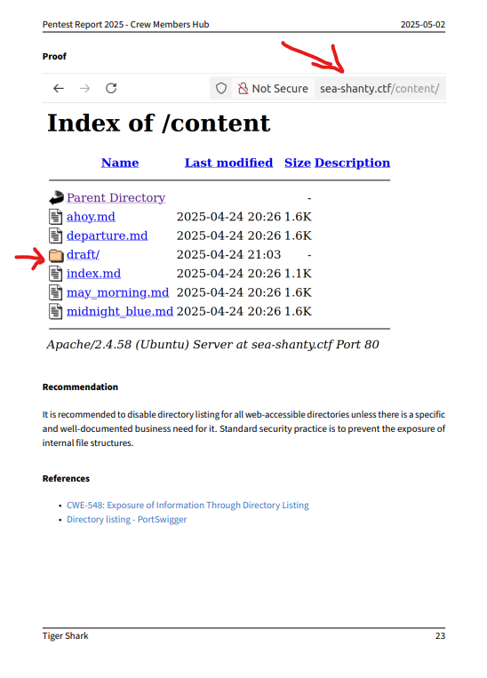
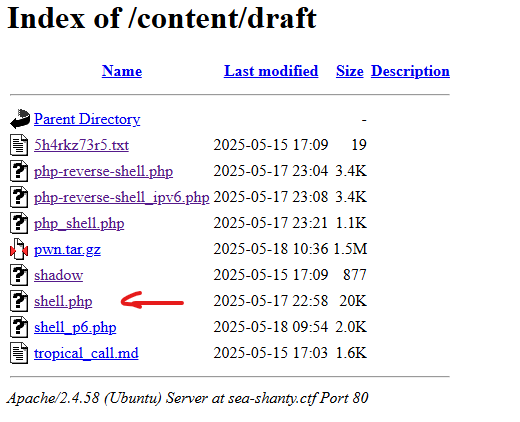
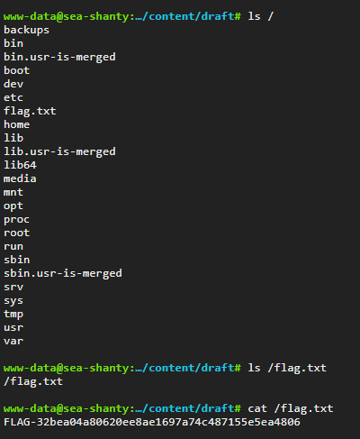

## Challenge Context

> The Wiz, I’ve got a special task that requires every bit of your brain power. I need you to infiltrate the CVSS Bonsecours Crew Members Hub and create your own crew account. This act will play a key part in the success of the heist.
> 
> To help you out, we managed to get our hands on a pentest report that assessed the hub. The pentest was done by a third-party firm named Sharkz4Hire — what kind of name is that? Would you believe they also call their employees Sharksterz?
> 
> Anyway, further intel indicates the so-called Sharksterz are known to be terrible at their job (yeah, shocking). I’m convinced that by combining their pentest results with your own findings, you will find a way.
> 
> Best of success.
> 
> Pentest report: [PenTest-Report.pdf](pentest-report.pdf)
> 
> **Resources:**
> - Pentest report: [PenTest-Report.pdf](pentest-report.pdf) // ~~https://dl.nsec/pentest-report.pdf~~
> - Refer to the post “Welcome to the CTF!” for `shell.ctf` information.

---

## Solution Walkthrough

1. **Review the Pentest Report**

    Examine the provided pentest report for any hints about vulnerabilities or misconfigurations in the Crew Members Hub.

2. **Access the Crew Members Hub**

    Use the information from the report to attempt account creation or exploitation.

3. **Shell Access**

    Once you gain access, attach to the shell and enumerate the system:

    ```sh
    ls /
    cat /flag.txt
    ```

4. **Capture the Flag**

    After successful exploitation, retrieve the flag from `/flag.txt`.

---





---

## Obtained Flag
<details>
<summary>Click to reveal the final flag</summary>

```flag
FLAG-32bea04a80620ee8ae1697a74c487155e5ea4806
```



</details>