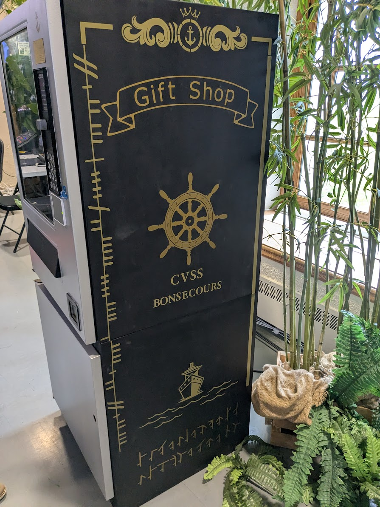
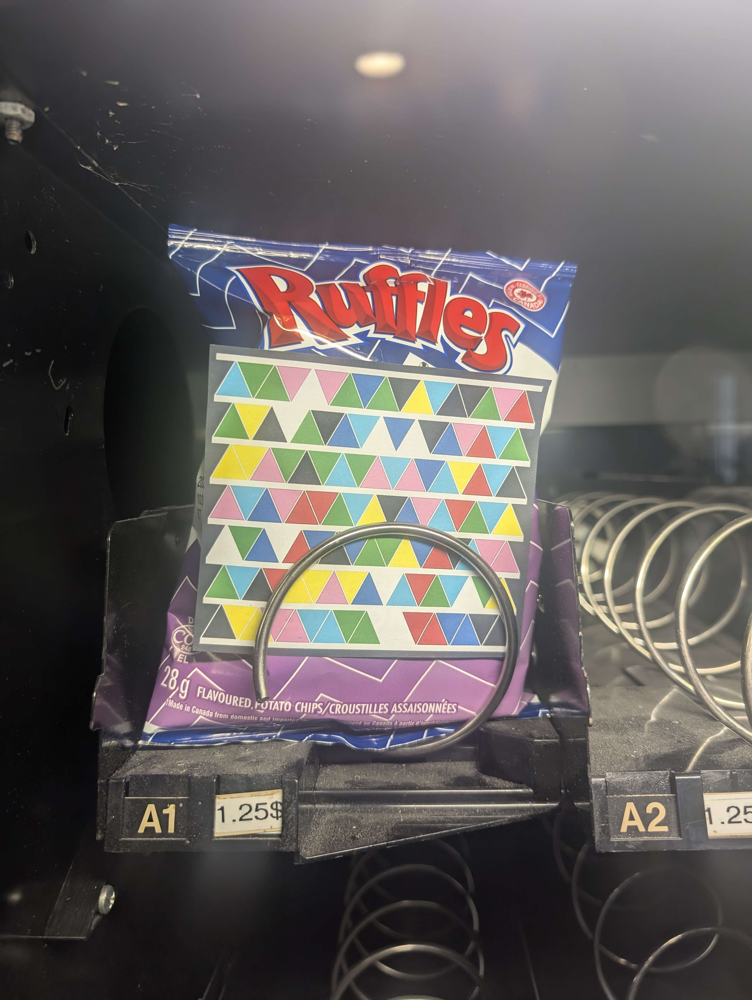
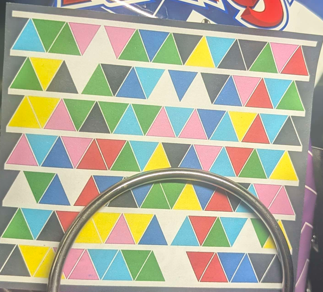
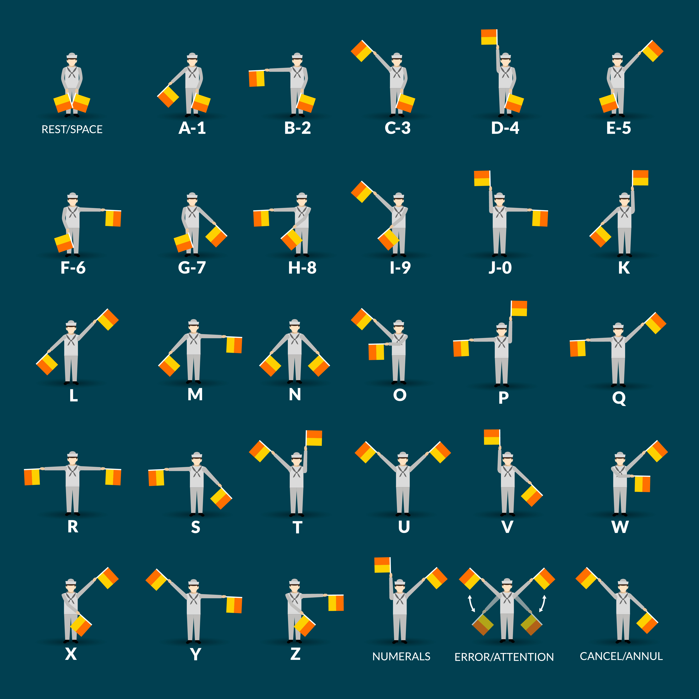
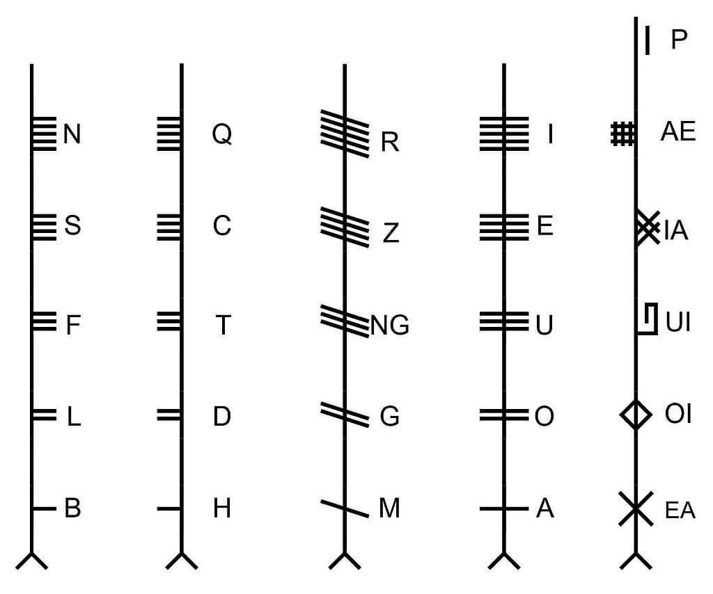
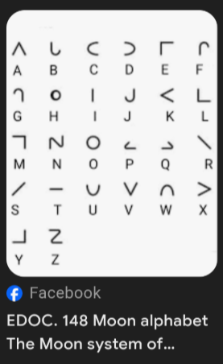

>Everybody can participate in games and stupid activities aboard the ship and get prize money that can be cashed in at a Gift Shop. Limbo dancing is definitely not in my task definition.
>
>Why care about some trinkets? We’ve studied the gift shop and there is an unusual item there. Chief thinks that this is a key item to crack the ship’s vault open. The problem is that our key card is maxed out at $1.24 credit, but that item, hidden in plain sight, is available for $1.25. They knew for sure that nobody should be able to get hold of it. I could smash the machine, but that will cause trouble. Can you hack your way in and get us the piece?
>
>A few helpful information for this track:
>
>1. If your team believes that you do not have the necessary equipment needed for this track, please visit the Admins table, we have equipment that can be handed out to teams in need.
>2. Please only take a single flag (we want everyone to be able to solve the track). Teams with more than one flag on their table will be penalized.
>3. Remember that items that are protected using a NorthSec sticker are strictly out-of-scope.

---

>There was a typo in a flag. It was fixed around 22h00. You can resubmit the flag.

---

>Why is this ancient language there. They are trying to fool us. Stay focused.

---

>Keep your eyes up. You are wasting time staring at your feet. Stay focused.

---

## Data 

I didn't go through this one myself but here is some data if you want to try it yourself.

