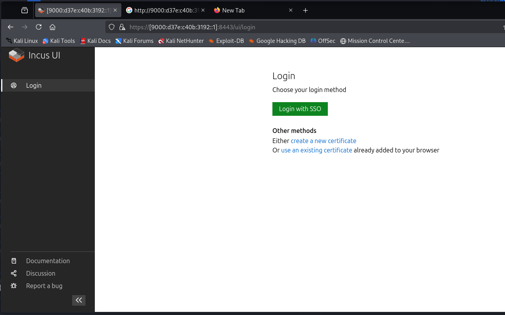

>Cruises are not known for their generosity. They’ll nickel-and-dime you at every opportunity. They’re out here to make money, just like us…
>
>It is by design that the Internet on the ship is bad. It creates a bad connection for everybody, but we know that the bandwidth could be better if we could remove the throttling they put in place.
>
>We need this for a specific reason: when the casino part of the heist will happen, we want everybody on their phone, live streaming the jackpot, and thus paralyzing the network while keeping everybody distracted.
>
>We have captured some traffic. Take a look and see if you can find anything.
>
><https://dl.nsec/d-and-s.pcapng>

[Local - Download the PCAP here](d-and-s.pcapng)

---

>I’ve done my legwork. The Internet aboard the ship has been set up by a cheap vendor, using a lot of custom services and such. Cruise ships, always needing to feel special.
>
>Wait, D.AND.S, what an unusual name. I wonder what it means? Did you take a look at the log server to see how all of this is processed?
>
>Oh. I just got it. Hopefully you got the pun, too.

---

## Some data

**Pcap Contains malform packet with text:**

```
Z464c41472d30383966333765633330616166663036653036643863333731656338653865643337383634313763
```

**DNS Request:**
```
596f7543616e52656164486578
YouCanReadHex
```
```
47617262616765
Garbage
```

**Looking at the only Malform Packet in Wireshark or other:**

` (_ws.malformed) && udp.stream eq 187`


<details>
<summary>Click to reveal the final flag</summary>

```flag
FLAG-089f37ec30aaff06e06d8c371ec8e8ed3786417c
```

</details>

---

## Next Step:


> I’ve done my legwork. The Internet aboard the ship has been set up by a cheap vendor, using a lot of custom services and such. Cruise ships, always needing to feel special.
> 
> Wait, D.AND.S, what an unusual name. I wonder what it means? Did you take a look at the log server to see how all of this is processed?
> 
> Oh. I just got it. Hopefully you got the pun, too.

```bash
curl -k https://[9000:d37e:c40b:3192::1]:8443/
```




hex encoding works

> No Additional Information.