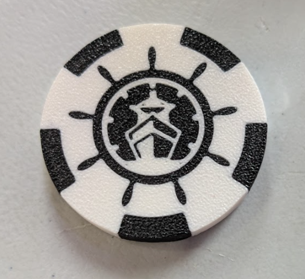
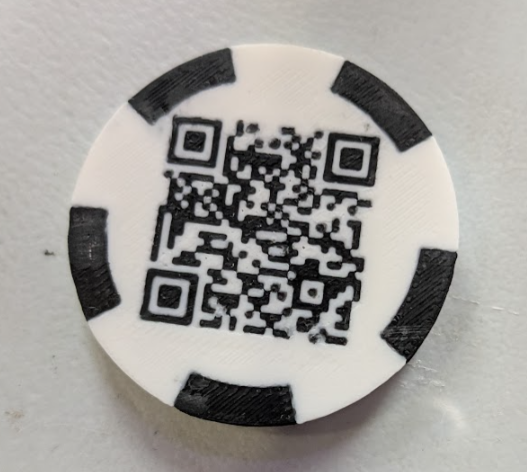
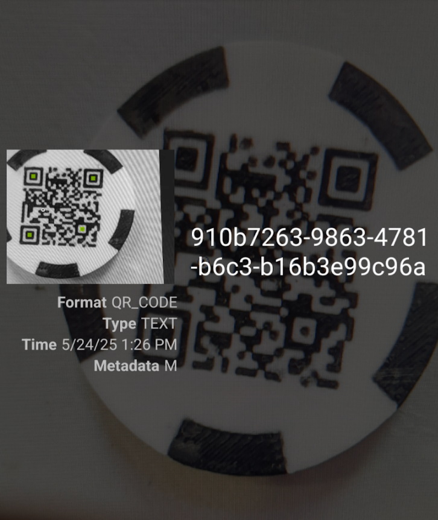

## Step 1

>The casino dealers are key allies in ensuring the success of the heist, but you’ll need to coordinate with them covertly. We’ve been working to get them on our side for a while now, but there’s some radio technology involved now, Wiz.
>
>They communicate using a secret number station to dispatch their teams. Your task is to figure out how their system works and use it to signal our team over the radio — without being detected.
>
>First, to show that you’re in, you’ll need a special token from the bar, left for you by our contact in the dealer crew.
>
>To obtain it, you’ll need to set the proper access on your badge.
>
>A challenge named Codenames on the badge will help you set the correct access if you answer it correctly.
>
>Once that’s done, go to the bar and plug your badge into the dock. If the dock lights up green, the bar staff will hand you the token. Don’t share it with anyone!

Connect to the badge using the included USB-C via PuTTY or any other terminal emulator. The badge is running a custom Linux OS, and you can access the Codenames challenge by running the following command:

```bash
./codenames
```

---

Once you set the correct access, you can plug the badge into the dock at the bar. The dock will light up green, and you will receive a token.

>Hey Wiz, the dealer gang mentioned they recently switched their transmission frequency to avoid detection—it’s now set to 147.655







<details>
<summary>Click to reveal the final flag</summary>

```flag
FLAG-910b7263-9863-4781-b6c3-b16b3e99c96a
```

</details>

## Step 2

>Wonderful. We’ve established contact.
>
>The Dealer gang just sent you an [audio file](petit_poney.mp3).
>
>Buried in this recording is the key to triggering their next radio transmission, the signal that mobilizes their crew.
>
>To air that transmission, you’ll need to uncover the name of the transmission server and figure out exactly how to craft the request that will set everything in motion.
>
>But this won’t be obvious. The information is hidden in the audio itself. As you know, some digital communication protocols travel by sound — masked as ordinary noise, music, or static.
>
>Your task is to decode the message, find the server endpoint and trigger the transmission.

<audio controls preload="auto" style="text-align: center; width: 100%; background-color: #22cc00ff; border-radius: 40px; padding: 7px; margin: 10px;">
    <source src="petit_poney.mp3" type="audio/mpeg">
    Your browser does not support the audio element.
</audio>

>The Fence just told us to use /satcom/fence to send your requests!

> I lost the remaining analysis I did. Maybe I'll do it again one day.