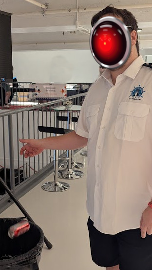
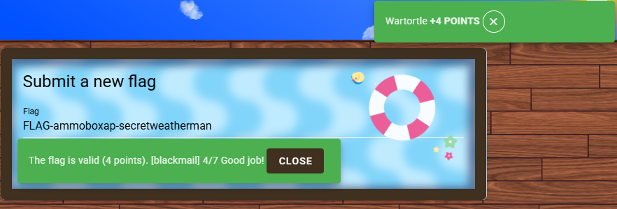

> You don’t need to know why, but when time will come, I’ll need a weapon and ammo. Bringing something onboard this high security ship was impossible, but we have a way out. There is a weapon on this ship, usable in extreme cases such as a pirate attack.
> 
> It looks like there is a pirate aboard, so I guess we can use it. The pirate is you, Wiz, you get it? Har har har.
> 
> Alright. Listen. There’s an ammo cache hidden on the ship, and for security protocol reasons, the cache is emitting a continuous signal to keep track of its location. This way, they know that the weapon is still onboard.
> 
> You will need to use your radio device to find that signal, leading to the ammo cache.
> The signal is live, and the frequency of the transmitter is around : 146.565 MHz
> 
> Follow the trail, and it’ll lead you straight to the stash.

---

## Part 1

You can first find the AmmoBox in the corner of the physical room. It comes with a QR Code with a flag.


<details>
<summary>Click to reveal the flag</summary>

```flag
FLAG-3f9c2a1b-5d8e-4c1a-91b3-7f4d6e2f9a6c
```

</details>


## Part 2

> Alright — you’ve found the ammo cache. But there’s a problem.
It’s sealed. No weapons in sight. Just a locked case, and no obvious way in. And we can’t tamper with it. Let me ask the team for help.
>
> Relax! You should take some time to study the field instead of trying to bash headfirst into things. Not everybody aboard a ship is allowed to use a weapon. The Weatherman is an officer aboard the ship that has clearance. But he’s paranoid, and for good reason — he doesn’t know you two, and he doesn’t trust anyone.
>
> But I got some compromising material on him. It might be just enough to get him talking, or at least to hand over whatever’s needed to unlock the cache.
>
> Find him, show him the photo, and he might cooperate. But tracking him won’t be easy since he moves around and rarely stays in one place.
>
> What we do know is that he’s carrying a device that emits a Morse code beacon at 902.9 MHz. Lock onto the signal, and you might just find him.
>
> Good luck. He won’t be always on deck.
>
>While not mandatory, you could craft a directionnal antenna at the RF village to help you.

Walk around the room and floors, you should be able to find this recycling fiend. Once you find him, interact with him and threaten to expose his secrets. He will provide you with a RFID to scan for payment and to delete this blackmail.






## Part 3

> We got him scared! I prefer more direct threats, but blackmail will do. Now that you have a SSID and PASSWORD, go back to the ammo cache and try to find the access point!

Connect to the Open but hidden Wifi. Your method may vary. Iphones had a harder time being auto led to the website. Computers also had a hit or miss redirect, but if you ended up on the site it was a photo of the Ammo Box with Alt text and also in the photo. You had to be near the AmmoBox to be able to get logged into the intentionally weak broadcasting wifi.


## Part 4

>Insane work, you’ve cracked open the ammo cache. That’s a major step forward to make the heist happen!
>
>But ammo without guns? Not much use. The weatherman played us a trick, but I managed to extract some more information while you were getting the ammo.
>
>Every 30 minutes on the clock, an image is transmitted over radio, a repeating signal at 144.225 MHz.
>
>If you can decode it, it could reveal the location of the gun cache.
>
>Set up your SDR gear, tune in, and be ready. The signal won’t wait for us.
>
>The poor guy finished by telling me to look at the waterfall, it should be SSTV or WeatherFax over Narrow band FM.


> Hey Wiz, one of us managed to recover enough information from the transmission to give you **this**… It might get you to the gun faster.
>
>

As this was near the end of the event, I only saw the Morse Code on Signal `144.225 MHz`, once and it stopped transmitting. SO I never got to continue the challenge.
