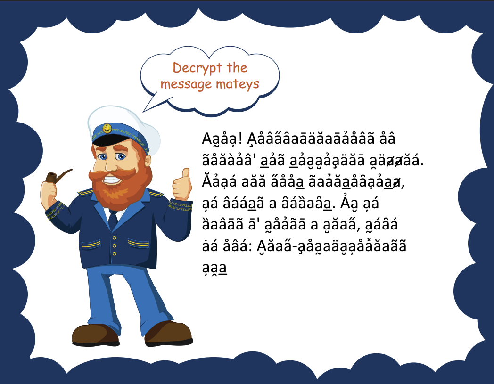

I dont have the pre-context unfortunately. 

I do have the image initially provided. This was solved but I think I lost the results I had.

The characters were decypherable to words.



<details>
<summary>Click to reveal flag</summary>

```flag
AHOY! CONGRTULTIONS ON
SOLVIN' DIS DIFFICULT PUZZLE.

LIKE aLL GOOD SaILDORKIDZ,
YE NEEDS a REWaRD. IF YE
WRTS T' HOIST a FLaG, HERE
KE ONE: FLAG-COHAUFYOXLASSYPD
```

</details>

## Unfinished

A music file was provided but not finished.

<audio controls preload="auto" style="text-align: center; width: 100%; background-color: #22cc00ff; border-radius: 40px; padding: 7px; margin: 10px;">
    <source src="SailorKidz.mp3" type="audio/mpeg">
    Your browser does not support the audio element.
</audio>

There was an attempt to analyze the audio file for morse code or other hidden data but it was not completed.


