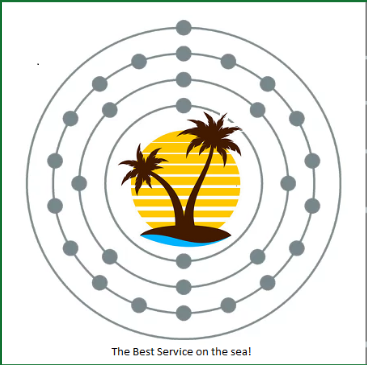
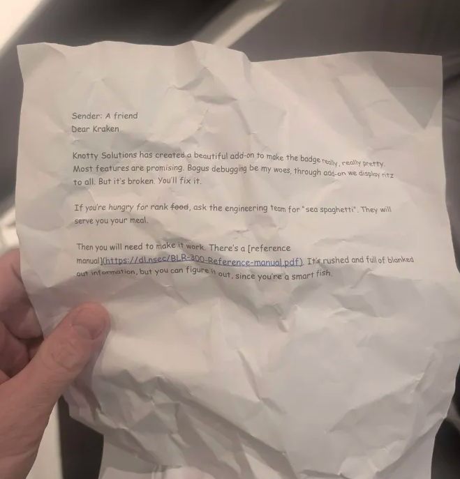

>The steps that were taken to get our access cards were colossal. While we’re working on making it a skeleton key, members of the crew that will see us with our regular cards will know that we don’t have clearance. This requires assembly, and had to be taken care inside the ship.
>
>The plan was to have the material sent to the cabin, but it got intercepted. Now we need to take care of that before “Copper Island”, the company that specializes in Data disposal takes care of it. Their motto is “We destroy information at the atomic level”, and we can’t let that happen.
>
>The instructions to upgrade the key are on-board and near the technical team near the casino, but we need to make it quick before they get destroyed. Go do some dumpster diving before “Copper Island” makes it.
>
>
>
>[Image](logo-copper-island.png)

---

>What is that? A whole manual to explain a faulty device? This is looking to be more complex than I expected. Good luck in deciphering all that and figure out that spaghetti. It looks that not only you need to get the device, you need to assemble it and to fix it? They really made our job harder… I hope your electronics skills are honed.
