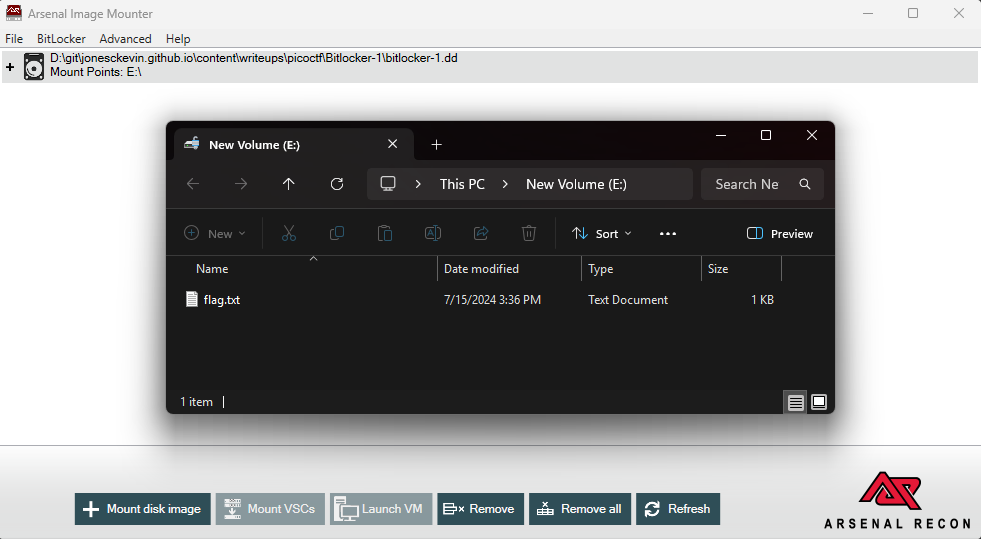

## Description

Jacky is not very knowledgable about the best security passwords and used a simple password to encrypt their BitLocker drive. See if you can break through the encryption!
Download the disk image [here](https://challenge-files.picoctf.net/c_verbal_sleep/9e934e4d78276b12e27224dac16e50e6bbeae810367732eee4d5e38e6b2bb868/bitlocker-1.dd).


- ~[Local download - bitlocker-1.dd](bitlocker-1.dd)~

---

## Solution

Using a created docker for johntheripper, I exec and utilized the `bitlocker2john.py` to extract the hash from the bitlocker image.

```docker
FROM python:3.9-slim

RUN apt-get update && \
    DEBIAN_FRONTEND=noninteractive apt-get install -y \
      git build-essential pkg-config libssl-dev libgmp-dev yasm zlib1g-dev && \
    git clone https://github.com/openwall/john.git && \
    cd john/src && \
    ./configure && \
    make -j"$(nproc)" && \
    apt-get clean && rm -rf /var/lib/apt/lists/*

WORKDIR /data
CMD ["bash"]
```

## Build and Run Docker Container

### Extract Bitlocker Hash

```bash
docker build -t johntheripper .
docker run -it --rm -v "$(pwd):/data" johntheripper
docker run --rm -v "$(pwd):/data" johntheripper:latest /data/bitlocker2john.py /data/bitlocker-1.dd > bitlocker.hash
```

```
$bitlocker$2$16$2b71884a0ef66f0b9de049a82a39d15b$1048576$12$00be8a46ead6da0106000000$60$a28f1a60db3e3fe4049a821c3aea5e4ba1957baea68cd29488c0f3f6efcd4689e43f8ba3120a33048b2ef2c9702e298e4c260743126ec8bd29bc6d58
$bitlocker$3$16$2b71884a0ef66f0b9de049a82a39d15b$1048576$12$00be8a46ead6da0106000000$60$a28f1a60db3e3fe4049a821c3aea5e4ba1957baea68cd29488c0f3f6efcd4689e43f8ba3120a33048b2ef2c9702e298e4c260743126ec8bd29bc6d58
$bitlocker$0$16$cb4809fe9628471a411f8380e0f668db$1048576$12$d04d9c58eed6da010a000000$60$68156e51e53f0a01c076a32ba2b2999afffce8530fbe5d84b4c19ac71f6c79375b87d40c2d871ed2b7b5559d71ba31b6779c6f41412fd6869442d66d
$bitlocker$1$16$cb4809fe9628471a411f8380e0f668db$1048576$12$d04d9c58eed6da010a000000$60$68156e51e53f0a01c076a32ba2b2999afffce8530fbe5d84b4c19ac71f6c79375b87d40c2d871ed2b7b5559d71ba31b6779c6f41412fd6869442d66d
```

---

### Brute Force Bitlocker Password

While you are exec or close enough to the john docker container, you can run john to attempt to brute force the hash using the rockyou.txt wordlist. 
> _(Odds are hashcat will be faster if you have a GPU available)_.

```bash
docker run --rm -v "$(pwd):/data" johntheripper:latest /john/run/john --wordlist=/data/rockyou.txt bitlocker.hash
```
```bash
root@fcbddc731151:/data# /john/run/john --wordlist=/data/rockyou.txt bitlocker.hash
Note: This format may emit false positives, so it will keep trying even after finding a possible candidate.
Using default input encoding: UTF-8
Loaded 2 password hashes with 2 different salts (BitLocker, BitLocker [SHA-256 AES 32/64])
Cost 1 (iteration count) is 1048576 for all loaded hashes
Will run 8 OpenMP threads
Note: Minimum length forced to 8 by format
Press 'q' or Ctrl-C to abort, 'h' for help, almost any other key for status
j*******e       (?)
j*******e       (?)
```

---

### Mount Bitlocker Image and Retrieve Flag

I opted to use Arsenal Image Mounter to mount the bitlocker image and provide the password found from johntheripper to unlock the drive. The image contained _flag.txt_.



---

## Flag Answer

<details>
<summary>Click to reveal the flag</summary>

Full: `picoCTF{us3_b3tt3r_p4ssw0rd5_pl5!_3242adb1}`

</details>

---
