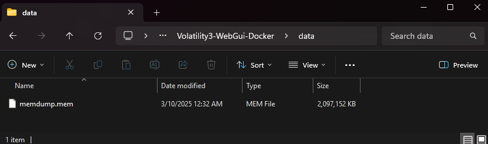

<style>
/* Apply to columns 0, 2, 3 (1st, 3rd, 4th) */
table th:nth-child(1),table td:nth-child(1),
table th:nth-child(3),table td:nth-child(3),
table th:nth-child(7),table td:nth-child(7) {
    min-width: 70px; overflow: hidden; text-overflow: ellipsis; white-space: nowrap;}
table th:nth-child(4),table td:nth-child(4){
    min-width: 100px; overflow: hidden; text-overflow: ellipsis; white-space: nowrap;}
/*Change table header background color*/
th {background-color: #333333 !important;color: #05a100ff;text-align: center;}
</style>

## Description

**Author: Venax**

Jacky has learnt about the importance of strong passwords and made sure to encrypt the BitLocker drive with a very long and complex password. We managed to capture the RAM while this drive was opened however. 

***See if you can break through the encryption!***

> Download the disk image [here](https://challenge-files.picoctf.net/c_verbal_sleep/b22e1ca13c0b82bb85afe5ae162f6ecbdf5b651e364e6a2b57c9ad44ae0b3bfd/bitlocker-2.dd) and the RAM dump [here](https://challenge-files.picoctf.net/c_verbal_sleep/b22e1ca13c0b82bb85afe5ae162f6ecbdf5b651e364e6a2b57c9ad44ae0b3bfd/memdump.mem.gz).

- ~[Local download - bitlocker-2.dd](bitlocker-2.dd)~
- ~[Local download - memdump.mem.gz](memdump.mem.gz)~

---

## Solution - Using my Volatility Web Docker

I wanted to test my Volatility Web Docker setup for this challenge which had the dependency of lacking the bitlocker plugin. So thanks to lorelyai's [volatility3-bitlocker](https://github.com/lorelyai/volatility3-bitlocker), I was able to integrate the necessary plugin and proceed with the analysis.

### Setting up Volatility Web

With Docker, download and initial build the Volatility Web GUI Docker:

```bash
git clone https://github.com/JonesCKevin/Volatility3-WebGui-Docker.git
cd Volatility3-WebGui-Docker
docker compose up -d
```


> Once completed, move the memory dump provided into the `data` directory.



### Navigate to the webapp

Open your web browser and go to `http://localhost:8080`. You should see the Volatility Web GUI.


### Initiate Analysis

Select `Analysis` tab and within the custom input type in `bitlocker` and press `Run`.


After an eternity and a half, the analysis completes and reveals the Bitlocker password.


> For transparency, I did end up running the command directly in the docker terminal to ensure it completed successfully using this specific command:
This was because I needed the output files from the plugin to proceed. This should be added in the repo now.

```bash
/opt/volatility-env/bin/vol -f /data/memdump.mem -vvv windows.bitlocker --tags FVEc Cngb None --dislocker
```

---

#### Links will download the local hosted fvek file from my output

|          File          | Offset         |   Tag    | Cipher  | FVEK                                                             | Tweak                            | Size  |
| :--------------------: | -------------- | :------: | :-----: | ---------------------------------------------------------------- | -------------------------------- | :---: |
| [File](0x80878347ece0) | 0x80878347ece0 |   Cngb   | AES-128 | 039e111586d5f9d974a571190474d097                                 |                                  |  672  |
| [File](0x8087835eab80) | 0x8087835eab80 |   Cngb   | AES-256 | 65b8064ec7acea96726aa18d294213176fd513a62a95c80720648f0590211364 |                                  |  672  |
| [File](0x808784457c90) | 0x808784457c90 |   Cngb   | AES-128 | d40582190eb6f067691120bbbe55e511                                 |                                  |  672  |
| [File](0x8087865bead0) | 0x8087865bead0 | **None** | AES-128 | 4f79d4a00d5e9b25965b89581a6a599c                                 | 4109b89a973fd5c65ed75841404e7c39 | 1280  |


<!---->

### Using the Password to Unlock the Drive


#### Make mount points
```bash
sudo mkdir /mnt/bit2-decrypted
sudo mkdir /mnt/bit2-fs
```

#### Using Dislocker to unlock the Bitlocker drive
```bash
sudo apt-get install dislocker ntfs-3g
```

#### Unlock the Bitlocker volume
```bash
sudo dislocker -v -k 0x8087865bead0-Dislocker.fvek -V bitlocker-2.dd /mnt/bit2-decrypted
```

#### Mount the decrypted filesystem
```bash
sudo mount -t ntfs-3g /mnt/bit2-decrypted/dislocker-file /mnt/bit2-fs
```

```
The disk contains an unclean file system (0, 0).
Metadata kept in Windows cache, refused to mount.
Falling back to read-only mount because the NTFS partition is in an unsafe state. Please resume and shutdown Windows fully (no hibernation or fast restarting.)
Could not mount read-write, trying read-only
```

#### Access the mounted filesystem and retrieve the flag
```bash
ls /mnt/bit2-fs
# '$RECYCLE.BIN'  'System Volume Information'   flag.txt

cat /mnt/bit2-fs/flag.txt
# picoCTF{}
```


#### Clean up mount points
```bash
sudo umount /mnt/bit2-fs
sudo umount /mnt/bit2-decrypted
sudo rmdir /mnt/bit2-fs
sudo rmdir /mnt/bit2-decrypted
```

---

## Update for Web UI


---

## Flag Answer

<details>
<summary>Click to reveal the flag</summary>

Full: `picoCTF{B1tl0ck3r_dr1v3_d3crypt3d_9029ae5b}`

</details>

---

## Resources

- **Volatility Web Docker:** [Github - JonesCKevin](https://github.com/JonesCKevin/Volatility3-WebGui-Docker)
- **Volatility3:** [Github - volatilityfoundation/volatility3](https://github.com/volatilityfoundation/volatility3)
- **Volatility3 Bitlocker Plugin:** [Github - Lorelei](https://github.com/lorelyai/volatility3-bitlocker)